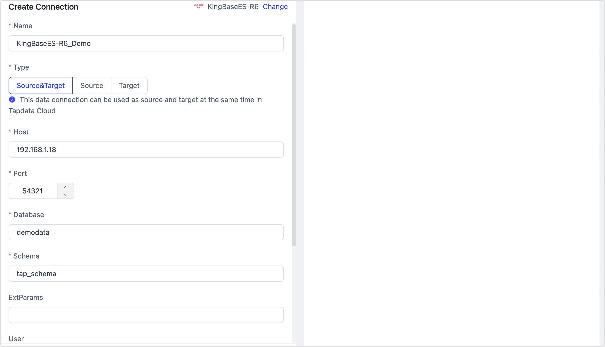

# KingbaseES-R6

import Content from '../../reuse-content/_enterprise-and-cloud-features.md';

<Content />

The Kingbase Database Management System (KingbaseES) is a commercial relational database management system developed independently by Beijing Kingbase Technology Inc, with proprietary intellectual property rights. KingbaseES-R6 is compatible with most features of Postgres 9.6 version. This article will introduce how to add KingbaseES-R6 data source in TapData Cloud, which can then be used as a source or target database to build data pipelines.

```mdx-code-block
import Tabs from '@theme/Tabs';
import TabItem from '@theme/TabItem';
```

## Supported Versions

KingBaseES-V8R6

:::tip

The database modes supported by KingbaseES-R6 are Oracle, PostgreSQL, and MySQL. It should be noted that in Oracle mode, objects are lowercase by default. For more information, see [Kingbase ES Official Documentation](https://help.kingbase.com.cn/v8/index.html).

:::

import Content1 from '../../reuse-content/_beta.md';

<Content1 />

## Prerequisites

1. Log in to the KingbaseES-R6 database as an administrator.

2. Execute the following commands to create an account for data synchronization/development tasks.

   ```sql
   CREATE USER username WITH PASSWORD 'password';
   ```

   * **username**: Username.
   * **password**: Password.

3. Grant permissions to the newly created account as required or customize permission control based on business needs.

```mdx-code-block
<Tabs className="unique-tabs">
<TabItem value="As Source">
```

```sql
-- Enter the database for which you want to grant permissions
\c database_name

-- Grant SELECT permission on all tables in the source schema
GRANT SELECT ON ALL TABLES IN SCHEMA schema_name TO username;

-- Grant USAGE permission on the source schema
GRANT USAGE ON SCHEMA schema_name TO username;
```

</TabItem>

<TabItem value="As Target">

```sql
-- Enter the database for which you want to grant permissions
\c database_name;

-- Grant CREATE and USAGE permissions on the target schema
GRANT CREATE, USAGE ON SCHEMA schema_name TO username;

-- Grant READ and WRITE permissions on all tables in the target schema
GRANT SELECT, INSERT, UPDATE, DELETE, TRUNCATE ON ALL TABLES IN SCHEMA schema_name TO username;
```
</TabItem>
</Tabs>

* **database_name**: Database name.
* **schema_name**: Schema name.
* **username**: Username.

4. To capture incremental changes from the source database, we need to execute the following command to set the replication identity to **FULL** (using the entire row as the identifier). This property determines the fields recorded in the log when `UPDATE/DELETE` operations occur.

   ```
   ALTER TABLE schema_name.table_name REPLICA IDENTITY FULL;
   ```

   - **schema_name**: The name of the schema.
   - **table_name**: The name of the table.

   After completing this operation, you will also need to contact [technical support](../../support.md) to provide the relevant plugin for installation on the server hosting KingbaseES-R6.


## Connect to KingbaseES-R6

1. [Log in to TapData Platform](../../user-guide/log-in.md).

2. In the left navigation panel, click **Connections**.

3. On the right side of the page, click **Create**.

4. In the pop-up dialog, select **KingbaseES-R6**.

5. On the page that you are redirected to, follow the instructions below to fill in the connection information for KingbaseES-R6.

   

   * **Connection Information Settings**
     * **Name**: Fill in a unique name that has business significance.
     * **Type**: Supports KingbaseES-R6 as a source or target database.
     * **Host**: The database connection address.
     * **Port**: The service port of database.
     * **Database**: Database name, a connection corresponding to a database, if there are multiple databases, you need to create multiple connections.
     * **Schema**: Schema name.
     * **ExtParams**: Additional connection parameters, default empty.
     * **User**: The database username.
     * **Password**: The database password.
     * **Log Plugin Name**: To read the data changes of KingbaseES-R6 and achieve incremental data synchronization, you need to complete the installation of the plugin according to the guidance of the [preparations](#preparations).
   * **Advanced Settings**
     * **Timezone**: Defaults to the time zone used by the database, which you can also manually specify according to your business needs.
     * **CDC Log Caching**: [Mining the source database's](../../user-guide/advanced-settings/share-mining.md) incremental logs, this feature allows multiple tasks to share incremental logs from the source database, avoiding redundant reads and thus significantly reducing the load on the source database during incremental synchronization. Upon enabling this feature, an external storage should be selected to store the incremental log.
     * **Contain Table**: The default option is **All**, which includes all tables. Alternatively, you can select **Custom** and manually specify the desired tables by separating their names with commas (,).
     * **Exclude Tables**: Once the switch is enabled, you have the option to specify tables to be excluded. You can do this by listing the table names separated by commas (,) in case there are multiple tables to be excluded.
     * **Agent Settings**: Defaults to **Platform automatic allocation**, you can also manually specify an agent.
     * **Model Load Time**: If there are less than 10,000 models in the data source, their information will be updated every hour. But if the number of models exceeds 10,000, the refresh will take place daily at the time you have specified.
     * **Enable Heartbeat Table**: When the connection type is selected as **Source and Target** or **Source**, you can enable this option to create a heartbeat table named **_tapdata_heartbeat_table** in the source database. It will be updated every 10 seconds by TapData (requires relevant permissions) and used for monitoring the health of the data source connection and tasks.

6. Click **Connection Test**, and when passed, click **Save**.

   :::tip

   If the connection test fails, follow the prompts on the page to fix it.

   :::
