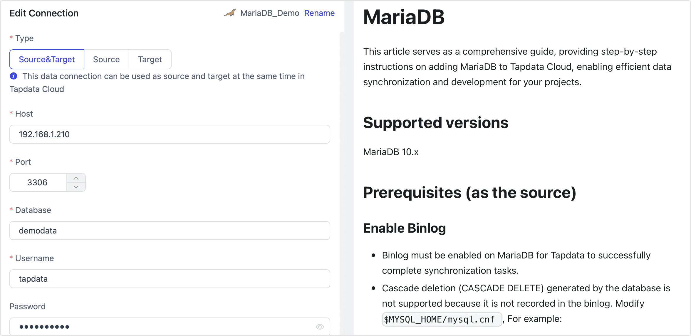

# MariaDB

import Content from '../../reuse-content/_enterprise-and-cloud-features.md';

<Content />

MariaDB is a versatile open-source relational database management system used for high-availability transaction data, analytics, as an embedded server, and is widely supported by various tools and applications. TapData Cloud provides comprehensive support for building data pipelines utilizing MariaDB as both the source and target database.

This article serves as a detailed guide, outlining the steps to seamlessly incorporate a MariaDB database into TapData Cloud, enabling efficient data integration and management within your pipelines.

import Tabs from '@theme/Tabs';
import TabItem from '@theme/TabItem';


## Supported versions

MariaDB 10.x

import Content1 from '../../reuse-content/_beta.md';

<Content1 />

## Preparations

Before establishing the connection, it is essential to complete the necessary preparations outlined in the provided article. These preparations may include authorizing an account and performing other relevant steps to ensure a smooth and secure connection.

* [As a Source Database](#source)
* [As a Target Database](#target)
* [Enabling SSL Connection (Optional)](#ssl)


### <span id="source">As Source Database</span>

To ensure smooth execution of tasks, you need to enable Binlog in the MariaDB database (for incremental data synchronization) and then create a database account for data replication/development tasks.

1. Log into the MariaDB database and execute the following format of command to create an account for data synchronization/development tasks.

   ```sql
   CREATE USER 'username'@'host' IDENTIFIED BY 'password'
   ```

   * **username**: Enter user name.
   * **password**: Enter password.
   * **host**: Enter the host that can be accessed by the account, percent (%) means to allow all host. Example: Create an account named tapdata: `CREATE USER 'tapdata'@'%' IDENTIFIED BY 'Tap@123456';`
   
2. Grant privileges to the newly created account. Below is a simplified example, and it is recommended to set more detailed permissions based on business needs.

```mdx-code-block
<Tabs className="unique-tabs">
<TabItem value="Grant Specific Database Permissions">
```
```sql
GRANT REPLICATION SLAVE, REPLICATION CLIENT ON *.* TO 'username' IDENTIFIED BY 'password';
GRANT SELECT ON database_name.* TO 'username' IDENTIFIED BY 'password';
```
</TabItem>

<TabItem value="Grant All Database Permissions">

```sql
GRANT REPLICATION SLAVE, REPLICATION CLIENT ON *.* TO 'username' IDENTIFIED BY 'password';
GRANT SELECT ON *.* TO 'username' IDENTIFIED BY 'password';
```
</TabItem>
</Tabs>

* **username**: Enter user name.
* **password**: Enter password.
* **host**: Enter the host that can be accessed by the account, percent (%) means to allow all host.

3. To ensure access to incremental data from the MariaDB database, follow the steps below to enable Binlog.

   1. Use the `vim` command to modify the configuration of MariaDB. For instance:

      In the scenario demonstrated in this article, MariaDB is deployed on the Ubuntu operating system, and the configuration file is located at `/etc/mysql/mariadb.cnf`. For more information, see [MariaDB Configuration File Introduction](https://mariadb.com/kb/en/configuring-mariadb-with-option-files/).
   
      ```bash
      [mysqld]
      server-id              = 1
      log_bin                = /var/log/mysql/myriadb-bin
      expire_logs_days       = 10
      max_binlog_size        = 100M
      binlog_format = ROW
      binlog_row_image = FULL
      ```
   
      - **server_id**: Must be unique for each server and replication client in MariaDB, set as an integer greater than 0.
      - **log_bin**: The base name of the binlog file.
      - **expire_logs_days**: The number of days to keep binary log files before automatic deletion.
      - **max_binlog_size**: The maximum size of a single binlog file.
      - **binlog_format**: Set to row, which records which rows were modified.
      - **binlog_row_image**: Set to full, recording data for all columns, whether they changed or not.
   
   2. After modification, execute the following command to restart the MariaDB database. Perform this during off-peak hours to avoid impacting services.
   
      ```bash
      systemctl restart mariadb
      ```
   
   3. (Optional) Log into the MariaDB database and execute the following command to confirm that the configuration has taken effect, i.e., the output shows **format** as **ROW**.
   
      ```sql
      SHOW VARIABLES LIKE 'binlog_format';
      ```
   
      Example output:
   
      ```sql
      +---------------+-------+
      | Variable_name | Value |
      +---------------+-------+
      | binlog_format | ROW   |
      +---------------+-------+
      1 row in set (0.00 sec)
      ```


### <span id="target">As Target Database</span>

1. Log into the MariaDB database and execute the following format of command to create an account for data synchronization/development tasks.

   ```sql
   CREATE USER 'username'@'host' IDENTIFIED BY 'password'
   ```

   * **username**: Enter user name.
   * **password**: Enter password.
   * **host**: Enter the host that can be accessed by the account, percent (%) means to allow all host. Example: Create an account named tapdata: `CREATE USER 'tapdata'@'%' IDENTIFIED BY 'Tap@123456';`

2. Grant privileges to the newly created account.

```mdx-code-block
<Tabs className="unique-tabs">
<TabItem value="Grant Specific Database Permissions">
```
```sql
GRANT SELECT, INSERT, UPDATE, DELETE, ALTER, CREATE, CREATE ROUTINE, CREATE TEMPORARY TABLES, 
DROP ON database_name.* TO 'username';
```
</TabItem>

<TabItem value="Grant All Database Permissions">

```sql
GRANT SELECT, INSERT, UPDATE, DELETE, ALTER, CREATE, CREATE ROUTINE, CREATE TEMPORARY TABLES, 
DROP ON *.* TO 'username';
```
</TabItem>
</Tabs>

* **database_name**: The name of the database to which permissions are granted.
* **username**: Enter user name.


### <span id="ssl">Enabling SSL Connection (Optional)</span>

To further enhance the security of the data link, you can choose to enable SSL (Secure Sockets Layer) encryption for the MariaDB database. This ensures encryption at the transport layer for network connections, enhancing communication data security while maintaining data integrity. The specific steps are as follows:

1. Create SSL certificates and private keys, which can be self-signed or obtained from a certificate authority.

   Next, we will demonstrate how to create a self-signed certificate using OpenSSL. Before proceeding, you can log into the MariaDB database and execute `SHOW GLOBAL VARIABLES LIKE '%ssl%';` to check if SSL/RSA files have been generated and the SSL status.

   1. Log into the device hosting the MariaDB database and execute the following commands to generate a CA certificate. For more information, see [OpenSSL](https://www.openssl.org/docs/man1.1.1/man1/openssl.html).

      ```bash
      # Create and enter the directory where the certificate files will be stored, adjust as needed
      mkdir -p /etc/mysql/ssl&&cd /etc/mysql/ssl
      # Generate the CA certificate
      openssl genrsa 2048 > ca-key.pem
      openssl req -new -x509 -nodes -days 365000 -key ca-key.pem -out ca-cert.pem
      ```

   2. Generate server certificates and keys, which will be used for server-side SSL encryption.

      ```bash
      openssl req -newkey rsa:2048 -days 365000 -nodes -keyout server-key.pem -out server-req.pem
      openssl rsa -in server-key.pem -out server-key.pem
      openssl x509 -req -in server-req.pem -days 365000 -CA ca-cert.pem -CAkey ca-key.pem -set_serial 01 -out server-cert.pem
      ```

   3. Generate client certificates and keys for two-way authentication.

      ```bash
      openssl req -newkey rsa:2048 -days 365000 -nodes -keyout client-key.pem -out client-req.pem
      openssl rsa -in client-key.pem -out client-key.pem
      openssl x509 -req -in client-req.pem -days 365000 -CA ca-cert.pem -CAkey ca-key.pem -set_serial 01 -out client-cert.pem
      ```

   4. Verify the correctness of the keys, returning `OK` if there are no issues.

      ```bash
      openssl verify -CAfile ca-cert.pem server-cert.pem
      openssl verify -CAfile ca-cert.pem client-cert.pem 
      ```

2. Edit the configuration file of MariaDB, adding the following content in the `[mysqld]` section. Replace `filepath` with the path where the CA certificate files are located. Save and exit the editor after making changes.

   In this case, MariaDB is deployed on the Ubuntu operating system, and the configuration file is located at `/etc/mysql/mariadb.cnf`. For more information, see [MariaDB Configuration File Introduction](https://mariadb.com/kb/en/configuring-mariadb-with-option-files/).

   ```bash
   [mysqld]
   # Self-signed CA certificate
   ssl-ca=/etc/mysql/ssl/ca-cert.pem
   # Server certificate file
   ssl-cert=/etc/mysql/ssl/server-cert.pem
   # Server private key file
   ssl-key=/etc/mysql/ssl/server-key.pem
   
   [client]
   # Certificate file required for the client to connect to the server
   ssl-cert=/etc/mysql/ssl/client-cert.pem
   # Private key file required for the client to connect to the server
   ssl-key=/etc/mysql/ssl/client-key.pem
   ```

3. Execute the following command to adjust the permissions of the certificate files.

   ```bash
   chown -R mysql:mysql /etc/mysql/ssl/
   ```

4. Log into the MariaDB database and **choose** to execute the following format of commands to adjust the account for data synchronization/development tasks.

   ```sql
   ALTER USER 'username'@'host' REQUIRE x509; -- Force the client to provide a valid certificate
   ALTER USER 'username'@'host' REQUIRE ssl; -- Do not force the client to provide a valid certificate
   FLUSH PRIVILEGES;
   ```

   * **username**: Enter user name.
   * **host**: Enter the host that can be accessed by the account, percent (%) means to allow all host. 

5. Restart the MariaDB database.

   ```bash
   systemctl restart mariadb
   ```

   


## Connect to MariaDB

1. [Log in to TapData Platform](../../user-guide/log-in.md).

2. In the left navigation panel, click **Connections**.

3. On the right side of the page, click **Create**.

4. In the pop-up dialog, search and select **MariaDB**.

5. On the page that you are redirected to, follow the instructions below to fill in the connection information for MariaDB.

   

    * **Connection Information Settings**

      * **Connection name**: Fill in a unique name that has business significance.
      * **Connection type**: Supports MariaDB as a source or target database.
      * **Host**: The database connection address.
      * **Port**: The service port of database.
      * **Database**: Database name, a connection corresponding to a database, if there are multiple databases, you need to create multiple connections.
      * **username**: The database username.
      * **Password**: The database password.
      * **Connection parameter string**: Additional connection parameters, default empty.

    * **Advanced settings**

      * **Timezone**: By default, TapData Cloud utilizes the time zone used by the database. However, you also have the flexibility to manually specify the time zone based on your business requirements.

        For instance, let's consider a scenario where the source database operates in the default database time zone (+8:00), while the target database has a specified time zone of +0:00. In this case, if the source database stores a timestamp as **2020-01-01 16:00:00**, the same timestamp will be interpreted as **2020-01-01 08:00:00** in the target database due to the time zone conversion.

      * **Contain table**: The default option is **All**, which includes all tables. Alternatively, you can select **Custom** and manually specify the desired tables by separating their names with commas (,).

      * **Exclude tables**: Once the switch is enabled, you have the option to specify tables to be excluded. You can do this by listing the table names separated by commas (,) in case there are multiple tables to be excluded.

      * **Agent settings**: Defaults to **Platform automatic allocation**, you can also manually specify an agent.

      * **Model load time**: If there are less than 10,000 models in the data source, their information will be updated every hour. But if the number of models exceeds 10,000, the refresh will take place daily at the time you have specified.

    * **SSL Settings**: Choose whether to enable SSL connections for the data source, which can further enhance data security. After turn on the switch, you will need to upload CA files, client certificates, client key files, etc. The related files can be obtained as outlined in the [Enabling SSL Connection](#ssl) section.

6. Click **Connection Test**, and when passed, click **Save**.

   :::tip

   If the connection test fails, follow the prompts on the page to fix it.

   :::

