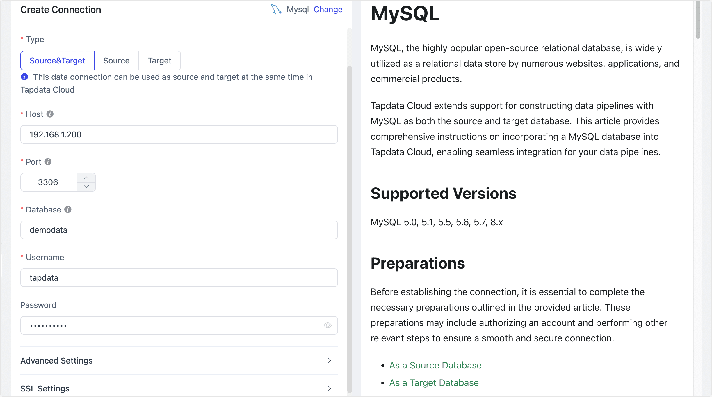

# MySQL

import Content1 from '../../reuse-content/_enterprise-and-cloud-features.md';

<Content1 />

MySQL, the highly popular open-source relational database, is widely utilized as a relational data store by numerous websites, applications, and commercial products.

TapData Cloud extends support for constructing data pipelines with MySQL as both the source and target database. This article provides comprehensive instructions on incorporating a MySQL database into TapData Cloud, enabling seamless integration for your data pipelines.

## Supported Versions

MySQL 5.0, 5.1, 5.5, 5.6, 5.7, 8.x

## Preparations

import Content from '../../reuse-content/_preparations.md';

<Content />

* [Enabling SSL Connection (Optional)](#ssl)

### As a Source Database

To ensure the smooth execution of the task, you need to turn on Binlog for MySQL database (incremental data synchronization can be achieved), and then create a database account for data replication/development tasks.

1. Log in to the MySQL database and execute the following commands to create an account.

import Tabs from '@theme/Tabs';
import TabItem from '@theme/TabItem';

<Tabs className="unique-tabs">
    <TabItem value="mysql5" label="MySQL 5.x" default>
    <pre>CREATE USER 'username'@'host' IDENTIFIED BY 'password';</pre>
   </TabItem>
   <TabItem value="mysql8" label="MySQL 8.x">
    <pre>CREATE USER 'username'@'host' IDENTIFIED WITH mysql_native_password BY 'password';</pre>
   </TabItem>
  </Tabs>

* **username**: Enter user name.
* **password**: Enter password.
* **host**: Enter the host that can be accessed by the account, percent (%) means to allow all host.

Example: Create an account named tapdata.

```sql
CREATE USER 'tapdata'@'%' IDENTIFIED BY 'Tap@123456';
```


2. Grant permissions to the account that we just created, we recommend setting more granular permissions control based on business needs.

<Tabs className="unique-tabs">
    <TabItem value="onedatabase" label="Grant to Specified DB" default>
    <pre>GRANT REPLICATION SLAVE, REPLICATION CLIENT ON *.* TO 'username' IDENTIFIED BY 'password';<br /> 
GRANT SELECT ON database_name.* TO 'username' IDENTIFIED BY 'password';</pre>
   </TabItem>
   <TabItem value="all" label="Grant to All DB">
    <pre>GRANT REPLICATION SLAVE, REPLICATION CLIENT ON *.* TO 'username' IDENTIFIED BY 'password';<br /> 
GRANT SELECT ON *.* TO 'username' IDENTIFIED BY 'password';</pre>
   </TabItem>
  </Tabs>

* **database_name**: Enter database name.
* **username**: Enter user name.
* **password**: Enter password.

3. To ensure that the incremental data of the MySQL database can be read, you need to follow the steps below to turn on Binlog.

   1. Use the `vim` command to modify the configuration in `$MYSQL_HOME/mysql.cnf`, for example:

      ```
      server_id         = 223344
      log_bin           = mysql-bin
      expire_logs_days  = 1
      binlog_format     = row
      binlog_row_image  = full
      ```

      - **server_id**: Set to an integer greater than 0, this value must be unique per server and replication client.
      - **log_bin**: The base name of the Binlog file.
      - **expire_logs_days**: The number of days to keep the binary log file, automatically deleted when it expires.
      - **binlog_format**: Set to row.
      - **binlog_row_image**: Set to full.

   2. After the modification is completed, execute the following command to restart the MySQL server.

      ```bash
      /etc/init.d/mysqld restart
      ```

   3. (Optional) Log in to the MySQL database and execute the following command to confirm that the configuration has taken effect, that is, in the output result, the value of the **binlog_format** is **ROW**.

      ```sql
      SHOW VARIABLES LIKE 'binlog_format';
      ```

      The output is as follows:

      ```sql
      +---------------+-------+
      | Variable_name | Value |
      +---------------+-------+
      | binlog_format | ROW   |
      +---------------+-------+
      1 row in set (0.00 sec)
      ```


### As a Target Database

1. Log in to the MySQL database and execute the following commands to create an account.

<Tabs className="unique-tabs">
    <TabItem value="mysql5" label="MySQL 5.x" default>
    <pre>CREATE USER 'username'@'host' IDENTIFIED BY 'password';</pre>
   </TabItem>
   <TabItem value="mysql8" label="MySQL 8.x">
    <pre>CREATE USER 'username'@'host' IDENTIFIED WITH mysql_native_password BY 'password';</pre>
   </TabItem>
  </Tabs>

* **username**: Enter user name.
* **password**: Enter password.
* **host**: Enter the host that can be accessed by the account, percent (%) means to allow all host.

Example: Create an account named tapdata.

```sql
CREATE USER 'tapdata'@'%' IDENTIFIED BY 'Tap@123456';
```


2. Grant permissions to the account that we just created, we recommend setting more granular permissions control based on business needs.

<Tabs className="unique-tabs">
    <TabItem value="onedatabase" label="Grant to Specified DB" default>
    <pre>GRANT SELECT, INSERT, UPDATE, DELETE, ALTER, CREATE, CREATE ROUTINE, CREATE TEMPORARY TABLES, INDEX, DROP ON database_name.* TO 'username';</pre>
   </TabItem>
   <TabItem value="all" label="Grant to All DB">
    <pre>GRANT SELECT, INSERT, UPDATE, DELETE, ALTER, CREATE, CREATE ROUTINE, CREATE TEMPORARY TABLES, INDEX, DROP ON *.* TO 'username';</pre>
   </TabItem>
  </Tabs>

* **database_name**: Enter database name.
* **username**: Enter user name.


### <span id="ssl">Enabling SSL Connection (Optional)</span>

To further enhance the security of the data connection, you can choose to enable SSL (Secure Sockets Layer) encryption for MySQL databases. This provides encryption at the transport layer for network connections, enhancing the security of communication data while ensuring data integrity. The specific steps are as follows:

1. Log in to the device hosting the MySQL database and run the **mysql_ssl_rsa_setup** program to create SSL/RSA files. You can locate this program using the find command.

   Before performing this step, you can log into the MySQL database and execute `SHOW GLOBAL VARIABLES LIKE '%ssl%';` to check if SSL/RSA files have been generated and the status of SSL.

   ```bash
   /usr/bin/mysql_ssl_rsa_setup
   ```

   :::tip

   * Ensure that **openssl** is installed on your device to run this program. For example, on a CentOS system, you can install it with the command `yum install openssl -y`.
   * Once the command is executed, files such as `ca-key.pem`, `server-key.pem`, and `client-key.pem` will be automatically generated, usually located in the `/var/lib/mysql/` directory. You can download them to your local machine for later use in configuring connections in TapData Cloud.

   :::

2. Use the `vim` command to modify the configuration in `$MYSQL_HOME/mysql.cnf`, enabling forced SSL authentication and specifying the locations of related SSL/RSA files. Save and exit the editor after making changes.

   ```bash
   [mysqld]
   require_secure_transport=ON
   # Self-signed CA certificate
   ssl-ca=/var/lib/mysql/ca.pem
   # Server certificate file
   ssl-cert=/var/lib/mysql/server-cert.pem
   # Server private key file
   ssl-key=/var/lib/mysql/server-key.pem
   [client]
   ssl-mode=REQUIRED
   # Certificate file required for the client to connect to the server
   ssl-cert=/var/lib/mysql/client-cert.pem
   # Private key file required for the client to connect to the server
   ssl-key=/var/lib/mysql/client-key.pem
   ```

3. Log into the MySQL database and **choose** to execute the following format of commands to adjust the account for data synchronization/development tasks.

   ```sql
   ALTER USER 'username'@'host' REQUIRE x509; -- Force the client to provide a valid certificate
   ALTER USER 'username'@'host' REQUIRE ssl; -- Do not force the client to provide a valid certificate
   FLUSH PRIVILEGES;
   ```

   * **username**: The username.
   * **host**: The host allowed for account login, e.g., use the percentage sign (%) to allow any host.

4. Restart the MySQL database.


## Connect to MySQL

1. [Log in to TapData Platform](../../user-guide/log-in.md).

2. In the left navigation panel, click **Connections**.

3. On the right side of the page, click **Create**.

4. In the pop-up dialog, search and select **MySQL**.

5. On the page that you are redirected to, follow the instructions below to fill in the connection information for MySQL.

   

    * **Connection Information Settings**

        * **Connection name**: Fill in a unique name that has business significance.
        * **Connection type**: Supports MySQL as a source or target database.
        * **Host**: The database connection address.
        * **Port**: The service port of database.
        * **Database**: Database name, a connection corresponding to a database, if there are multiple databases, you need to create multiple connections.
        * **username**: The database username.
        * **Password**: The database password.
        * **Connection parameter string**: Additional connection parameters, default empty.

    * **Advanced settings**

        * **Timezone**: By default, TapData Cloud utilizes the time zone used by the database. However, you also have the flexibility to manually specify the time zone based on your business requirements.

          For instance, let's consider a scenario where the source database operates in the default database time zone (+8:00), while the target database has a specified time zone of +0:00. In this case, if the source database stores a timestamp as **2020-01-01 16:00:00**, the same timestamp will be interpreted as **2020-01-01 08:00:00** in the target database due to the time zone conversion.

        * **CDC Log Caching**: [Mining the source database's](../../user-guide/advanced-settings/share-mining.md) incremental logs, this feature allows multiple tasks to share incremental logs from the source database, avoiding redundant reads and thus significantly reducing the load on the source database during incremental synchronization. Upon enabling this feature, an external storage should be selected to store the incremental log.

        * **Contain table**: The default option is **All**, which includes all tables. Alternatively, you can select **Custom** and manually specify the desired tables by separating their names with commas (,).

        * **Exclude tables**: Once the switch is enabled, you have the option to specify tables to be excluded. You can do this by listing the table names separated by commas (,) in case there are multiple tables to be excluded.

        * **Agent settings**: Defaults to **Platform automatic allocation**, you can also manually specify an agent.
        
        * **Model load time**: If there are less than 10,000 models in the data source, their information will be updated every hour. But if the number of models exceeds 10,000, the refresh will take place daily at the time you have specified.
        
    * **SSL Settings**: Choose whether to enable SSL connections for the data source, which can further enhance data security. After turn on the switch, you will need to upload CA files, client certificates, client key files, etc. The related files can be obtained as outlined in the [Enabling SSL Connection](#ssl) section.

6. Click **Connection Test**, and when passed, click **Save**.

   :::tip

   If the connection test fails, follow the prompts on the page to fix it.

   :::


## FAQ

* Q: Can I synchronze data from MySQL replicas?

   A: Yes, in addition to implementing the above settings for MySQL replicas, you also need to:

   1. Execute the following command to check the parameter configuration of the MySQL replicas and ensure that the value of **log_slave_updates** is 1.

      ```sql
      Select @@log_slave_updates
      ```

   2. Execute the command `SHOW SLAVE STATUS` or `SHOW REPLICA STATUS` to check the delay information of the replica.

      Perform data synchronization after repairing according to specific error reporting.

* Q: "Unknown error 1044" appears in the dialog after the connection test.

   A: If the correct permissions have been granted, can be checked and fixed by:

   ```sql
   SELECT host,user,Grant_priv,Super_priv FROM mysql.user where user='username';
   // Check if the value of Grant_priv field is Y, if not, execute the following command.
   UPDATE mysql.user SET Grant_priv='Y' WHERE user='username';
   FLUSH PRIVILEGES;
   ```

## Related Topics

[MySQL to BigQuery Real-Time Sync](../../pipeline-tutorial/mysql-to-bigquery.md)

