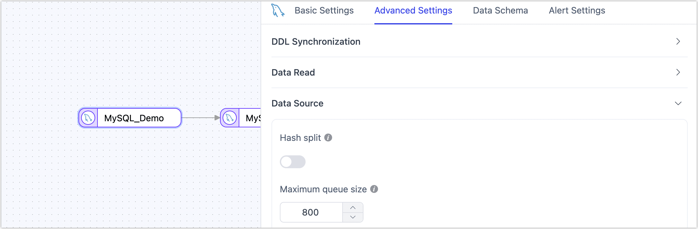

# MySQL
MySQL is the most widely used open-source relational database, serving as the data storage solution for many websites, applications, and commercial products. This document will guide you through adding an MySQL data source in TapData, which can be used as a **source** or **target database** to build real-time data pipelines.

```mdx-code-block
import Tabs from '@theme/Tabs';
import TabItem from '@theme/TabItem';
```

## Supported Versions and Architectures

* **Version**: MySQL 5.0 ~ 9
* **Architecture**: Single-node or primary-replica architecture

## Supported Data Types

| **Category**         | **Data Types**                                               |
| -------------------- | ------------------------------------------------------------ |
| String               | CHAR, VARCHAR, TINYTEXT, TEXT, MEDIUMTEXT, LONGTEXT, BINARY, VARBINARY |
| Integer              | TINYINT, SMALLINT, MEDIUMINT, INT, BIGINT                    |
| Numeric              | DECIMAL, FLOAT, DOUBLE                                       |
| Date/Time            | DATE, TIME, DATETIME, TIMESTAMP, YEAR                        |
| Binary Large Objects | TINYBLOB, BLOB, MEDIUMBLOB, LONGBLOB                         |
| Spatial Data         | POINT, LINESTRING, POLYGON, GEOMETRY, MULTIPOINT, MULTILINESTRING, MULTIPOLYGON, GEOMCOLLECTION |
| Other                | BIT, ENUM, SET, JSON                                         |

## SQL Operations for Sync

- **DML**: INSERT, UPDATE, DELETE

  :::tip

  When MySQL is used as a target database, you can configure write policies through advanced settings in the task node: for insert conflicts, you can choose to update or discard; for update failures, you can choose to insert or just log the errors.

  :::

- **DDL**: ADD COLUMN, CHANGE COLUMN, DROP COLUMN, RENAME COLUMN

In addition, for data synchronization between MySQL databases, extra support is provided for synchronizing **column default values**, **auto-increment columns**, and **foreign key constraints**.

## Considerations

* Incremental data capture is mainly achieved through parsing the binlog, which may consume CPU and disk I/O resources if there are frequent data changes.
* In MySQL 5.6 and earlier versions, preprocess negative values for the **TIME** type (e.g., convert to a legal positive value) to avoid issues with incremental data capture.
* For some data sources based on the MySQL kernel, using schemas or functions not supported by native MySQL might cause errors in incremental data capture. In such cases, please contact [TapData Support](mailto:team@tapdata.io) for assistance.

## Preparation

### As a Source Database

1. Log in to the MySQL database and execute the following commands to create an account.

```mdx-code-block
<Tabs className="unique-tabs">
<TabItem value="MySQL 5.x" default>
```

```sql
CREATE USER 'username'@'host' IDENTIFIED BY 'password';
```

</TabItem>
<TabItem value="MySQL 8.x and above">

```sql
CREATE USER 'username'@'host' IDENTIFIED WITH mysql_native_password BY 'password';
```

</TabItem>
</Tabs>

* **username**: Enter user name.
* **password**: Enter password.
* **host**: Enter the host that can be accessed by the account, percent (%) means to allow all host.

Example: Create an account named `tapdata`:

```sql
CREATE USER 'tapdata'@'%' IDENTIFIED BY 'yourpasswd';
```

2. Grant permissions to the account that we just created, we recommend setting more granular permissions control based on business needs.

```mdx-code-block
<Tabs className="unique-tabs">
<TabItem value="Full Data Synchronization" default>
```

```sql
-- Grant read permissions for the specified database
GRANT SELECT ON database_name.* TO 'username' IDENTIFIED BY 'password';
```

</TabItem>
<TabItem value="Full + Incremental Data Synchronization">

```sql
-- Grant read permissions for the specified database
GRANT SELECT ON database_name.* TO 'username' IDENTIFIED BY 'password';
-- Grant replication permissions
GRANT REPLICATION SLAVE, REPLICATION CLIENT ON *.* TO 'username' IDENTIFIED BY 'password';
```

</TabItem>
</Tabs>

* **database_name**: The name of the database to grant permissions.
* **username**: Enter user name.
* **password**: Enter password.

3. To ensure that the incremental data of the MySQL database can be read, you need to follow the steps below to turn on Binlog.

   1. Use the `vim` command to modify the configuration in `$MYSQL_HOME/mysql.cnf`, for example:

      ```bash
      server_id         = 223344
      log_bin           = mysql-bin
      expire_logs_days  = 1
      binlog_format     = row
      binlog_row_image  = full
      ```

      - **server_id**: Set to an integer greater than 0, this value must be unique per server and replication client.
      - **log_bin**: The base name of the Binlog sequence file.
      - **expire_logs_days**: The number of days to retain binary log files, automatically deleting them upon expiration.
      - **binlog_format**: Set to `row`.
      - **binlog_row_image**: Set to `full`.

   2. After modification, restart the MySQL service with the following command:

      ```bash
      /etc/init.d/mysqld restart
      ```

   3. (Optional) Log in to the MySQL database and execute the following command to confirm that the configuration has taken effect, that is, in the output result, the value of the **binlog_format** is **ROW**.

      ```sql
      SHOW VARIABLES LIKE 'binlog_format';
      ```

      The output is as follows:

      ```sql
      +---------------+-------+
      | Variable_name | Value |
      +---------------+-------+
      | binlog_format | ROW   |
      +---------------+-------+
      1 row in set (0.00 sec)
      ```

### As a Target Database

1. Log in to the MySQL database and execute the following commands to create an account.

```mdx-code-block
<Tabs className="unique-tabs">
<TabItem value="MySQL 5.x" default>
```

```sql
CREATE USER 'username'@'host' IDENTIFIED BY 'password';
```

</TabItem>
<TabItem value="MySQL 8.x and above">

```sql
CREATE USER 'username'@'host' IDENTIFIED WITH mysql_native_password BY 'password';
```

</TabItem>
</Tabs>

* **username**: Enter user name.
* **password**: Enter password.
* **host**: Enter the host that can be accessed by the account, percent (%) means to allow all host.

Example: Create an account named `tapdata`:

```sql
CREATE USER 'tapdata'@'%' IDENTIFIED BY 'yourpasswd';
```

2. Grant permissions to the account that we just created, we recommend setting more granular permissions control based on business needs.

<Tabs className="unique-tabs">
<TabItem value="Grant to Specified Database" default>

```sql
GRANT SELECT, INSERT, UPDATE, DELETE, ALTER, CREATE, CREATE ROUTINE, CREATE TEMPORARY TABLES, DROP ON database_name.* TO 'username';
```

</TabItem>

<TabItem value="Grant to All Databases">

```sql
GRANT SELECT, INSERT, UPDATE, DELETE, ALTER, CREATE, CREATE ROUTINE, CREATE TEMPORARY TABLES, DROP ON *.* TO 'username';
```

</TabItem>
</Tabs>

* **database_name**: The name of the database to grant permissions.
* **username**: Enter user name.

### <span id="ssl">Enable SSL Connection (Optional)</span>

To further enhance the security of the data connection, you can choose to enable SSL (Secure Sockets Layer) encryption for MySQL databases. This provides encryption at the transport layer for network connections, enhancing the security of communication data while ensuring data integrity. The specific steps are as follows:

1. Log in to the device where MySQL is hosted and run the **mysql_ssl_rsa_setup** program to create SSL/RSA files. You can use the `find` command to locate the program.

   Before performing this step, you can log in to the MySQL database and run the `SHOW GLOBAL VARIABLES LIKE '%ssl%';` command to check if SSL/RSA files have been generated and if SSL is enabled.

   ```bash
   /usr/bin/mysql_ssl_rsa_setup
   ```

   :::tip

   * Ensure that the device has **openssl** installed to run this program. For example, on CentOS, you can run `yum install openssl -y` to install it.
   * After executing the command, the files `ca-key.pem`, `server-key.pem`, and `client-key.pem` will be automatically generated, typically located in the `/var/lib/mysql/` directory. You can download these files for use when configuring the connection in TapData.

   :::

2. Use the `vim` command to modify the configuration in `$MYSQL_HOME/mysql.cnf`, enabling forced SSL authentication and specifying the locations of the relevant SSL/RSA files. After modification, save and exit the editor.

   ```bash
   [mysqld]
   require_secure_transport=ON
   # Self-signed CA certificate
   ssl-ca=/var/lib/mysql/ca.pem
   # Server certificate file
   ssl-cert=/var/lib/mysql/server-cert.pem
   # Server private key file
   ssl-key=/var/lib/mysql/server-key.pem
   [client]
   # Enable SSL enforced authentication
   ssl-mode=REQUIRED
   # Certificate file required by the client to connect to the server
   ssl-cert=/var/lib/mysql/client-cert.pem
   # Private key file required by the client to connect to the server
   ssl-key=/var/lib/mysql/client-key.pem
   ```

3. Log in to the MySQL database and **optionally** run the following commands to adjust the account for data synchronization/development tasks.

   ```sql
   ALTER USER 'username'@'host' REQUIRE x509; -- Enforce client to provide valid certificate
   ALTER USER 'username'@'host' REQUIRE ssl; -- Do not enforce client to provide valid certificate
   FLUSH PRIVILEGES;
   ```

   * **username**: The username.
   * **host**: The host allowed to log in with this account, with the percentage symbol (`%`) representing any host.

4. Restart the MySQL database.

## Connect to MySQL

1. Log in to TapData Platform.

2. In the left navigation panel, click **Connections**.

3. On the right side of the page, click **Create**.

4. In the pop-up dialog, search for and select **MySQL**.

5. On the redirected page, fill in the MySQL connection information as described below.

   

    * **Connection Settings**
        * **Name**: Enter a unique name with business significance.
        * **Type**: Support using MySQL as either a source or target database.
        * **Deployment Mode**: Support for single-node and primary-replica architecture. When selecting the primary-replica architecture, provide the primary and replica server addresses and service ports. The primary server information should be entered in the first row.
        * **Server Address**: Database connection address.
        * **Port**: Database service port.
        * **Database**: The database name. Each connection corresponds to one database. If there are multiple databases, create multiple connections.
        * **Username**: The database username.
        * **Password**: The database password.
    * **Advanced Settings**
        * **Connection Parameter String**: Default is `useUnicode=yes&characterEncoding=UTF-8`, indicating that data transmission will use the UTF-8 encoded Unicode character set, which helps avoid character encoding issues.
        * **Timezone**: Default is set to 0 timezone. If configured to another timezone, it will affect fields without timezone information (e.g., `datetime`). Fields with timezone information (e.g., `timestamp`, `date`, and `time`) are not affected.
        * **CDC Log Caching**: Mining the source database's incremental logs. This allows multiple tasks to share the same source database’s incremental log mining process, reducing duplicate reads and minimizing the impact of incremental synchronization on the source database. After enabling this feature, you will need to select an external storage to store the incremental log information.
        * **Contain Table**: The default option is **All**, which includes all tables. Alternatively, you can select **Custom** and manually specify the desired tables by separating their names with commas (,).
        * **Exclude Tables**: Once the switch is enabled, you have the option to specify tables to be excluded. You can do this by listing the table names separated by commas (,) in case there are multiple tables to be excluded.
        * **Agent Settings**: Defaults to **Platform automatic allocation**, you can also manually specify an agent.
        * **Model Load Time**: If there are less than 10,000 models in the data source, their schema will be updated every hour. But if the number of models exceeds 10,000, the refresh will take place daily at the time you have specified.
        * **Enable Heartbeat Table**: When the connection type is source or target, you can enable this switch. TapData will create a `_tapdata_heartbeat_table` heartbeat table in the source database and update it every 10 seconds (requires appropriate permissions) to monitor the health of the data source connection and tasks. The heartbeat task starts automatically after the data replication/development task starts, and you can view the heartbeat task in the data source editing page.
    * **SSL Settings**: Choose whether to enable SSL for the data source connection to enhance data security. After enabling this feature, you need to upload CA files, client certificates, client key files, etc., which were obtained in the [Enable SSL Connection](#ssl) section.

6. Click **Test**, and after passing the test, click **Save**.

   :::tip

   If the connection test fails, please follow the prompts to resolve the issue.

   :::

## Node Advanced Features

When configuring data synchronization/transformation tasks with MySQL as a source node, TapData provides more advanced features to better meet complex business requirements and maximize performance:



* **Hash Split**: When enabled, all table data will be split into multiple partitions based on hash values during the full sync phase, allowing concurrent data reading and significantly improving performance. However, it also increases the database load. The maximum number of partitions can be manually set after enabling this feature.
* **Maximum Queue Size**: Controls the capacity of the incremental data read queue, default is **800** (DML events). If the target database synchronization speed is slow or the individual rows are large, consider reducing this value.

## FAQ

- **Q**: Can I synchronze data from MySQL replicas?

  A: Yes, in addition to implementing the above settings for MySQL replicas, you also need to:

  1. Execute the following command to check the parameter configuration of the MySQL replicas and ensure that the value of **log_slave_updates** is 1.

     ```sql
     Select @@log_slave_updates
     ```

  2. Execute the command `SHOW SLAVE STATUS` or `SHOW REPLICA STATUS` to check the delay information of the replica.

     Perform data synchronization after repairing according to specific error reporting.

- **Q**: "Unknown error 1044" appears in the dialog after the connection test.

  **A**: If the correct permissions have been granted, can be checked and fixed by:

  ```sql
  SELECT host, user, Grant_priv, Super_priv FROM mysql.user WHERE user='username';
  -- Check if the Grant_priv field value is 'Y'
  -- If not, execute the following command:
  UPDATE mysql.user SET Grant_priv='Y' WHERE user='username';
  FLUSH PRIVILEGES;
  ```

  
