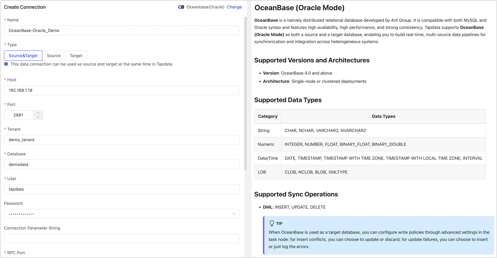
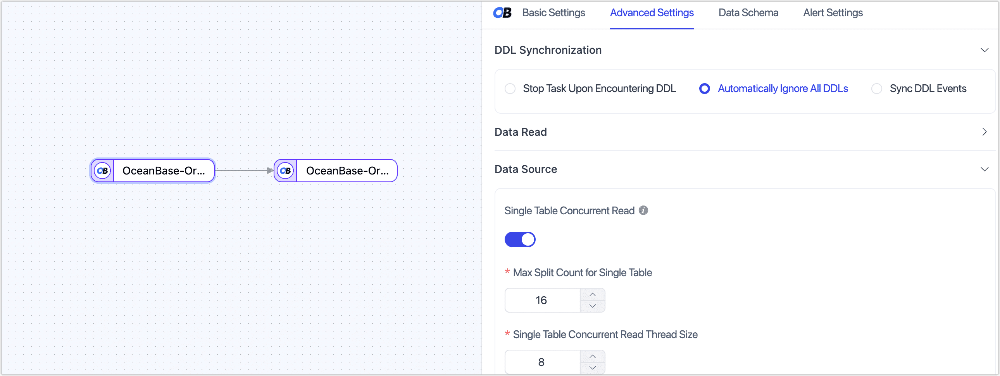

# OceanBase (Oracle Mode)

**OceanBase** is a natively distributed relational database developed by Ant Group. It is compatible with both MySQL and Oracle syntax and features high availability, high performance, and strong consistency. Tapdata supports **OceanBase (Oracle Mode)** as both a source and a target database, enabling you to build real-time, multi-source data pipelines for synchronization and integration across heterogeneous systems.

```mdx-code-block
import Tabs from '@theme/Tabs';
import TabItem from '@theme/TabItem';
```

## Supported Versions and Architectures

- **Version**: OceanBase 4.0 and above
- **Architecture**: Single-node or clustered deployments

## Supported Data Types

| Category  | Data Types                                                   |
| --------- | ------------------------------------------------------------ |
| String    | CHAR, NCHAR, VARCHAR2, NVARCHAR2                             |
| Numeric   | INTEGER, NUMBER, FLOAT, BINARY_FLOAT, BINARY_DOUBLE          |
| Date/Time | DATE, TIMESTAMP, TIMESTAMP WITH TIME ZONE, TIMESTAMP WITH LOCAL TIME ZONE, INTERVAL |
| LOB       | CLOB, NCLOB, BLOB, XMLTYPE                                   |

## Supported Sync Operations

- **DML**: INSERT, UPDATE, DELETE

  :::tip

  When OceanBase is used as a target database, you can configure write policies through advanced settings in the task node: for insert conflicts, you can choose to update or discard; for update failures, you can choose to insert or just log the errors.

  :::

- **DDL**: ADD COLUMN, CHANGE COLUMN, DROP COLUMN, RENAME COLUMN

## Prerequisites

```mdx-code-block
<Tabs className="unique-tabs">
<TabItem value="As Source Database" default>
```

1. Ensure the network where the TapData Agent resides is included in the [tenant allowlist](https://en.oceanbase.com/docs/common-oceanbase-database-10000000001971592) of OceanBase and has internal network access.

2. Log in to the [tenant](https://en.oceanbase.com/docs/common-oceanbase-database-10000000001971107) as `root` and create a user for data synchronization using the following command format:

   ```sql
   CREATE USER 'username' IDENTIFIED BY 'password';
   ```

   - **username**: Enter user name.
   - **password**: Corresponding password.

3. Grant read permissions to the user at the database level. You can also apply more fine-grained [permission controls](https://en.oceanbase.com/docs/common-oceanbase-database-10000000001971491) as needed:

   ```mdx-code-block
      <Tabs className="unique-tabs">
      <TabItem value="Full Data Synchronization">
   ```
      ```sql
      -- Replace 'username' with the actual username
      GRANT
          CREATE SESSION,
          SELECT ANY TABLE,
      TO username;
      ```
      </TabItem>

      <TabItem value="Full + Incremental Data Synchronization">

      ```sql
      -- Replace 'username' with the actual username
      GRANT CREATE SESSION,
            ALTER SESSION,
            EXECUTE_CATALOG_ROLE,
            SELECT ANY DICTIONARY,
            SELECT ANY TRANSACTION,
            SELECT ANY TABLE
      TO username;
      ```
      </TabItem>
      </Tabs>

4. To support incremental data reading from OceanBase, deploy and configure the following components:

   1. [Deploy OBProxy](https://en.oceanbase.com/docs/common-odp-doc-en-10000000002135940): the proxy layer that handles client connections and load balancing.
   
   2. [Deploy oblogproxy](https://en.oceanbase.com/docs/community-obd-en-10000000002136450): the incremental log proxy that connects to OceanBase and fetches CDC logs.
   
   3. Contact the [Tapdata team](https://tapdata.io/) to obtain the `OB-Log-Decoder` installation package.
   
      In Oracle mode, the OceanBase oblogproxy component only supports C/C++ clients. To enable cross-language incremental data consumption, Tapdata provides a dedicated **OB-Log-Decoder** component. This component wraps `liboblog` to parse and output CDC data efficiently and integrates seamlessly with the Tapdata platform.
   
   4. After extracting the `OB-Log-Decoder` package, copy the `obcdcServer` file to the OceanBase installation path:
   
      ```bash
      ${work_directory}/home/admin/oceanbase/bin
      ```
   
   5. Set the dynamic library environment variable:
   
      ```bash
      export LD_LIBRARY_PATH=${work_directory}/home/admin/oceanbase/lib64/
      ```
   
   6. Start the log decoding service, using `-p` to specify the config path:
   
      ```bash
      ./obcdcServer -p ${cdc_conf_path}
      ```
   
      The default CDC user for OceanBase in Oracle mode is: `cluster_user=root@sys`.
   

</TabItem>

<TabItem value="As Target Database">

1. Ensure the network where the TapData Agent resides is included in the [tenant allowlist](https://en.oceanbase.com/docs/common-oceanbase-database-10000000001971592) of OceanBase and has internal network access.

2. Log in to the [tenant](https://en.oceanbase.com/docs/common-oceanbase-database-10000000001971107) as `root` and create a user for data synchronization using the following command format:

   ```sql
   CREATE USER 'username' IDENTIFIED BY 'password';
   ```

   - **username**: Enter user name.
   - **password**: Corresponding password.

3. Grant full permissions to the user at the database level. You can also apply more fine-grained [permission controls](https://en.oceanbase.com/docs/common-oceanbase-database-10000000001971491) as needed:

   ```sql
   -- Replace 'username' with the actual username
   -- Under the user's own Schema
   GRANT 
       CREATE SESSION,
       CREATE ANY TABLE,
       UNLIMITED TABLESPACE
   TO username;
   ```

</TabItem>
</Tabs>

## Connect to OceanBase (Oracle Mode)

1. [Log in to Tapdata platform](../../user-guide/log-in.md).

2. In the left navigation bar, click **Connections**.

3. Click **Create** on the right side of the page.

4. In the pop-up dialog, search for and select **OceanBase (Oracle)**.

5. On the redirected page, fill in the connection details as described below:

   

   - **Connection Settings**
     - **Name**: Enter a business-meaningful name for easy identification and management.
     - **Type**: Select whether OceanBase will act as a source or target.
     - **Host**: Host address of the database, typically the OBProxy deployment address. IP or domain name are both supported.
     - **Port**: Access port for the database. Default is **2881**.
     - **Tenant**: Logical tenant name in OceanBase (similar to an instance in traditional databases).
     - **Database**: Name of the database. One connection corresponds to one database; create multiple connections for multiple databases.
     - **User**: Username within the tenant.
     - **Password**: Password corresponding to the username.
     - **Connection Parameter String**: Optional JDBC parameters (e.g., encoding, SSL); leave empty if not needed.
     - **RPC Port**: OBProxy’s service port to access OceanBase, default is **2882**.
     - **Raw Log Server Host**: Host (IP or domain) where `OB-Log-Decoder` is deployed.
     - **Raw Log Server Port**: Listening port for `OB-Log-Decoder`, default is **8190**.
     - **CDC User**: Account for accessing incremental logs, default is `root@sys`.
     - **CDC Password**: Password for the CDC account.
     - **Time Zone**: Defaults to UTC (UTC+0). If changed, only affects time zone–less types like `TIMESTAMP`. `TIMESTAMP WITH TIME ZONE` and `DATE` are unaffected.
   - **Advanced Settings**
     - **CDC Log Caching**: [Mining the source database's](../../user-guide/advanced-settings/share-mining.md) incremental logs. This allows multiple tasks to share the same source database’s incremental log mining process, reducing duplicate reads and minimizing the impact of incremental synchronization on the source database. After enabling this feature, you will need to select an external storage to store the incremental log information.
     - **Agent Settings**: Defaults to **Platform Automatic Allocation**, you can also manually specify an agent.
     - **Model Load Time**: If there are less than 10,000 models in the data source, their schema will be updated every hour. But if the number of models exceeds 10,000, the refresh will take place daily at the time you have specified.
     - **Enable Heartbeat Table**: When OceanBase is used as **source and target** or **source**, you can enable this option. Tapdata will create a `_tapdata_heartbeat_table` in the source and update it every 10 seconds for health monitoring (requires proper permissions).

6. Click **Test**. If successful, click **Save**.

   If the connection test fails, follow the on-screen instructions to resolve the issue.

## Node Advanced Features

When OceanBase (MySQL Mode) is used as a **source node** in a data replication or transformation task, Tapdata provides built-in advanced options to improve performance and handle complex scenarios.



**Single Table Concurrent Read** (Disabled by default): When enabled, Tapdata splits large tables based on partitions and **launches multiple read threads in parallel**, reading different partitions simultaneously. This significantly improves full read performance. Recommended for large tables and when database resources are sufficient.

- **Max Split Count for Single Table**: Default to 16.
- **Single Table Concurrent Read Thread Size**: Default to 8.

These parameters can be adjusted in the UI.