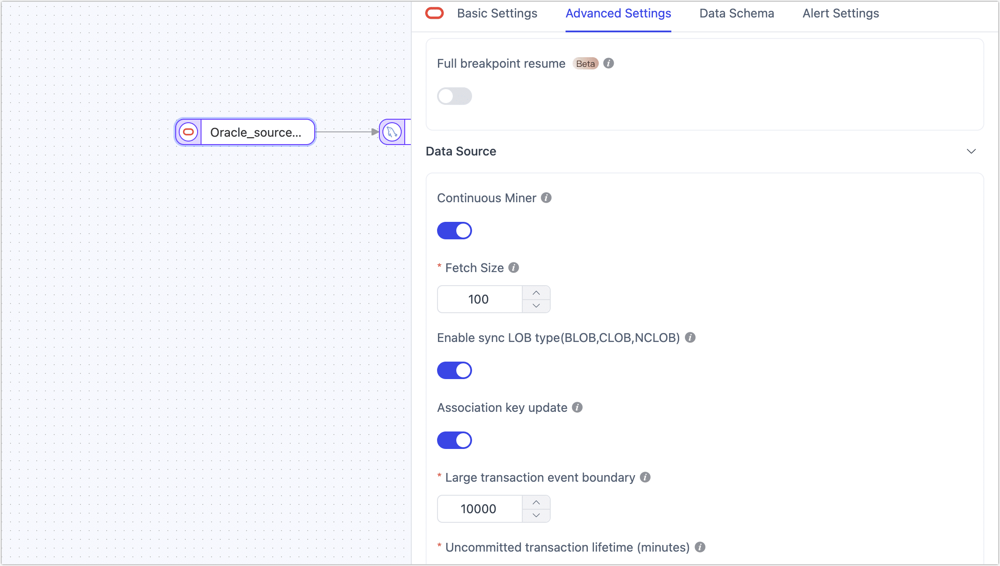

# Oracle

Oracle Database is a powerful and widely used relational database management system (RDBMS) developed by Oracle Corporation. It provides a comprehensive set of features to store, organize and retrieve large amounts of data efficiently. Because of its scalability, reliability, concurrency and performance, it is a popular choice for large-scale enterprise applications. This document will guide you through adding an Oracle data source in TapData, which can be used as a **source** or **target database** to build real-time data pipelines.


```mdx-code-block
import Tabs from '@theme/Tabs';
import TabItem from '@theme/TabItem';
```

## Supported Versions and Architectures

| **Category** | **Description**                                              |
| ------------ | ------------------------------------------------------------ |
| Version      | Oracle 9i, 10g, 11g, 12c, 18c, 19c+                          |
| Architecture | Supports single instance or RAC environments, with connections to the primary node of Data Guard, Active Data Guard, or Automatic Storage Management.<br />When using the **Raw Log** method for incremental data capture, connections to standby nodes are supported to minimize the impact on the source database. |

## Supported Data Types

| Category    | Data Types                                                   |
| ----------- | ------------------------------------------------------------ |
| Strings     | VARCHAR2, CHAR, NVARCHAR2, NCHAR, CLOB, NCLOB                |
| Numbers     | NUMBER, INTEGER, FLOAT, BINARY_FLOAT, BINARY_DOUBLE          |
| Date & Time | DATE, TIMESTAMP, TIMESTAMP WITH TIME ZONE, TIMESTAMP WITH LOCAL TIME ZONE, INTERVAL |
| Others      | BLOB, XMLTYPE                                                |

:::tip

- When using the LogMiner method for incremental data capture, **INTERVAL** and **XMLTYPE** are not supported; when using the Raw Log method, **TIMESTAMP WITH LOCAL TIME ZONE** is not supported.
- When Oracle is used as a target database, **TIMESTAMP WITH LOCAL TIME ZONE** and **INTERVAL** are not supported.

:::

## SQL Operations for Sync

- **DML**: INSERT, UPDATE, DELETE

  :::tip

  When Oracle is used as a target, you can select the write strategy through the advanced settings of the task node: in case of insert conflicts, you can choose to convert to an update or discard the record; in case of update failures, you can choose to convert to an insert or just log the issue.

  :::

- **DDL**: ADD COLUMN, CHANGE COLUMN, DROP COLUMN, RENAME COLUMN

## Incremental Data Capture Methods

To improve data change capture efficiency, TapData supports both the native database log parsing tool (LogMiner) and a custom method that directly parses database incremental log files for more efficient event capture. The two methods are compared <span id="log-miner">below</span>:

| Method               | Features                                                     | Suitable Scenarios                                           |
| -------------------- | ------------------------------------------------------------ | ------------------------------------------------------------ |
| Traditional LogMiner | ● No additional components needed, low maintenance costs<br />● Parses database redo logs to capture incremental changes<br />● Performance is limited by the database, usually with RPS below 20,000<br />● Versions 19C RAC and above may involve slow incremental data capture | Suitable for lightweight deployments<br />Scenarios with low performance requirements |
| TapData Raw Log      | ● Requires additional components, involves some maintenance costs<br />● Directly parses native binary logs, reducing intermediate steps<br />● Higher capture performance, RPS can exceed 60,000<br />● Requires more relaxed account permissions | Suitable for scenarios with frequent data changes and high performance requirements<br />Minimizes impact on the source database during incremental data capture |

:::tip

- When using the traditional LogMiner method, each data synchronization task will start a LogMiner session. For large-scale incremental changes, it can occupy up to one CPU core; for smaller changes, it may use about 0.25 CPU cores. It is recommended to dedicate a separate mining process for large data tasks, while small tasks can use shared mining.
- When using the Raw Log method, due to its high parsing performance, it may occupy CPU, memory, and disk I/O resources during peak times. It is recommended to connect to standby nodes to minimize the impact on business operations.

:::

## Limitations

* When Oracle is used as a source database:
  * Log parsing speed is approximately 10,000 records per second. If incremental events exceed this rate, it may cause delays in data processing. For higher rates, consider using TapData’s [Raw Log method](#log-miner).
  * When using the LogMiner method:
    - Due to [LogMiner limitations](https://docs.oracle.com/en/database/oracle/oracle-database/19/sutil/oracle-logminer-utility.html), the length of table and column names must not exceed 30 characters; otherwise, incremental data changes may not be captured.
    - To avoid issues with virtual columns during the incremental synchronization phase, consider adding a JS node or manually creating the target table structure.
    - During manual mining, if a large number of DML events occur simultaneously with a table DDL change, there is a slight chance that the dictionary cannot parse the original Schema information, leading to anomalies in data capture.
    - When manually mining RAC nodes, there may be some duplicate captures (not out of order), requiring idempotency at the downstream, which affects tables without primary keys.
* When Oracle is used as a target database:
  * In cross-database synchronization, since Oracle does not support empty strings (automatically converted to null), the non-null constraints from the source database are usually not suitable for synchronization to Oracle. Consider ignoring the not-null constraint during task configuration to filter the non-null constraints of string types from the source table.
  * Db2 non-null fields can be assigned with `""`, but when these fields are written to Oracle, Oracle treats them as NULL, causing non-null field write failures.

## Considerations

* To check the setting of the `connect_time` parameter, which automatically disconnects timeout sessions and may lead to real-time synchronization exceptions, you can use the following command.

  ```sql
  SELECT resource_name, limit FROM dba_profiles WHERE profile=( SELECT profile FROM dba_users WHERE username = 'username');
  ```

* To ensure smooth database operation, it is important to allocate sufficient storage space for archive logs and prevent overcrowding, you can use the `ALTER SYSTEM SET DB_RECOVERY_FILE_DEST_SIZE` to set the storage capacity.

* When using the Raw Log method for incremental data capture, forcibly terminating the engine may cause the Raw Log component to slowly restart, as it will need to rescan accumulated fzs files in the directory. If an anomaly occurs, save the relevant parsing logs and provide them to technical support.

* When using the LogMiner method for incremental data capture, please note the following:
  * Capture performance depends on the source machine's performance. In automatic mining or RAC dual-node scenarios, it is generally recommended that PGA memory be greater than 16 GB, with redo logs between 512 MB and 2 GB. For single-node deployments, you can lower the settings accordingly and avoid continuous archiving.
  * For uncommitted transactions, related data will be stored in memory. If the transaction is large (containing many DML events), TapData will persist it to disk to avoid memory overflow. If the task is stopped or the engine is restarted, TapData will record the earliest uncommitted transaction's SCN and restart the task from that SCN. Idempotency at the downstream ensures no data loss. To avoid excessive rollback of incremental information, set the **Uncommitted Transaction Lifespan** during task configuration, allowing TapData to clean up uncommitted transactions beyond this period.
  * To improve capture performance, consider disabling LOB synchronization during task configuration or clarify that primary key/foreign key fields will not be updated in the business.
  * For Oracle versions below 19C, TapData will use an automatic capture mechanism that automatically finds redo logs, making it compatible with various Oracle deployment architectures. To enhance capture performance, adjust the fetchSize in task configuration based on the data change volume.
  * For Oracle version 19C, due to internal Oracle mechanism changes, TapData will use a manual capture mechanism, which involves continuous scanning of online logs supplemented by archived logs. In single-node deployments, this method offers better performance as only one redo log is scanned at a time. In RAC deployments, the SCN numbers grow alternately across threads, causing `{number of nodes X 2}` redo logs to be scanned at most, or `{number of nodes X 1}` redo logs at least. Larger redo logs will decrease the performance of incremental data reads.

    :::tip

    As the capture process cannot detect whether nodes are archiving, it may trigger a mechanism to re-capture some node data to ensure transaction sequence consistency. Therefore, the target database needs to support idempotency constraints.

    :::

## Preparation

### As a Source Database

1. Log in to Oracle Database as a user with DBA privileges.
2. Execute the following command to create a user for data synchronization/transformation tasks.

```mdx-code-block
<Tabs className="unique-tabs">
<TabItem value="Standard Mode">
```

```sql
CREATE USER username IDENTIFIED BY password;
```

</TabItem>

<TabItem value="Multitenant Mode">

```sql
-- Switch to the root container
ALTER SESSION SET CONTAINER=cdb$root;

-- Create user
CREATE USER username IDENTIFIED BY password CONTAINER=all;
```

</TabItem>
</Tabs>

   - **username**: Enter user name. If you're using Oracle in multi-tenant mode, you need to add the prefix `C##` to the username.
   - **password**: Enter user's password.

3. Grant permissions to the account we just created, or you can customize permissions control based on business needs.

```mdx-code-block
<Tabs className="unique-tabs">
<TabItem value="Full Data Synchronization">
```

```sql
-- Replace 'username' with the actual username
-- Under the user's own Schema
GRANT 
    CREATE SESSION
    TO username;

-- Under other Schemas (recommended)
GRANT
    CREATE SESSION,
    SELECT ANY TABLE,
TO username;   
-- If in multitenant mode, specify the container at the end of the command, e.g., CONTAINER=all
```

</TabItem>

<TabItem value="Incremental Data Synchronization">

```sql
-- Replace 'username' with the actual username
GRANT CREATE SESSION,
      ALTER SESSION,
      EXECUTE_CATALOG_ROLE,
      SELECT ANY DICTIONARY,
      SELECT ANY TRANSACTION,
      SELECT ANY TABLE
TO username;
```

:::tip
For Oracle versions 12c and above, you also need to grant `LOGMINING` permission by executing the command `GRANT LOGMINING TO username;`.
:::
</TabItem>
</Tabs>

4. If you need to obtain the data changes from the database for incremental synchronization, you also need to follow the steps below.

   1. Turn on database archive mode (ARCHIVELOG). Since this involves restarting the database, perform this operation during a low-traffic period.

      :::tip

      You can verify if the feature is enabled by executing the `SELECT log_mode FROM v$database` command. If the result returned is **ARCHIVELOG**, it indicates that the feature is turned on, and you can skip this step.

      :::

      ```sql
      -- Shut down the database
      SHUTDOWN IMMEDIATE;
      
      -- Start and mount the database
      STARTUP MOUNT;
      
      -- Enable archiving and open the database
      ALTER DATABASE archivelog;
      ALTER DATABASE OPEN;
      ```

   2. Enable supplemental logging.

      ```sql
      -- Enable primary key supplemental logging at the database level. To disable, replace ADD with DROP.
      ALTER DATABASE ADD SUPPLEMENTAL LOG DATA (PRIMARY KEY) COLUMNS;
      
      -- Enable primary key supplemental logging for a single table. Replace 'Schema' and 'table_name' with the actual names.
      ALTER TABLE Schema.table_name ADD SUPPLEMENTAL LOG DATA (PRIMARY KEY) COLUMNS;
      ```

      :::tip

      If disk space is ample, you can simplify the process by enabling full supplemental logging at the database level with the command `ALTER DATABASE ADD SUPPLEMENTAL LOG DATA (ALL) COLUMNS;`.

      :::

   3. If there are tables without primary keys, choose to enable full supplemental logging (full supplemental logging) for a single table or all tables using the following commands.

      ```sql
      -- Enable for a single table. Replace 'Schema' and 'table_name' with the actual names.
      ALTER TABLE Schema.table_name ADD SUPPLEMENTAL LOG DATA (ALL) COLUMNS;
      
      -- Enable for all tables.
      ALTER DATABASE ADD SUPPLEMENTAL LOG DATA (ALL) COLUMNS;
      ```

      :::tip

      If Oracle is in multitenant mode, it is recommended to enable this for a specific container by executing the command `ALTER SESSION SET CONTAINER=PDB_name;` before running the above commands.

      :::

   4. Apply the changes.

      ```sql
      ALTER SYSTEM SWITCH LOGFILE;
      ```

   5. If Oracle is in multitenant mode, you also need to execute the following command to open pluggable databases.

      ```sql
      ALTER PLUGGABLE DATABASE ALL OPEN;
      ```

### As a Target Database

1. Log in to Oracle Database as a user with DBA privileges.

2. Execute the following commands to create a user for data replication/transformation tasks.

```mdx-code-block
<Tabs className="unique-tabs">
<TabItem value="Standard Mode">
```

```sql
CREATE USER username IDENTIFIED BY password;
```

</TabItem>

<TabItem value="Multitenant Mode">

```sql
-- Switch to the root container
ALTER SESSION SET CONTAINER=cdb$root;

-- Create user
CREATE USER username IDENTIFIED BY password CONTAINER=all;
```

</TabItem>
</Tabs>

   - **username**: Enter user name. If you're using Oracle in multi-tenant mode, you need to add the prefix `C##` to the username.
   - **password**: Enter user's password.

3. Grant permissions to the account we just created, or you can customize permissions control based on business needs.

```mdx-code-block
<Tabs className="unique-tabs">
<TabItem value="Standard Mode">
```

```sql
-- Replace 'username' with the actual username
-- Under the user's own Schema
GRANT 
    CREATE SESSION,
    CREATE ANY TABLE,
    UNLIMITED TABLESPACE
TO username;

-- Under other Schemas
GRANT
    CREATE SESSION,
    CREATE ANY TABLE,
    DELETE ANY TABLE,
    DROP ANY TABLE,
    INSERT ANY TABLE,
    SELECT ANY TABLE,
    UPDATE ANY TABLE,
    ALTER ANY INDEX,
    CREATE ANY INDEX,
    DROP ANY INDEX,
    UNLIMITED TABLESPACE
TO username;
```

</TabItem>

<TabItem value="Multitenant Mode">

```sql
-- Replace 'username' with the actual username
-- Under the user's own Schema
GRANT 
    CREATE SESSION,
    CREATE ANY TABLE,
    UNLIMITED TABLESPACE
TO username;

-- Under other Schemas
GRANT
    CREATE SESSION,
    CREATE ANY TABLE,
    DELETE ANY TABLE,
    DROP ANY TABLE,
    INSERT ANY TABLE,
    SELECT ANY TABLE,
    UPDATE ANY TABLE,
    ALTER ANY INDEX,
    CREATE ANY INDEX,
    DROP ANY INDEX,
    UNLIMITED TABLESPACE
TO  username CONTAINER=all;
```

</TabItem>
</Tabs>


### <span id="ssl">Enable SSL Connection (Optional)</span>

To further enhance the security of your data connection, you can opt to enable SSL (Secure Sockets Layer) encryption for Oracle databases. This process encrypts network connections at the transport layer, thereby improving the security of communication data and ensuring data integrity.

Next, we will demonstrate the specific steps for enabling SSL on Oracle 12c deployed on a Linux platform:

1. Log into the device hosting the Oracle database and execute the following commands to adjust directory permissions and switch to the Oracle user:

   ```bash
   chown oracle:dba /opt/oracle/ -R
   su oracle
   mkdir -p /opt/oracle/wallet
   ```

2. Execute the following commands in sequence to create a directory for storing certificate files and generate a Key file. Replace `{password}` with the password you wish to set:

   ```bash
   $ORACLE_HOME/bin/orapki wallet create -wallet /opt/oracle/wallet -pwd {password} -auto_login
   $ORACLE_HOME/bin/orapki wallet add -wallet /opt/oracle/wallet -pwd {password} -dn "CN=localhost" -keysize 1024 -self_signed -validity 365
   ```

3. Run the following command to generate a jks file. Replace `{password}` with the corresponding password:

   ```bash
   $ORACLE_HOME/bin/orapki wallet pkcs12_to_jks -wallet /opt/oracle/wallet -pwd {password} -jksKeyStoreLoc /opt/oracle/wallet/oracle12c_ks.jks -jksKeyStorepwd {password} -jksTrustStoreLoc /opt/oracle/wallet/oracle12c_ts.jks -jksTrustStorepwd {password}
   ```

   To convert pem files, you can execute the following command:

   ```bash
   cd /opt/oracle/wallet && openssl pkcs12 -clcerts -nokeys -out oracle_cert.pem -in ewallet.p12
   ```

4. Create the relevant configuration files to complete the SSL setup:

   ```bash
   # Adjust the directory based on your environment
   cd /u01/app/oracle/product/12.1.0/xe/network/admin
   touch listener.ora
   touch sqlnet.ora
   touch tnsnames.ora
   ```

   Add the following content to the configuration files:

```mdx-code-block
<Tabs className="unique-tabs">
<TabItem value="listener.ora">
```

```bash
# listener.ora

SSL_CLIENT_AUTHENTICATION = FALSE

WALLET_LOCATION =
  (SOURCE =
    (METHOD = FILE)
    (METHOD_DATA =
      (DIRECTORY = /opt/oracle/wallet)
    )
  )

LISTENER =
(DESCRIPTION_LIST =
  (DESCRIPTION =
    (ADDRESS = (PROTOCOL = IPC)(KEY = EXTPROC1))
    (ADDRESS = (PROTOCOL = TCP)(HOST = 0.0.0.0)(PORT = 1521))
  )
  (DESCRIPTION =
     (ADDRESS = (PROTOCOL = TCPS)(HOST = 0.0.0.0)(PORT = 2484))
   )
)

DEDICATED_THROUGH_BROKER_LISTENER=ON
DIAG_ADR_ENABLED = off
```

</TabItem>

<TabItem value="sqlnet.ora">

```bash
# sqlnet.ora

WALLET_LOCATION =
   (SOURCE =
     (METHOD = FILE)
     (METHOD_DATA =
       (DIRECTORY = /opt/oracle/wallet)
     )
   )

SQLNET.AUTHENTICATION_SERVICES = (TCPS,NTS,BEQ)
SSL_CLIENT_AUTHENTICATION = FALSE
SSL_CIPHER_SUITES = (SSL_RSA_WITH_AES_256_CBC_SHA, SSL_RSA_WITH_3DES_EDE_CBC_SHA)
```

</TabItem>

<TabItem value="tnsnames.ora">

```bash
# tnsnames.ora

SSL=
(DESCRIPTION =
  (ADDRESS = (PROTOCOL = TCPS)(HOST = 0.0.0.0)(PORT = 2484))
  (CONNECT_DATA =
    (SERVER = DEDICATED)
    (SERVICE_NAME = XE)
  )
)

XE=
(DESCRIPTION =
  (ADDRESS = (PROTOCOL = TCP)(HOST = 0.0.0.0)(PORT = 1521))
  (CONNECT_DATA =
    (SERVER = DEDICATED)
    (SERVICE_NAME = XE)
  )
)
```

</TabItem>
</Tabs>

5. During off-peak hours, execute the following commands in sequence to restart Oracle services:

   ```bash
   $ORACLE_HOME/bin/lsnrctl stop
   $ORACLE_HOME/bin/lsnrctl start
   $ORACLE_HOME/bin/sqlplus / as sysdba
   shutdown
   startup
   ```
   
6. Verify that Oracle can be logged in via SSL, for example, `$ORACLE_HOME/bin/sqlplus username/password@SSL`. 


## Connect to Oracle

1. Log in to TapData Platform.

2. In the left navigation panel, click **Connections**.

3. On the right side of the page, click **Create**.

4. In the pop-up dialog, select **Oracle**.

5. On the page that you are redirected to, follow the instructions below to fill in the connection information for Oracle.

   

   * **Connection Information Settings**
      * **Name**: Fill in a unique name that has business significance.
      * **Type**: Supports Oracle as a source or target database.
      * **Connection Mode**: Choose to connect through SID or Service Name.
      * **DB Address**: The database connection address.
      * **Port**: The service port of database.
      * **SID**/**Service name**: Fill in the SID or Service Name information.
      * **Schema**: The name of the Schema. One connection corresponds to one Schema. To connect to multiple Schemas, create separate data connections.
      * **User**: The database account.
      * **Password**: The database password.
      * **Log plugin name**: Choose based on your business needs, with the default being **logMiner**. For more information, see [Incremental Log Retrieval Methods](#log-miner).
   * **Advanced <span id="advanced">Settings</span>**
      * **Connection Parameter String**: additional connection parameters, default empty.
      * **Load Table Comment**:  Choose whether to load table comment information (default is off) to help quickly identify the business significance of tables. Note that loading a large number of comments may affect model loading efficiency.
      * **Multi-tenant**: If Oracle is in multitenant mode, enable this option and enter the PDB information.
      * **Use SSL**: Select whether to enable SSL connection for the data source to enhance data security. After enabling this feature, you will need to upload SSL certificate files and enter the certificate password. The relevant files can be obtained from [Enabling SSL Connection](#ssl).
      * **Timezone for datetime**: Default is set to UTC (0 timezone). If changed to another timezone, fields without timezone (such as TIMESTAMP) will be affected, while fields with timezone (such as TIMESTAMP WITH TIME ZONE) and DATE types will remain unaffected.
      * **Socket Read Timeout**: Set this parameter to avoid zombie connections that may occur due to unexpected situations (e.g., socket interaction timeout) when LogMiner automatically mines incremental changes. The default value of 0 means no timeout is set.
      * **CDC Log Caching**: Mining the source database's incremental logs. This allows multiple tasks to share the same source database’s incremental log mining process, reducing duplicate reads and minimizing the impact of incremental synchronization on the source database. After enabling this feature, you will need to select an external storage to store the incremental log information.
      * **Contain table**: The default option is **All**, which includes all tables. Alternatively, you can select **Custom** and manually specify the desired tables by separating their names with commas (,).
      * **Exclude tables**: Once the switch is enabled, you have the option to specify tables to be excluded. You can do this by listing the table names separated by commas (,) in case there are multiple tables to be excluded.
      * **Agent settings**: Defaults to **Platform automatic allocation**, you can also manually specify an agent.
      * **Model load time**: If there are less than 10,000 models in the data source, their schema will be updated every hour. But if the number of models exceeds 10,000, the refresh will take place daily at the time you have specified.

6. Click **Test**, and when passed, click **Save**.

   :::tip

   If the connection test fails, follow the prompts on the page to fix it.

   :::


## Advanced Node Features

When configuring data synchronization or transformation tasks, using Oracle as a source or target node, TapData provides advanced features to better meet complex business requirements and maximize performance. You can configure these features based on your business needs:



```mdx-code-block
<Tabs className="unique-tabs">
<TabItem value="Oracle as Source Node">
```

| **Configuration**                | **Description**                                              |
| -------------------------------- | ------------------------------------------------------------ |
| Full Breakpoint Resume           | In large data migration scenarios (over 100 million records), TapData's full sync with resume function allows data to be split and migrated in fragments, effectively preventing data loss or task failure due to interruptions, improving reliability and efficiency. |
| Continuous Miner                 | Choose whether to enable automatic mining: when enabled, Oracle log files are automatically loaded, and the processing of encoding dictionaries is more stable. When disabled, logs must be manually loaded to handle file switching due to archiving, with slightly better performance than automatic mining under optimal configuration.<br />Note that versions 19 and above are no longer supported by Oracle for this feature. |
| Fetch Size                       | When **Continuous Miner** is enabled, LogMiner accumulates a certain amount of data (including DML, COMMIT, and ROLLBACK events), defaulting to 100 entries before being available for downstream reading. Adjust this setting based on the frequency of data changes: setting it too large may delay the final few events if changes are infrequent, while setting it too small could affect performance if changes are frequent. |
| Enable Sync LOB Type             | Choose whether to sync large object types (e.g., BLOB, CLOB, NCLOB). The default is enabled. Currently, the default sync method is reverse lookup. Disabling this can improve performance but may result in unreliable LOB type parsing. |
| Association Key Update           | If there are no scenarios in the business where physical primary key values are updated, you can disable this option to improve the parsing performance of UPDATE events. |
| Large Transaction Event Boundary | When using LogMiner to obtain incremental data, this setting determines the threshold for entering large transaction logic, defaulting to 10,000 DML events. Setting this too high may increase memory pressure and risk OOM, while setting it too low may frequently rely on disk caching, affecting performance. It is recommended to avoid bulk data operations involving tens of millions of records in the business, such as `insert into select` or bulk `update`. |
| Uncommitted Transaction Lifetime | To avoid data loss when restarting tasks, TapData retains long-uncommitted transactions in the task cache and starts mining from the earliest uncommitted transaction upon restart. To ensure collection performance, you can control the retention time of uncommitted transactions with this parameter (default is 702 minutes). Transactions exceeding this duration will be automatically cleared. |
| Hash Split                       | When enabled, all table data will be split into multiple partitions based on hash values during the full sync phase, allowing concurrent data reading and significantly improving performance. However, it also increases the database load. The maximum number of partitions can be manually set after enabling this feature. |
| Enable Fzs Compression           | When using the raw log method, the raw log component is usually deployed at the database layer and is on a different machine from the TapData service. Enabling compression can effectively reduce the performance bottleneck caused by network transmission but consumes some CPU resources. The default is off. |
| Fzs Socket Timeout               | Set this parameter to avoid non-responsiveness issues caused by unexpected situations (such as socket interaction timeout) in the raw log component. The default value is 10 seconds. |

</TabItem>

<TabItem value="Oracle as Target Node">

| **Configuration** | **Description**                                              |
| ----------------- | ------------------------------------------------------------ |
| Ignore NotNull    | Default is enabled, used to remove non-null constraints from string-type fields in the Oracle database. This prevents data synchronization errors in heterogeneous database synchronization scenarios, where Oracle treats empty strings as null. If there are no empty strings in your business data, you may choose to disable this option. |

</TabItem>
</Tabs>

## Performance Testing

### Test Environment

- **Oracle Environment**: **ecs.ebmhfc6.20xlarge** instance, equipped with 80 CPU cores, 192 GB RAM, and 500GB ESSD storage.
- **Table Structure**: The test table contains 53 fields, including 30 random string fields of length 8, 21 random float fields, 1 primary key field, 1 title field, and 1 date field.

### Test Results

The performance tests covered both full and incremental data read/write operations. The results are as follows, which are indicative of this specific environment and not the performance limits of TapData.

| **Category**                     | **Records Processed Per Second (RPS)** | **Remarks**                                    |
| -------------------------------- | -------------------------------------- | ---------------------------------------------- |
| Full Data Write                  | 240,000                                | None                                           |
| Incremental Data Write           | 12,000                                 | The ratio of INSERT, UPDATE, DELETE was 1:1:1  |
| Full Data Read                   | 300,000                                | None                                           |
| Incremental Data Read (LogMiner) | 20,000                                 | Average incremental delay is around 3 seconds  |
| Incremental Data Read (Raw Logs) | 62,000                                 | Average incremental delay is around 10 seconds |

## FAQs

- **Q: Does Oracle support partition tables for incremental sync?**

  **A:** Incremental events from partitioned tables can be parsed, but the DDL changes for adding partitions are not currently supported.

- **Q: Why does the connection limit exceed when multiple sync tasks are started on Oracle?**

  **A:** Check if the Oracle version is 11.2.0.4. This issue is an Oracle bug (ID 19587324), where LogMiner starts too many parallel query services to collect statistics. You can resolve it by applying a patch or switching to the raw log method.

- **Q: Why is the incremental data sync delay significant when using the LogMiner method?**

  **A:** Ensure that automatic mining is enabled. The log buffer size might be set too large, which could cause delays if the actual incremental data volume is small.

- **Q: Why does the QPS drop significantly for some tables during Oracle target writes?**

  **A:** The table may lack a primary key. It is recommended to configure update conditions (business logic primary key), as performance can be severely affected if the table has many fields.

- **Q: Why is there garbled data in the parsed raw logs?**

  **A:** The system language environment variable for the raw log component must match the database language. Use `select userenv('language') from dual;` to check the database language, and then run the following commands to modify the environment variables on the raw log machine:

  ```sql
   # Modify system variables, replacing with the correct language configuration
   vi ~/.bash_profile
   export NLS_LANG={database language query result}
   
   # Apply the system variable changes
   source ~/.bash_profile
  ```

- **Q: Why do errors increase with retry attempts as the incremental QPS scales up under raw log parsing?**

  **A:** Check the configuration of the raw logs, particularly the `param_proc_max_mem` parameter in the conf/export.conf file. It is recommended to set it to 8192.


