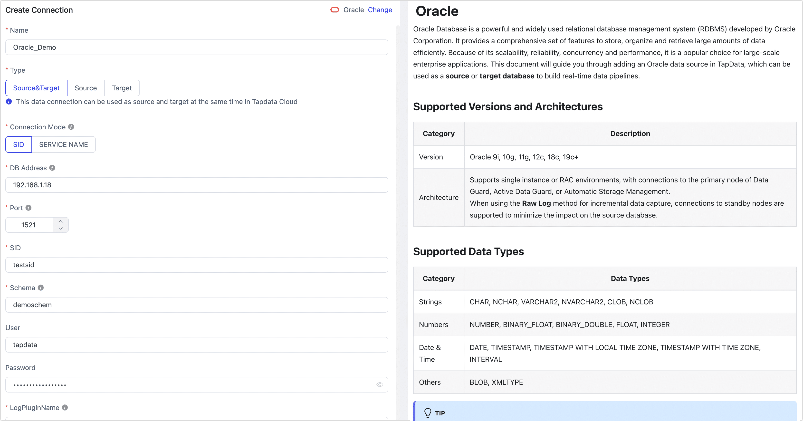

# Oracle

import Content1 from '../../reuse-content/_enterprise-and-cloud-features.md';

<Content1 />

TapData Cloud provides support for building data pipelines using Oracle Database as both the source and target database. Oracle Database, developed and marketed by Oracle Corporation, is a versatile and comprehensive multi-model database management system.

This article serves as a guide, outlining the steps to add an Oracle database to TapData Cloud, enabling seamless integration for your data pipelines.


```mdx-code-block
import Tabs from '@theme/Tabs';
import TabItem from '@theme/TabItem';
```


## Supported Versions

Oracle 9i, 10g, 11g, 12c, 19c

## Precautions
* To check the setting of the connect_time parameter, which automatically disconnects timeout sessions and may lead to real-time synchronization exceptions, you can use the following command.

   ```sql
   SELECT resource_name, limit FROM dba_profiles WHERE profile=( SELECT profile FROM dba_users WHERE username = 'username');
   ```

* To ensure smooth database operation, it is important to allocate sufficient storage space for archive logs and prevent overcrowding, you can use the `ALTER SYSTEM SET DB_RECOVERY_FILE_DEST_SIZE` to set the storage capacity.

## Limitations

* When Oracle as a source database:
   * If the incremental event exceeds a rate of 10,000 queries per second, it could lead to a delay in data processing due to the current log parsing speed.
   * At this time, the raw log function cannot be used on RAC-ASM deployment architectures. Additionally, it is not possible to retrieve raw logs from non-master nodes of the DG architecture.
* When Oracle as a target database:
   * If you assign a non-empty value of Db2 as "", it may fail to write when transferred to Oracle , as Oracle considers it to be null.

## Preparations

import Content from '../../reuse-content/_preparations.md';

<Content />


### As a Source Database

1. Log in to the Oracle database using the DBA role.

2. Execute the following command to create a user for data synchronization/development tasks.

```mdx-code-block
<Tabs className="unique-tabs">
<TabItem value="Oracle Standard Mode">
```
```sql
CREATE USER username IDENTIFIED BY password;
```
</TabItem>

<TabItem value="Oracle Multi-tenant Mode">

```sql
-- Switch to the root container
ALTER SESSION SET CONTAINER=cdb$root;

-- Create a user
CREATE USER username IDENTIFIED BY password CONTAINER=all;
```
</TabItem>
</Tabs>

- **username**: Enter user name. If you're using Oracle in multi-tenant mode, you need to add the prefix `C##` to the username.
- **password**: Enter user's password.


3. Grant permissions to the account we just created, or you can customize permissions control based on business needs.

```mdx-code-block
<Tabs className="unique-tabs">
<TabItem value="Read Full Data Only">
```
```sql
-- Replace the username with the actual username
GRANT CREATE SESSION, SELECT ANY TABLE TO username;
```
</TabItem>

<TabItem value="Read Full Data and Incremental Data">

```sql
-- Replace the username with the actual username
GRANT CREATE SESSION,
      ALTER SESSION,
      EXECUTE_CATALOG_ROLE,
      SELECT ANY DICTIONARY,
      SELECT ANY TRANSACTION,
      SELECT ANY TABLE
TO username;
```
:::tip
When the Oracle version is 12c or above, you also need to execute the `GRANT LOGMINING TO username;` command.
:::
</TabItem>
</Tabs>


4. If you need to obtain the data changes from the database for incremental synchronization, you also need to follow the steps below.

   1. Turn on database archive mode (ARCHIVELOG).

      :::tip

      You can verify if the feature is enabled by executing the `SELECT log_mode FROM v$database` command. If the result returned is **ARCHIVELOG**, it indicates that the feature is turned on, and you can skip this step.

      :::

      1. Execute the following command to close the database.It is advisable to perform this operation during off-peak times to minimize any impact on data reading and writing.

         ```sql
         SHUTDOWN IMMEDIATE;
         ```

      2. Execute the following command to start and mount the database.

         ```sql
         STARTUP MOUNT;
         ```

      3. Execute the following command to open archive and database.

         ```sql
         ALTER DATABASE archivelog;
         ALTER DATABASE OPEN;
         ```

   2. Turn on Supplemental Logging.
      ```sql
      ALTER DATABASE ADD SUPPLEMENTAL LOG DATA;
      ```

   3. Select the following command to turn on the identification key log for a single table or all tables.

      ```sql
      -- Turn on for single table, you need to replace the Schema_Name and Table_Name with yours
      ALTER TABLE Schema_Name.Table_Name ADD SUPPLEMENTAL LOG DATA (PRIMARY KEY) COLUMNS;

      -- Turn on for all tables
      ALTER DATABASE ADD SUPPLEMENTAL LOG DATA (PRIMARY KEY) COLUMNS;
      ```

      :::tip

      When using Oracle in multi-tenant mode, it's recommended to first open the designated container by running the `ALTER SESSION SET CONTAINER=PDB Name;` command before executing any other commands in order to properly apply changes to the container.

      :::

   4. Select the following command to turn on full supplemental logging for a single table or all tables.

      ```sql
      -- Turn on for single table, you need to replace the Schema_Name and Table_Name with yours
      ALTER TABLE Schema_Name.Table_Name ADD SUPPLEMENTAL LOG DATA (ALL) COLUMNS;

      -- Turn on for all tables
      ALTER DATABASE ADD SUPPLEMENTAL LOG DATA (ALL) COLUMNS;
      ```

   5. Submit changes

      ```sql
      ALTER SYSTEM SWITCH LOGFILE;
      ```

   6. When using Oracle in multi-tenant mode, you also need to execute the following command to open the pluggable database.

      ```sql
      ALTER PLUGGABLE DATABASE ALL OPEN;
      ```


### As a Target Database

1. Log in to the Oracle database using the DBA role.

2. Execute the following command to create a user for data synchronization/development tasks.

```mdx-code-block
<Tabs className="unique-tabs">
<TabItem value="Oracle Standard Mode">
```
```sql
CREATE USER username IDENTIFIED BY password;
```
</TabItem>

<TabItem value="Oracle Multi-tenant Mode">

```sql
-- Switch to root container
ALTER SESSION SET CONTAINER=cdb$root;

-- Create a user
CREATE USER username IDENTIFIED BY password CONTAINER=all;
```
</TabItem>
</Tabs>

- **username**: Enter user name. If you're using Oracle in multi-tenant mode, you need to add the prefix `C##` to the username.
- **password**: Enter user's password.


3. Grant permissions to the account we just created, or you can customize permissions control based on business needs.

```mdx-code-block
<Tabs className="unique-tabs">
<TabItem value="Oracle Standard Mode">
```
```sql
-- Replace the username with the actual username
GRANT CREATE SESSION,
      CREATE ANY TABLE,
      DELETE ANY TABLE,
      DROP ANY TABLE,
      INSERT ANY TABLE,
      SELECT ANY TABLE,
      UPDATE ANY TABLE,
      ALTER ANY INDEX,
      CREATE ANY INDEX,
      DROP ANY INDEX,
      UNLIMITED TABLESPACE
TO  username;
```
</TabItem>

<TabItem value="Oracle Multi-tenant Mode">

```sql
-- Replace the username with the actual username
GRANT CREATE SESSION,
      CREATE ANY TABLE,
      DELETE ANY TABLE,
      DROP ANY TABLE,
      INSERT ANY TABLE,
      SELECT ANY TABLE,
      UPDATE ANY TABLE,
      ALTER ANY INDEX,
      CREATE ANY INDEX,
      DROP ANY INDEX,
      UNLIMITED TABLESPACE
TO  username CONTAINER=all;
```
</TabItem>
</Tabs>

### <span id="ssl">Enabling SSL Connection (Optional)</span>

To further enhance the security of your data connection, you can opt to enable SSL (Secure Sockets Layer) encryption for Oracle databases. This process encrypts network connections at the transport layer, thereby improving the security of communication data and ensuring data integrity.

Next, we will demonstrate the specific steps for enabling SSL on Oracle 12c deployed on a Linux platform:

1. Log into the device hosting the Oracle database and execute the following commands to adjust directory permissions and switch to the Oracle user:

   ```bash
   chown oracle:dba /opt/oracle/ -R
   su oracle
   mkdir -p /opt/oracle/wallet
   ```

2. Execute the following commands in sequence to create a directory for storing certificate files and generate a Key file. Replace `{password}` with the password you wish to set:

   ```bash
   $ORACLE_HOME/bin/orapki wallet create -wallet /opt/oracle/wallet -pwd {password} -auto_login
   $ORACLE_HOME/bin/orapki wallet add -wallet /opt/oracle/wallet -pwd {password} -dn "CN=localhost" -keysize 1024 -self_signed -validity 365
   ```

3. Run the following command to generate a jks file. Replace `{password}` with the corresponding password:

   ```bash
   $ORACLE_HOME/bin/orapki wallet pkcs12_to_jks -wallet /opt/oracle/wallet -pwd {password} -jksKeyStoreLoc /opt/oracle/wallet/oracle12c_ks.jks -jksKeyStorepwd {password} -jksTrustStoreLoc /opt/oracle/wallet/oracle12c_ts.jks -jksTrustStorepwd {password}
   ```

   To convert pem files, you can execute the following command:

   ```bash
   cd /opt/oracle/wallet && openssl pkcs12 -clcerts -nokeys -out oracle_cert.pem -in ewallet.p12
   ```

4. Create the relevant configuration files to complete the SSL setup:

   ```bash
   # Adjust the directory based on your environment
   cd /u01/app/oracle/product/12.1.0/xe/network/admin
   touch listener.ora
   touch sqlnet.ora
   touch tnsnames.ora
   ```

   Add the following content to the configuration files:

```mdx-code-block
<Tabs className="unique-tabs">
<TabItem value="listener.ora">
```

```bash
# listener.ora

SSL_CLIENT_AUTHENTICATION = FALSE

WALLET_LOCATION =
  (SOURCE =
    (METHOD = FILE)
    (METHOD_DATA =
      (DIRECTORY = /opt/oracle/wallet)
    )
  )

LISTENER =
(DESCRIPTION_LIST =
  (DESCRIPTION =
    (ADDRESS = (PROTOCOL = IPC)(KEY = EXTPROC1))
    (ADDRESS = (PROTOCOL = TCP)(HOST = 0.0.0.0)(PORT = 1521))
  )
  (DESCRIPTION =
     (ADDRESS = (PROTOCOL = TCPS)(HOST = 0.0.0.0)(PORT = 2484))
   )
)

DEDICATED_THROUGH_BROKER_LISTENER=ON
DIAG_ADR_ENABLED = off
```

</TabItem>

<TabItem value="sqlnet.ora">

```bash
# sqlnet.ora

WALLET_LOCATION =
   (SOURCE =
     (METHOD = FILE)
     (METHOD_DATA =
       (DIRECTORY = /opt/oracle/wallet)
     )
   )

SQLNET.AUTHENTICATION_SERVICES = (TCPS,NTS,BEQ)
SSL_CLIENT_AUTHENTICATION = FALSE
SSL_CIPHER_SUITES = (SSL_RSA_WITH_AES_256_CBC_SHA, SSL_RSA_WITH_3DES_EDE_CBC_SHA)
```

</TabItem>

<TabItem value="tnsnames.ora">

```bash
# tnsnames.ora

SSL=
(DESCRIPTION =
  (ADDRESS = (PROTOCOL = TCPS)(HOST = 0.0.0.0)(PORT = 2484))
  (CONNECT_DATA =
    (SERVER = DEDICATED)
    (SERVICE_NAME = XE)
  )
)

XE=
(DESCRIPTION =
  (ADDRESS = (PROTOCOL = TCP)(HOST = 0.0.0.0)(PORT = 1521))
  (CONNECT_DATA =
    (SERVER = DEDICATED)
    (SERVICE_NAME = XE)
  )
)
```

</TabItem>
</Tabs>

5. During off-peak hours, execute the following commands in sequence to restart Oracle services:

   ```bash
   $ORACLE_HOME/bin/lsnrctl stop
   $ORACLE_HOME/bin/lsnrctl start
   $ORACLE_HOME/bin/sqlplus / as sysdba
   shutdown
   startup
   ```
   
6. Verify that Oracle can be logged in via SSL, for example, `$ORACLE_HOME/bin/sqlplus username/password@SSL`. 


## Connect to Oracle

1. [Log in to TapData Platform](../../user-guide/log-in.md).

2. In the left navigation panel, click **Connections**.

3. On the right side of the page, click **Create connection**.

4. In the pop-up dialog, select **Oracle**.

5. On the page that you are redirected to, follow the instructions below to fill in the connection information for Oracle.

   

   * Connection Information Settings
      * **Connection name**: Fill in a unique name that has business significance.
      * **Connection type**: Supports Oracle as a source or target database.
      * **Connection mode**: Choose to connect through SID or Service Name.
      * **DB Address**: The database connection address.
      * **Port**: The service port of database.
      * **SID**/**Service name**: Fill in the SID or Service Name information.
      * **Schema**: Schema name, a connection corresponding to a Schema, if you need to connect multiple Schema, you need to create multiple connections.
      * **Connection Parameter String**: additional connection parameters, default empty.
      * **User**: The database account.
      * **Password**: The database password.
      * **Log plugin name**: Keep default (**logMiner**).
   * Advanced <span id="advanced">settings</span>
      * **Load Table Comment**:  Choose whether to load table comment information to help quickly identify the business significance of the tables.
      * **Multi-tenant**: If Oracle is a multi-tenant mode, you need to turn on the switch and fill in the PDB information.
      * **Use SSL**: Select whether to enable SSL connection for the data source to enhance data security. After enabling this feature, you will need to upload SSL certificate files and enter the certificate password. The relevant files can be obtained from [Enabling SSL Connection](#ssl).
      * **Timezone for datetime**: Defaults to the time zone used by the database, which you can also manually specify according to your business needs.
      * **Socket Read Timeout**: Setting this parameter can prevent indefinitely waiting for the database to return results in special cases, thus avoiding zombie connections. The unit is minutes, and it is generally not necessary to set this; the default value of 0 means no setting is applied.
      * **CDC Log Caching**: [Mining the source database's](../../user-guide/advanced-settings/share-mining.md) incremental logs, this feature allows multiple tasks to share incremental logs from the source database, avoiding redundant reads and thus significantly reducing the load on the source database during incremental synchronization. Upon enabling this feature, an external storage should be selected to store the incremental log.
      * **Contain table**: The default option is **All**, which includes all tables. Alternatively, you can select **Custom** and manually specify the desired tables by separating their names with commas (,).
      * **Exclude tables**: Once the switch is enabled, you have the option to specify tables to be excluded. You can do this by listing the table names separated by commas (,) in case there are multiple tables to be excluded.
      * **Agent settings**: Defaults to **Platform automatic allocation**, you can also manually specify an agent.
      * **Model load time**: If there are less than 10,000 models in the data source, their information will be updated every hour. But if the number of models exceeds 10,000, the refresh will take place daily at the time you have specified.

6. Click **Connection Test**, and when passed, click **Save**.

   :::tip

   If the connection test fails, follow the prompts on the page to fix it.

   :::


## Related Topics

[Oracle to Tablestore Real-Time Sync](../../pipeline-tutorial/oracle-to-tablestore.md)


