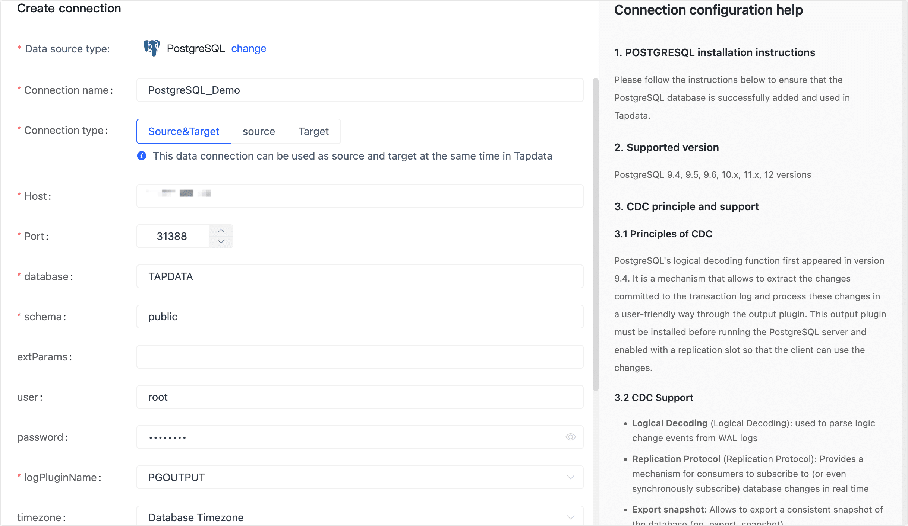

# PostgreSQL

import Content1 from '../../reuse-content/_enterprise-and-cloud-features.md';

<Content1 />

TapData Cloud offers extensive support for building data pipelines using PostgreSQL as both the source and target database. PostgreSQL is a robust open-source object-relational database management system (ORDBMS) known for its powerful capabilities.

This article provides detailed instructions on adding a PostgreSQL database to TapData Cloud, facilitating seamless integration and data flow in your pipelines.


## Supported Versions

PostgreSQL versions 9.4, 9.5, 9.6, 10.x, 11.x, 12


## Incremental Data Synchronization Principle

By PostgreSQL's logical decoding function, TapData Cloud can extract the changes made to the transaction log and handle the changes in a user-friendly manner. Supported Change Data Capture (CDC) is as follows:

- Logical Decoding: Used to parse logical change events from Wal logs.
- Replication Protocol: Provides a mechanism for consumers to subscribe the database changes in real time.
- Export Snapshot: Allow export of consistent snapshots of the database (pg_export_snapshot)
- Replication Slot: Used to save consumer offsets and track subscriber progress.

## Preparations

import Content from '../../reuse-content/_preparations.md';

<Content />


### As a Source Database

1. Log in to the PostgreSQL database as an administrator.

2. Create a user and grant them permissions.

   1. Execute the following commands to create an account for data synchronization/development tasks.

      ```sql
      CREATE USER username WITH PASSWORD 'password';
      ```

      * **username**: The user name.
      * **password**: The password.

   2. Execute the following command to grant permissions for database user.

      ```sql
      -- Enter the database you want to authorize
      \c database_name
      
      -- Grant table read permission to schema
      GRANT SELECT ON ALL TABLES IN SCHEMA schema_name TO username;
      
      -- Grant USAGE permission to schema
      GRANT USAGE ON SCHEMA schema_name TO username;
      
      -- Grant REPLICATION permission
      ALTER USER username REPLICATION;
      ```

      * **database_name**: Database name.
      * **Schema**: Schema name.
      * **username**: User name.
      
      :::tip
      
      If you only need to read the full data from PostgreSQL(not including incremental changes), you do not need to proceed with the following steps.
      
      :::

3. To ensure that the entire row is used as the identifier for logging during UPDATE/DELETE operations, modify the replication identity to **FULL**. This setting determines the field used for logging when changes occur.

   ```sql
   ALTER TABLE 'schema_name'.'table_name' REPLICA IDENTITY FULL;   
   ```

   * **Schema**: Schema name.
   * **table_name**: Table name.

4. Log in to the PostgreSQL server. Choose the decoder plugin that you want to install according to your business needs and version:

   - [Wal2json](https://github.com/eulerto/wal2json/blob/master/README.md)(PostgreSQL 9.4 and above)

      Deletion cannot be synchronized if the source table does not have a primary key.

   - [Decoderbufs](https://github.com/debezium/postgres-decoderbufs)(PostgreSQL 9.6 and above)

   - [Pgoutput](https://www.postgresql.org/docs/15/sql-createsubscription.html)(PostgreSQL 10.0 and above)

   Next, we will use **Wal2json** as an example to demonstrate the installation process.

   :::tip

   In this case, PostgreSQL is version 12 and has been installed on CentOS 7. If your environment is different from this, you need to adjust the development package version and the path of the environment variables in the following steps.

   :::

   1. Add repository package.

      ```bash
      yum install https://download.postgresql.org/pub/repos/yum/reporpms/EL-7-x86_64/pgdg-redhat-repo-latest.noarch.rpm
      ```

   2. Install the PostgreSQL 12 development package.

      ```bash
      yum install -y postgresql12-devel
      ```

   3. Set the environment variable and make it effective.

      ```bash
      export PATH=$PATH:/usr/pgsql-12/bin
      source /etc/profile
      ```

   4. Install the necessary software, including llvm, clang, gcc, etc.

      ```bash
      yum install -y devtoolset-7-llvm centos-release-scl devtoolset-7-gcc* llvm5.0
      ```

   5. Execute the following command to complete the installation of the plugin.

      ```bash
      # Download wal2json
      git clone https://github.com/eulerto/wal2json.git && cd wal2json

      # Enter the devtoolset environment of the scl
      scl enable devtoolset-7 bash

      # Compile and install
      make && make install
      ```

   6. Execute the command `vim/var/lib/pgsql/12/data/postgresql.conf` to modify the configuration file and modify the value of `wal_level` to `logical`.

      :::tip

      If the PostgreSQL version is 9.4, 9.5, 9.6, you also need to set the value of `max_replication_slots` and `max_wal_senders` to 10.

      :::

   7. Restart the PostgreSQL service during low business hours.

      ```sql
      service postgresql-12.service restart
      ```


5. (Optional) Test the log plugin.

   1. Connect to the postgres database, switch to the database that needs to be synchronized, and create a test table.

      ```sql
      -- Suppose the database to be synchronized is demodata and the schema is public
      \c demodata

      CREATE TABLE public.test_decode
      (
        uid    integer not null
            constraint users_pk
                primary key,
        name   varchar(50),
        age    integer,
        score  decimal
      );
      ```

   2. Create a slot connection, using the wal2json plugin as an example.

      ```sql
      SELECT * FROM pg_create_logical_replication_slot('slot_test', 'wal2json');
      ```

   3. Insert a record into the test table.

      ```sql
      INSERT INTO public.test_decode (uid, name, age, score)
      VALUES (1, 'Jack', 18, 89);
      ```

   4. Check the logs to see the results of the operation that was just inserted.

      ```sql
      SELECT * FROM pg_logical_slot_peek_changes('slot_test', null, null);
      ```

      Returns the following example (vertical display):

      ```sql
      lsn  | 0/3E38E60
      xid  | 610
      data | {"change":[{"kind":"insert","schema":"public","table":"test_decode","columnnames":["uid","name","age","score"],"columntypes":["integer","character varying(50)","integer","numeric"],"columnvalues":[1,"Jack",18,89]}]}
      ```

   5. Once the slot connection and test table have been confirmed to be working, you can delete them.

      ```sql
      SELECT * FROM pg_drop_replication_slot('slot_test');
      DROP TABLE public.test_decode;
      ```

6. (Optional) To perform incremental synchronization using the last updated timestamp, you need to perform the following steps.

   1. In the source database, execute the following command to create a public function, which needs to replace the schema name.

      ```sql
      CREATE OR REPLACE FUNCTION schema_name.update_lastmodified_column()
        RETURNS TRIGGER LANGUAGE plpgsql AS $$
        BEGIN
            NEW.last_update = now();
            RETURN NEW;
        END;
      $$;
      ```

   2. Create fields and triggers, each table needs to be executed once, such as the table name **mytable**.

      ```sql
      // Add last_update column into table
      ALTER TABLE schema_name.mytable ADD COLUMN last_update timestamp DEFAULT now();
      
      // Create trigger
      CREATE TRIGGER trg_uptime BEFORE UPDATE ON schema_name.mytable FOR EACH ROW EXECUTE PROCEDURE
        update_lastmodified_column();
      ```


### As a Target Database

1. Log in to the PostgreSQL database as an administrator.

2. Execute the following commands to create an account for data synchronization/development tasks.

   ```sql
   CREATE USER username WITH PASSWORD 'password';
   ```

   * **username**: The user name.
   * **password**: The password.

3. Execute the following command to grant permissions to the database user.

   ```sql
   -- Enter the database you want to authorize
   \c database_name;
   
   -- Grant USAGE and CREATE permissions to schema
   GRANT CREATE,USAGE ON SCHEMA schemaname TO username;
   
   -- Grant table read and write permissions to schema
   GRANT SELECT,INSERT,UPDATE,DELETE,TRUNCATE ON ALL TABLES IN SCHEMA schemaname TO username;
   ```

   * **database_name**: The database name.
   * **Schema**: Schema name.
   * **username**: The user name.


## Connect to PostgreSQL

1. [Log in to TapData Platform](../../user-guide/log-in.md).

2. In the left navigation panel, click **Connections**.

3. On the right side of the page, click **Create connection**.

4. In the pop-up dialog, select **PostgreSQL**.

5. On the page that you are redirected to, follow the instructions below to fill in the connection information for PostgreSQL.

   

   * **Connection Information Settings**
      * **Connection name**: Fill in a unique name that has business significance.
      * **Connection type**: Supports PostgreSQL as a source or target database.
      * **Host**: The database connection address.
      * **Port**: The service port of database.
      * **Database**: database name, a connection corresponding to a database, if there are multiple databases, you need to create multiple connections.
      * **Schema**: Schema name.
      * **extParams**: Additional connection parameters, default empty.
      * **User**: The database username.
      * **Password**: The database password.
      * **Log plugin name**: To read the data changes of PostgreSQL and achieve incremental data synchronization, you need to complete the installation of the plugin according to the guidance of the preparations.
   * **Advanced settings**
      * **Timezone**: Defaults to the time zone used by the database, which you can also manually specify according to your business needs.
      * **CDC Log Caching**: [Mining the source database's](../../user-guide/advanced-settings/share-mining.md) incremental logs, this feature allows multiple tasks to share incremental logs from the source database, avoiding redundant reads and thus significantly reducing the load on the source database during incremental synchronization. Upon enabling this feature, an external storage should be selected to store the incremental log.
      * **Contain table**: The default option is **All**, which includes all tables. Alternatively, you can select **Custom** and manually specify the desired tables by separating their names with commas (,).
      * **Exclude tables**: Once the switch is enabled, you have the option to specify tables to be excluded. You can do this by listing the table names separated by commas (,) in case there are multiple tables to be excluded.
      * **Agent settings**: Defaults to **Platform automatic allocation**, you can also manually specify an agent.
      * **Model load time**: If there are less than 10,000 models in the data source, their information will be updated every hour. But if the number of models exceeds 10,000, the refresh will take place daily at the time you have specified.
   * **SSL Settings**: Choose whether to enable SSL connections to the data source to further enhance data security. After turn on this button, you will also need to upload a CA file, client certificate, and key, as well as fill in the client password.
   
6. Click **Connection Test**, and when passed, click **Save**.

   :::tip

   If the connection test fails, follow the prompts on the page to fix it.

   :::

##  Exceptions Resolution

If the CDC is stopped abruptly, the connection to the PostgreSQL master node may not be properly terminated, which can prevent the Slot from being removed. In this situation, you need to manually log in to the master node and delete the Slot to prevent it from taking up resources.

```sql
-- Check if there is any information with slot_name=tapdata
TABLE pg_replication_slots;

-- Delete Slot
select * from pg_drop_replication_slot('tapdata');
```