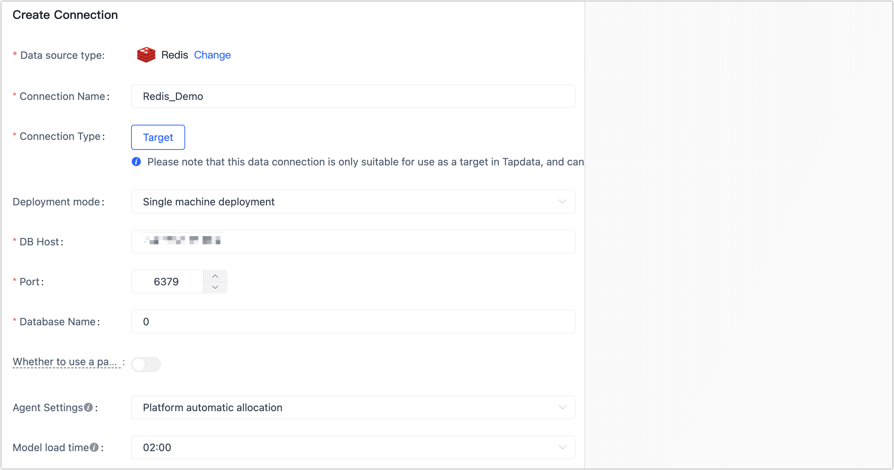

# Redis

import Content from '../../reuse-content/_enterprise-and-cloud-features.md';

<Content />

Redis is an open source (BSD licensed), in-memory data structure store used as a database, cache, message broker, and streaming engine. TapData Cloud supports real-time synchronization of data from relational databases (Oracle, MySQL, MongoDB, PostgreSQL, SQL Server) to Redis to help you quickly complete data flow. 
This article describes how to connect to Redis data sources on TapData Cloud.

## Supported Versions

Redis 2.8 ~ 6.0

## Connect to Redis

1. [Log in to TapData Platform](../../user-guide/log-in.md).

2. In the left navigation panel, click **Connections**.

3. On the right side of the page, click **Create**.

4. In the pop-up dialog, select **Redis**.

5. Fill in the connection information for Redis on the redirected page, following the instructions provided below.

   

   * **Connection name**: Fill in a unique name that has business significance.
   * **Connection type**: Currently only supported as a** Target**.
   * **Deployment mode**: choose** a stand-alone deployment** or a** sentry deployment**. If you choose a** sentry deployment**, you also need to fill in the sentry address.
   * **DB address**: Fill in the database connection address.
   * **Port**: Fill in the service port of database.
   * **Database name**: Fill in the database name, such as **0**.
   * **Whether to use the password**: If Redis enables password authentication, you need to turn on the switch and fill in the database password.
   * **Agent settings**: Defaults to **Platform automatic allocation**, you can also manually specify an agent.

6. Click **Test Connection**, and when passed, click **Save**.

   :::tip

   If the connection test fails, follow the prompts on the page to fix it.

   :::
