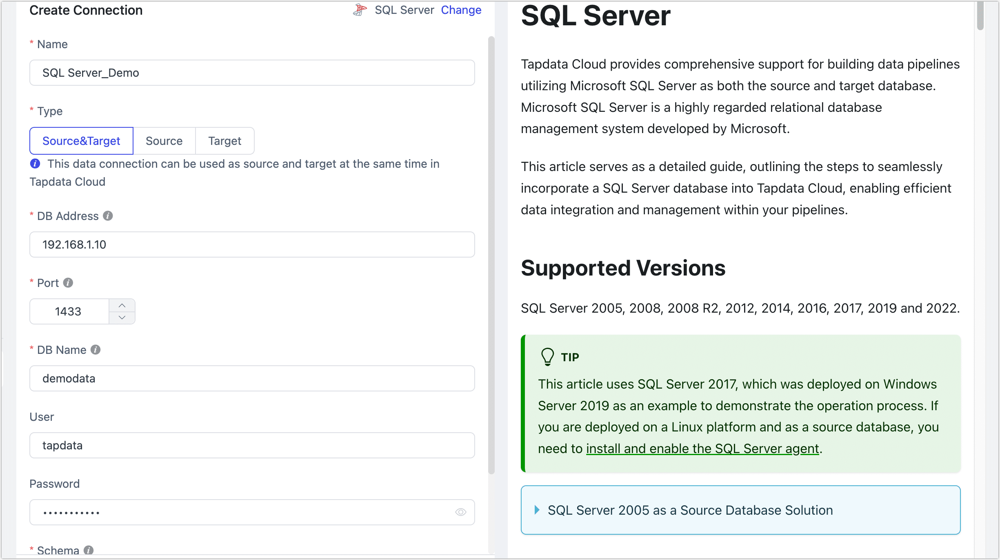
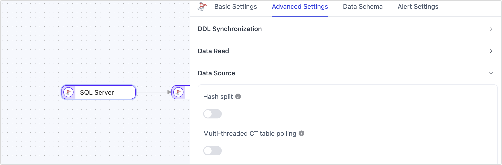

# SQL Server

[SQL Server](https://www.microsoft.com/en-us/sql-server/) is a relational database management system (RDBMS) developed by Microsoft. TapData supports using SQL Server as both a source and target database, helping you quickly build real-time data synchronization pipelines. In this guide, we will walk you through how to add SQL Server as a data source in TapData.

```mdx-code-block
import Tabs from '@theme/Tabs';
import TabItem from '@theme/TabItem';
```

## Supported Versions and Architecture

Single-node architecture for SQL Server 2008, 2008 R2, 2012, 2014, 2016, 2017, 2019, 2022.

## Supported Data Types

| Category  | Data Types                                                   |
| --------- | ------------------------------------------------------------ |
| String    | char, varchar, nchar, nvarchar, text, ntext, varchar(max), nvarchar(max) |
| Integer   | tinyint, smallint, int, bigint                               |
| Decimal   | decimal, numeric, money, real, float                         |
| Date/Time | date, time, datetime, datetime2, smalldatetime, datetimeoffset |
| Binary    | binary, varbinary, varbinary(max), timestamp                 |
| Others    | uniqueidentifier, bit, image, xml, geography                 |

:::tip

When using SQL Server as a target database, `timestamp` is not supported.

:::

## Supported Operations

- **DML**: INSERT, UPDATE, DELETE

  :::tip

  When SQL Server is used as a target, you can select the write strategy through the advanced settings of the task node: in case of insert conflicts, you can choose to convert to an update or discard the record; in case of update failures, you can choose to convert to an insert or just log the issue.

  :::

- **DDL**: ADD COLUMN, CHANGE COLUMN, DROP COLUMN, RENAME COLUMN

In addition, for synchronization from SQL Server to PostgreSQL, extra support is provided for synchronizing **column default values**, **auto-increment columns**, and **foreign key constraints**.

## Considerations

* Incremental data capture in SQL Server is based on Change Data Capture (CDC). TapData polls the CT (Change Tracking) tables of each synchronized table to capture data changes. It is recommended to limit the number of tables in a single sync task to reduce the polling cycle and lower the incremental data delay. For low-performance databases, to avoid frequent CT table queries affecting performance, consider enabling CDC only at the table or column level as needed and adjust CT table data retention to reduce disk usage.

  ```sql
  -- Set CT table data retention to 24 hours, default is 3 days
  EXEC sys.sp_cdc_change_job @job_type = N'cleanup', 
                             @retention = 2880;
  ```

* SQL Server's CDC solution has limited support for DDL capture. Implicitly committed DDLs are not recorded in the `cdc.ddl_history` table, which may affect synchronization. Additionally, after executing DDL operations, the CT table does not update automatically, and TapData relies on polling to detect and rebuild the CT table. Therefore, if DDL and DML occur simultaneously or within a short period, it may lead to DML data loss.

* When SQL Server is used as the source database and a DDL operation (such as adding a column) is performed on the fields of a table under incremental sync, you will need to restart change data capture for the table to avoid data synchronization errors or failures.

<details>
<summary>Restart change data capture for the corresponding table</summary>

```sql
-- Disable change data capture for the table
GO
EXEC sys.sp_cdc_disable_table
@source_schema = N'[Schema]',
@source_name = N'[Table]',
@capture_instance = N'[Schema_Table]'
GO
-- The capture_instance is usually the combination of schema_table. You can query its actual value with the following command:
EXEC sys.sp_cdc_help_change_data_capture
@source_schema = N'[Schema]',
@source_name = N'[Table]';

-- Enable change data capture for the table
USE [DatabaseName]
GO
EXEC sys.sp_cdc_enable_table
@source_schema = N'[Schema]',
@source_name = N'[Table]',
@role_name = N'[Role]'
GO
```

</details>

## Limitations

- Tables with CDC enabled cannot use the `truncate table` statement or modify field names with `sp_rename`.
- CDC can only be enabled or disabled at the table level. If it was previously disabled, setting incremental sync in task configurations based on a specific time will be invalid.
- When inserting or updating large fields, CDC only processes up to 64KB by default. It is recommended to use column-level CDC for handling large fields.

## Prerequisites

:::tip

This guide uses SQL Server 2017 on Windows Server 2019 as an example. If you are deploying on Linux as a source database, you will also need to [install and enable SQL Server Agent](https://learn.microsoft.com/en-us/sql/linux/sql-server-linux-setup-sql-agent?view=sql-server-2017#EnableAgentAfterCU4).

:::

### As a Source Database

1. Log in to SQL Server Management Studio or sqlcmd with administrator privileges (e.g., **sa**).

2. Execute the following commands to create a user for data replication/transformation tasks:

   ```sql
   -- Create a login account
   CREATE LOGIN login_name WITH PASSWORD='passwd', default_database=database_name;
   
   -- Create a database user
   CREATE USER login_name FOR LOGIN login_name with default_schema=schema_name;
   ```

   * **login_name**: The username.
   * **passwd**: The user's password.
   * **database_name**: The default database the user will log into.
   * **schema_name**: The database schema name (e.g., **dbo**), which serves as the namespace for objects like tables, views, procedures, and functions. More info: [Create a Database Schema](https://learn.microsoft.com/en-us/sql/relational-databases/security/authentication-access/create-a-database-schema?view=sql-server-ver16).

   Example: Create a user **tapdata** to log into the **demodata** database with **dbo** schema:

   ```sql
   -- Create login account
   CREATE LOGIN tapdata WITH password='Tap@123456', default_database=demodata;
   
   -- Create a database user
   CREATE USER tapdata FOR LOGIN tapdata with default_schema=dbo;
   ```

3. Grant permissions to the newly created user, or customize permissions based on business needs.

   ```mdx-code-block
   <Tabs className="unique-tabs">
   <TabItem value="Full Data Sync">
   ```

   ```sql
   -- Grant select permission on all tables in the specified schema
   GRANT SELECT ON SCHEMA::schema_name TO login_name;
   ```
   </TabItem>

   <TabItem value="Full and Incremental Data Sync">

   ```sql
   -- Grant select permission on all tables in the specified schema
   GRANT SELECT ON SCHEMA::schema_name TO login_name;
   
   -- Grant select permission on the CDC schema
   GRANT SELECT ON SCHEMA::cdc TO login_name;
   ```
   </TabItem>
   </Tabs>

   Example: Grant the **tapdata** user select permission on all tables in the **dbo** and **cdc** schemas:

   ```sql
   GRANT SELECT ON SCHEMA::dbo TO tapdata;
   GRANT SELECT ON SCHEMA::cdc TO tapdata;
   ```

4. If you need to capture incremental changes from the source database for synchronization, follow these steps:

   1. [Enable SQL Server Agent](https://learn.microsoft.com/en-us/sql/ssms/agent/start-stop-or-pause-the-sql-server-agent-service?view=sql-server-ver16).

   2. Check the database's log file size limit via [sys.master_files documentation](https://learn.microsoft.com/en-us/sql/relational-databases/system-catalog-views/sys-master-files-transact-sql?view=sql-server-ver16). If the log file size is too small, it may prevent logs from growing and affect CDC functionality.

   3. Enable CDC at the database and table levels using the following commands:

      * Enable CDC at the database level:

        ```sql
        -- Enable CDC
        USE database_name;
        GO
        EXEC sys.sp_cdc_enable_db;
        GO
        
        -- Check if CDC is enabled, a value of 1 in is_cdc_enabled indicates it is enabled
        SELECT [name], database_id, is_cdc_enabled
        FROM sys.databases
        WHERE [name] = N'database_name';
        GO
        ```

      * Enable CDC at the table level:

        ```sql
        USE database_name;
        GO
        EXEC sys.sp_cdc_enable_table 
        @source_schema = N'schema_name', 
        @source_name   = N'table_name',
        @capture_instance = NULL,
        @role_name     = N'role_name',
        @supports_net_changes = 1;
        GO
        ```

        For tables without primary keys:

        ```sql
        USE database_name;
        GO
        EXEC sys.sp_cdc_enable_table 
        @source_schema = N'schema_name', 
        @source_name   = N'table_name',
        @capture_instance = NULL,
        @role_name     = N'role_name',
        @supports_net_changes = 0;
        GO
        ```

        * **database_name**: The database name.
        * **schema_name**: The schema name (e.g., **dbo**).
        * **table_name**: The table name.
        * **role_name**: The role name for accessing change data (can be set to NULL).
        * **capture_instance**: The default is NULL, but a new capture instance can be specified if a conflict arises with an existing instance.

### As a Target Database

1. Log in to SQL Server Management Studio or sqlcmd with administrator privileges (e.g., **sa**).

2. Create a user for data replication/transformation tasks:

   ```sql
   -- Create a login account
   CREATE LOGIN login_name WITH PASSWORD='passwd', default_database=database_name;

   -- Create a database user
   CREATE USER login_name FOR LOGIN login_name with default_schema=schema_name;
   ```

   Example: Create a user **tapdata** to log into the **demodata** database with **dbo** schema:

   ```sql
   -- Create login account
   CREATE LOGIN tapdata WITH password='Tap@123456', default_database=demodata;
   
   -- Create a database user
   CREATE USER tapdata FOR LOGIN tapdata with default_schema=dbo;
   ```

3. Grant permissions to the user:

   ```sql
   -- Grant create table permission
   GRANT CREATE TABLE TO login_name;
   
   -- Grant full access to all tables in the specified schema
   GRANT ALTER, DELETE, INSERT, SELECT, UPDATE ON SCHEMA::schema_name TO login_name;
   ```

   Example: Grant **tapdata** user permission to create tables and perform full operations on all tables in the **dbo** schema:

   ```sql
   GRANT CREATE TABLE TO tapdata;
   GRANT ALTER, DELETE, INSERT, SELECT, UPDATE ON SCHEMA::dbo TO tapdata;
   ```

## <span id="ssl">Enable SSL (Optional)</span>

To further enhance the security of the data connection, you can choose to enable SSL (Secure Sockets Layer) encryption for SQL Server databases. This provides encryption at the transport layer for network connections, enhancing the security of communication data while ensuring data integrity. The specific steps are as follows:

* [Windows Platform](https://learn.microsoft.com/en-us/sql/database-engine/configure-windows/configure-sql-server-encryption?view=sql-server-ver15)
* [Linux Platform](https://learn.microsoft.com/en-us/sql/linux/sql-server-linux-encrypted-connections?view=sql-server-ver15&tabs=server)

:::tip

After completing the configuration, be sure to securely store the certificate-related files, as they will be used later when configuring connections.

:::

## Connect to SQL Server

1. Log in to TapData platform.

2. In the left-hand navigation bar, click **Connections**.

3. Click **Create** on the right-hand side of the page.

4. In the pop-up window, search for and select **SQL Server**.

5. In the redirected page, fill in the SQL Server connection details as described below:

   

   * **Connection Settings**
     * **Name**: Enter a unique and meaningful name.
     * **Type**: Choose whether SQL Server is a source or target database.
     * **DB Address**: The address of the database.
     * **Port**: The port number for the database.
     * **DB Name**: The name of the database. Each connection corresponds to a single database. Create additional connections for multiple databases.
     * **Schema**: The schema name. Each database can have multiple schemas, and the default is **dbo**.
     * **User**: The database account.
     * **Password**: The password for the database account.
   * **Advanced Settings**
     * **Additional Connection Parameters**: Additional connection parameters, default empty.
     * **Timezone**: The default timezone is UTC (0 timezone). If another timezone is configured, it will affect synchronization times for fields without timezone information, such as `time`, `datetime`, `datetime2`, and `smalldatetime`. Fields with timezone information (e.g., `datetimeoffset`) and the `date` type will not be affected.
     * **Use SSL/TLS**: Select whether to enable SSL for a more secure connection. If enabled, you will need to upload a CA certificate, certificate password, and server hostname details (see the [Enable SSL](#ssl) section for files).
     * **Using CDC Log Caching**: Mining the source database's incremental logs. This allows multiple tasks to share the same source database’s incremental log mining process, reducing duplicate reads and minimizing the impact of incremental synchronization on the source database. After enabling this feature, you will need to select an external storage to store the incremental log information.
     * **Contain Table**: The default option is **All**, which includes all tables. Alternatively, you can select **Custom** and manually specify the desired tables by separating their names with commas (,).
     * **Exclude Tables**: Once the switch is enabled, you have the option to specify tables to be excluded. You can do this by listing the table names separated by commas (,) in case there are multiple tables to be excluded.
     * **Agent Settings**: Defaults to **Platform automatic allocation**, you can also manually specify an agent.
     * **Model Load Time**: If there are less than 10,000 models in the data source, their schema will be updated every hour. But if the number of models exceeds 10,000, the refresh will take place daily at the time you have specified.
     * **Enable Heartbeat Table**: When the connection type is set to **Source and Target** or **Source**,, this option can be enabled. TapData will create a heartbeat table in the source database (_tapdata_heartbeat_table) and update it every 10 seconds (the database user must have the required permissions). Once the data replication/development task starts, the heartbeat task will automatically start. You can view the heartbeat task in the data source edit page.

6. Click **Test**, and if the test passes, click **Save**.

   :::tip

   If the connection test fails, follow the page prompts to resolve the issue.

   :::

## Advanced Node Features

When configuring SQL Server as the source node for a task, TapData provides several advanced features to enhance performance and handle complex scenarios:



* **Hash Split**: Disabled by default. When enabled, TapData will split the data into multiple shards based on hash values during the full sync phase, allowing concurrent reads. This significantly improves read performance but increases the load on the database.

* **Multi-threaded CT Table Polling**: Disabled by default. If the source SQL Server has a large number of tables (over 500) that need to be synchronized, enabling this option will optimize incremental data collection performance and improve synchronization efficiency.

  :::tip

  This feature is only supported when configuring data replication tasks.

  :::

## Frequently Asked Questions

* **Q**: Why is the SQL Server incremental task not running, and the task log shows the warning: "open cdc failed"?

  **A**: Check the prerequisites for incremental capture. It may be due to residual resources left by previous CDC tools. Restarting the database-level CDC may resolve the issue.

* **Q**: Is SQL Server 2005 supported?

  **A**: SQL Server 2005 does not support CDC. Incremental data capture can be done via field polling, or by using the following method:

  <details>
  <summary>SQL Server 2005 as a Source Solution</summary>
  Since CDC is supported from SQL Server 2008 onward, for earlier versions, you can simulate change data capture using Custom SQL. When replicating data from older versions, the source table must have a change-tracking column, such as <b>LAST_UPDATED_TIME</b>, which is updated with every insert or update. When creating the data replication task, set the task synchronization type to <b>Full</b>, enable <b>Repeat Custom SQL</b> as <b>True</b>, and provide appropriate Custom SQL in the mapping design.
  </details>

## Additional Reading

This section addresses common issues encountered when using the change data capture feature. For more information, refer to the [official Microsoft documentation](https://docs.microsoft.com/en-us/sql/relational-databases/system-stored-procedures/change-data-capture-stored-procedures-transact-sql?view=sql-server-ver15).

* **Cleaning up CDC Logs**

  SQL Server does not automatically clean up CDC logs. You need to configure a cleanup job as shown below:

  ```sql
  -- retention period is in minutes, this sets it to 2 days (2880 minutes)
  USE AdventureWorks2012;  
  GO  
  EXECUTE sys.sp_cdc_change_job   
      @job_type = N'cleanup',  
      @retention = 2880;  
  GO 
  ```

* **Enabling CDC for the Entire Database**

  ```sql
  -- Replace TAPDATA with the actual database name
  -- Replace INSURANCE with the actual schema name
  USE TAPDATA
  GO
  EXEC sys.sp_cdc_enable_db;
  GO
  
  DECLARE @table_name varchar(100);
  DECLARE @database_name varchar(100);
  DECLARE @schema_name varchar(100);
  
  SET @database_name = 'TAPDATA';
  SET @schema_name = 'INSURANCE';
  
  DECLARE my_cursor CURSOR FOR SELECT TABLE_NAME
                               FROM TAPDATA.INFORMATION_SCHEMA.TABLES
                               WHERE TABLE_CATALOG = @database_name
                                 AND TABLE_SCHEMA = @schema_name;
  OPEN my_cursor;
  FETCH NEXT FROM my_cursor INTO @table_name;
  
  WHILE @@FETCH_STATUS = 0
  BEGIN
      BEGIN TRY
          EXEC sys.sp_cdc_enable_table
               @source_schema = @schema_name,
               @source_name = @table_name,
               @role_name = NULL;
      END TRY
      BEGIN CATCH
          PRINT('[ERROR] ' + @table_name);
      END CATCH;
  
      FETCH NEXT FROM my_cursor INTO @table_name;
  END
  
  CLOSE my_cursor;
  DEALLOCATE my_cursor;
  ```

* **Disabling CDC for the Entire Database**

  ```sql
  -- Replace TAPDATA with the actual database name
  -- Replace INSURANCE with the actual schema name
  USE TAPDATA
  GO
  
  DECLARE @table_name varchar(100);
  DECLARE @database_name varchar(100);
  DECLARE @schema_name varchar(100);
  
  SET @database_name = 'TAPDATA';
  SET @schema_name = 'INSURANCE';
  
  DECLARE my_cursor CURSOR FOR SELECT TABLE_NAME
                               FROM TAPDATA.INFORMATION_SCHEMA.TABLES
                               WHERE TABLE_CATALOG = @database_name
                                 AND TABLE_SCHEMA = @schema_name;
  OPEN my_cursor;
  FETCH NEXT FROM my_cursor INTO @table_name;
  
  WHILE @@FETCH_STATUS = 0
  BEGIN
      BEGIN TRY
          EXEC sys.sp_cdc_disable_table
               @source_schema = @schema_name,
               @source_name = @table_name,
               @capture_instance = 'all';
      END TRY
      BEGIN CATCH
          PRINT ('[ERROR] ' + @table_name);
      END CATCH;
  
      FETCH NEXT FROM my_cursor INTO @table_name;
  END
  
  CLOSE my_cursor;
  DEALLOCATE my_cursor;
  
  EXEC sys.sp_cdc_disable_db;
  GO
