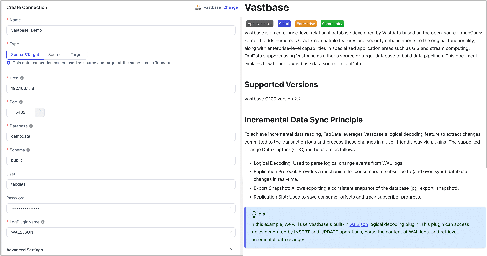

# Vastbase

import Content from '../../reuse-content/_all-features.md';

<Content />

Vastbase is an enterprise-level relational database based on the open-source openGauss kernel. It adds numerous Oracle-compatible features and security enhancements to the original functionality, along with enterprise-level capabilities in specialized application areas such as GIS and stream computing. TapData supports using Vastbase as either a source or target database to build data pipelines. This document explains how to add a Vastbase data source in TapData.

## Supported Versions
Vastbase G100 version 2.2

## Incremental Data Sync Principle

To achieve incremental data reading, TapData leverages Vastbase's logical decoding feature to extract changes committed to the transaction logs and process these changes in a user-friendly way via plugins. The supported Change Data Capture (CDC) methods are as follows:

- Logical Decoding: Used to parse logical change events from WAL logs.
- Replication Protocol: Provides a mechanism for consumers to subscribe to (and even sync) database changes in real-time.
- Export Snapshot: Allows exporting a consistent snapshot of the database (pg_export_snapshot).
- Replication Slot: Used to save consumer offsets and track subscriber progress.

:::tip

In this example, we will use Vastbase's built-in [wal2json](https://docs.vastdata.com.cn/zh/docs/VastbaseG100Ver2.2.10/doc/%E5%BC%80%E5%8F%91%E8%80%85%E6%8C%87%E5%8D%97/wal2json%E6%8F%92%E4%BB%B6.html) logical decoding plugin. This plugin can access tuples generated by INSERT and UPDATE operations, parse the content of WAL logs, and retrieve incremental data changes.

:::

## Prerequisites

### As a Source Database

1. Log in to the Vastbase <span id="prerequisites-vastbase">database</span> as an administrator.

2. Create a user and grant permissions.

   1. Execute the following command to create an account for data synchronization/development tasks.

      ```sql
      CREATE USER username WITH PASSWORD 'password';
      ```

      * **username**: Username.
      * **password**: Password.

   2. Execute the following commands to grant permissions to the account.

      ```sql
      -- Connect to the database to grant permissions
      \c database_name
      
      -- Grant SELECT permission on all tables in the target schema
      GRANT SELECT ON ALL TABLES IN SCHEMA schema_name TO username;
      
      -- Grant USAGE permission on the target schema
      GRANT USAGE ON SCHEMA schema_name TO username;
      
      -- Grant replication permission if incremental data reading is needed
      ALTER USER username REPLICATION;
      ```

      * **database_name**: Database name.
      * **schema_name**: Schema name.
      * **username**: Username.
      
      :::tip
      
      If you only need to read the full data (without incremental changes) from Vastbase, you can skip the following steps.
      
      :::

3. Execute the following command to change the replication identity to **FULL** (using the full row as the identifier), which determines the fields recorded in the logs during UPDATE/DELETE operations.

   ```sql
   ALTER TABLE 'schema_name'.'table_name' REPLICA IDENTITY FULL;   
   ```

   * **schema_name**: Schema name.
   * **table_name**: Table name.

4. Execute the following commands to modify the related parameters to support the [wal2json](https://docs.vastdata.com.cn/zh/docs/VastbaseG100Ver2.2.10/doc/%E5%BC%80%E5%8F%91%E8%80%85%E6%8C%87%E5%8D%97/wal2json%E6%8F%92%E4%BB%B6.html) logical decoding capability.

   ```sql
   ALTER SYSTEM SET wal_level to logical;
   ALTER SYSTEM SET max_wal_senders to 10;
   ALTER SYSTEM SET max_replication_slots to 10;
   ```

4. Restart the database instance during off-peak hours.

6. (Optional) Test the log plugin.

   1. Connect to the Vastbase database, switch to the database to be synchronized, and create a test table.

      ```sql
      -- Assuming the database to be synchronized is demodata, and the schema is public
      \c demodata
      
      CREATE TABLE public.test_decode
      (
        uid    integer not null
            constraint users_pk
                primary key,
        name   varchar(50),
        age    integer,
        score  decimal
      );
      ```

   2. Create a Slot connection using the wal2json plugin.

      ```sql
      SELECT * FROM pg_create_logical_replication_slot('slot_test', 'wal2json');
      ```

   3. Insert a record into the test table.

      ```sql
      INSERT INTO public.test_decode (uid, name, age, score)
      VALUES (1, 'Jack', 18, 89);
      ```

   4. Listen to the logs and check if there is information about the insert operation.

      ```sql
      SELECT * FROM pg_logical_slot_peek_changes('slot_test', null, null);
      ```

      Sample return (vertical display):

      ```sql
      lsn  | 0/3C91A10
      xid  | 16914
      data | {"change":[{"kind":"insert","schema":"public","table":"test_decode","columnnames":["uid","name","age","score"],"columntypes":["integer","varchar(50)","integer","numeric"],"columnvalues":[1,"Jack",18,89]}]}
      ```

   5. Confirm that there are no issues, then destroy the Slot connection and delete the test table.

      ```sql
      SELECT * FROM pg_drop_replication_slot('slot_test');
      DROP TABLE public.test_decode;
      ```

6. (Optional) To use the last update timestamp for incremental synchronization, follow these steps.

   1. Execute the following command in the source database to create a public function, replacing the schema name as needed.

      ```sql
      CREATE OR REPLACE FUNCTION schema_name.update_lastmodified_column()
        RETURNS TRIGGER LANGUAGE plpgsql AS $$
        BEGIN
            NEW.last_update = now();
            RETURN NEW;
        END;
      $$;
      ```

   2. Create the field and trigger for each table, for example, for a table named **mytable**.

      ```sql
      // Create the last_update field
      ALTER TABLE schema_name.mytable ADD COLUMN last_update timestamp DEFAULT now();
      
      // Create the trigger
      CREATE TRIGGER trg_uptime BEFORE UPDATE ON schema_name.mytable FOR EACH ROW EXECUTE PROCEDURE
        update_lastmodified_column();
      ```


### As a Target Database

1. Log in to the Vastbase database as an administrator.

2. Execute the following command to create an account for data synchronization/development tasks.

   ```sql
   CREATE USER username WITH PASSWORD 'password';
   ```

   * **username**: Username.
   * **password**: Password.

3. Execute the following commands to grant permissions to the database account.

   ```sql
   -- Connect to the database to grant permissions
   \c database_name;
   
   -- Grant CREATE and USAGE permissions on the target schema
   GRANT CREATE,USAGE ON SCHEMA schemaname TO username;
   
   -- Grant read/write permissions on all tables in the target schema
   GRANT SELECT,INSERT,UPDATE,DELETE,TRUNCATE ON ALL TABLES IN SCHEMA schemaname TO username;
   ```

   * **database_name**: Database name.
   * **schema_name**: Schema name.
   * **username**: Username.
	


## Add Data Source
1. [Log in to the TapData platform](../../user-guide/log-in.md).

2. In the left navigation bar, click **Connections**.

3. Click **Create** on the right side of the page.

4. In the pop-up dialog box, search for and select **Vastbase**.

5. On the redirected page, fill in the Vastbase connection information as described below.

   

   * **Connection Information Settings**
      * **Connection Name**: Enter a unique name that has business significance.
      * **Connection Type**: Supports using Vastbase as a source or target database.
      * **Host**: Database connection address.
      * **Port**: The database service port, default is **5432**.
      * **Database**: Database name, i.e., one connection corresponds to one database. If there are multiple databases, create multiple data connections.
      * **Schema**: Schema name.
      * **Username**: Database username.
      * **Password**: The password corresponding to the database username.
      * **Log Plugin**: If you need to read incremental data changes from Vastbase, you must complete the plugin installation according to the [prerequisites](#prerequisites-vastbase).
   * **Advanced Settings**
      * **Additional Parameters**: Additional connection parameters, default is empty.
      * **Timezone**: Defaults to the time zone used by the database, which you can also manually specify according to your business needs.
      * **CDC Log Caching**: [Mining the source database's](../../user-guide/advanced-settings/share-mining.md) incremental logs, this feature allows multiple tasks to share incremental logs from the source database, avoiding redundant reads and thus significantly reducing the load on the source database during incremental synchronization. Upon enabling this feature, an external storage should be selected to store the incremental log.
      * **Contain Table**: The default option is **All**, which includes all tables. Alternatively, you can select **Custom** and manually specify the desired tables by separating their names with commas (,).
      * **Exclude tables**: Once the switch is enabled, you have the option to specify tables to be excluded. You can do this by listing the table names separated by commas (,) in case there are multiple tables to be excluded.
      * **Agent Settings**: Defaults to **Platform automatic allocation**, you can also manually specify an agent.
      * **Model Load Time**: If there are less than 10,000 models in the data source, their information will be updated every hour. But if the number of models exceeds 10,000, the refresh will take place daily at the time you have specified.
      * **Enable Heartbeat Table**: When the connection type is selected as **Source and Target** or **Source**, this switch can be enabled. Tapdata will create a heartbeat table named **_tapdata_heartbeat_table** in the source database and update its data every 10 seconds (the database account must have the relevant permissions), to monitor the connection and task health of the data source.
   * **SSL Settings**: Choose whether to enable SSL connection to the data source for enhanced data security. After enabling this feature, you will need to upload the CA file, client certificate, key, and fill in the client password.

6. Click **Connection Test**, and after passing the test, click **Save**.

   :::tip

   If the connection test fails, please follow the prompts on the page to troubleshoot and resolve the issue.

   :::

##  Exceptions Resolution

If the CDC is stopped abruptly, the connection to the PostgreSQL master node may not be properly terminated, which can prevent the Slot from being removed. In this situation, you need to manually log in to the master node and delete the Slot to prevent it from taking up resources.

```sql
-- Check if there is any information with slot_name=tapdata
TABLE pg_replication_slots;

-- Delete Slot
select * from pg_drop_replication_slot('tapdata');
```