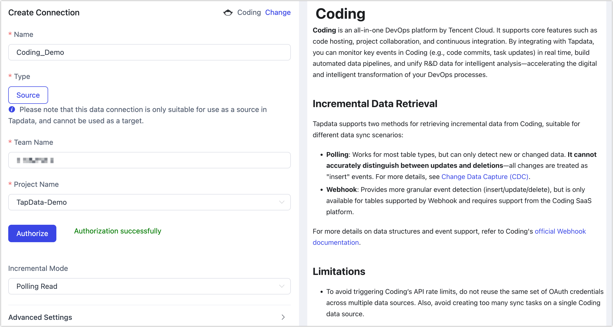
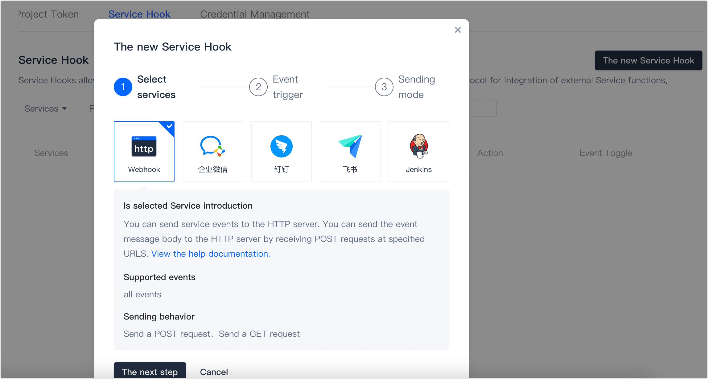
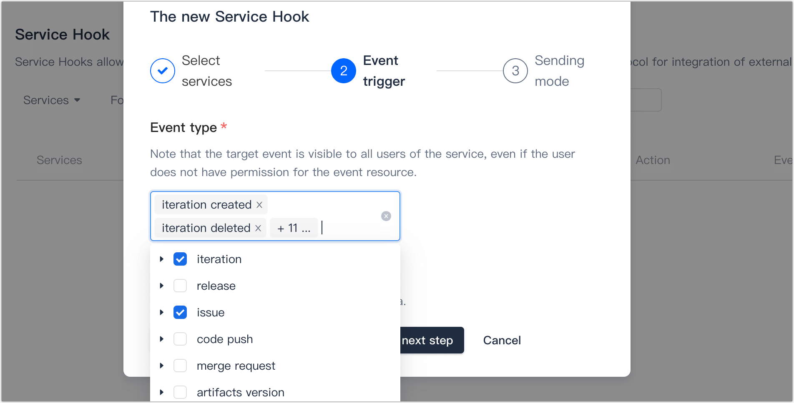
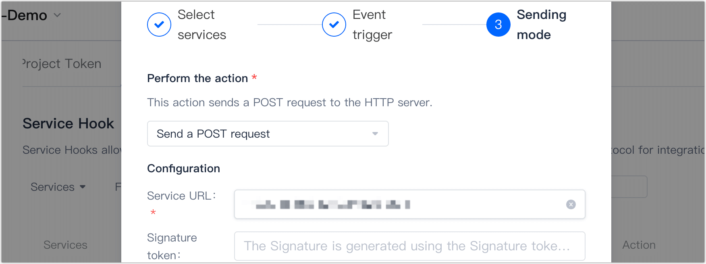

# Coding

**Coding** is an all-in-one DevOps platform by Tencent Cloud. It supports core features such as code hosting, project collaboration, and continuous integration. By integrating with Tapdata, you can monitor key events in Coding (e.g., code commits, task updates) in real time, build automated data pipelines, and unify R&D data for intelligent analysis—accelerating the digital and intelligent transformation of your DevOps processes.

## Incremental Data Retrieval

Tapdata supports two methods for retrieving incremental data from Coding, suitable for different data sync scenarios:

- **Polling**: Works for most table types, but can only detect new or changed data. It cannot accurately distinguish between updates and deletions—all changes are treated as "**insert**" events.
- **Webhook**: Provides more granular event detection (insert/update/delete), but is only available for tables supported by Webhook and requires support from the Coding SaaS platform.

For more details on data structures and event support, refer to Coding's [official Webhook documentation](https://coding.net/help/docs/project-settings/open/webhook.html).

## Limitations

- To avoid triggering Coding’s API rate limits, do not reuse the same set of OAuth credentials across multiple data sources. Also, avoid creating too many sync tasks on a single Coding data source.
- Due to API limitations, when using polling for incremental sync, Tapdata uses a **full overwrite** strategy for the *Iterations* table. As a result, the number of incremental events displayed in monitoring might not match the actual number of changes—but data accuracy remains unaffected.

## Connect to Coding

1. Log in to Tapdata platform.

2. In the left navigation panel, click **Connections**.

3. Click **Create** on the right side of the page.

4. In the pop-up dialog, search for and select **Coding**.

5. On the redirected page, fill in the connection details as described below.

   

   - **Name**: Enter a unique, business-meaningful name.

   - **Type**: Currently only supported as a **Source**.

   - **Team Name**: Obtain this from your Coding login URL. For example, if your login URL is `https://team_name.coding.net/`, then the team name is `team_name`. After entering it, click **Authorize** to complete the login and authorization on the redirected page.

   - **Project Name**: After authorization, select the project you want to connect to.

   - **Incremental Mode**: Choose based on your business needs:

     - **Polling Read** (default): Periodically queries specific columns (e.g., timestamps) in database tables and compares data before and after a point in time to detect changes. This mode cannot detect deletions or schema changes.

     - **Webhook**: Uses Coding’s Webhook feature to listen for events and sends notifications to the Tapdata platform via HTTP POST. If selected, click **Generate** to obtain a service URL, and follow the steps below to configure Webhook on the Coding platform.

       

       
Configure Webhook on the Coding Platform

   
       1. Log in to the [Coding platform](https://e.coding.net/login) as an administrator.
   
       2. Navigate to **Project Settings** > **Developer Options**, then go to the **Service Hook** tab and click **The new  Service Hook**.
   
       3. In the dialog, keep the default **HTTP** method and click **Next**.
   
          
   
       4. Select the event types you want to monitor, then click **Next**.
   
          
   
       5. Enter the Service URL generated on the Tapdata platform. Optionally, click **Send Test PING Event** to validate. Then click **Complete**.
   
          
   
       

     
   - **Advanced Settings**: Configure based on your business needs:
   
     - **CDC Log Caching**: Mining the source database's incremental logs. This allows multiple tasks to share the same source database’s incremental log mining process, reducing duplicate reads and minimizing the impact of incremental synchronization on the source database. After enabling this feature, you will need to select an external storage to store the incremental log information.
     - **Agent Settings**: Defaults to **Platform automatic allocation**, you can also manually specify an agent.
     - **Model Load Time**: If there are less than 10,000 models in the data source, their schema will be updated every hour. But if the number of models exceeds 10,000, the refresh will take place daily at the time you have specified.
   
6. Click **Test **, and after the test passes, click **Save**.