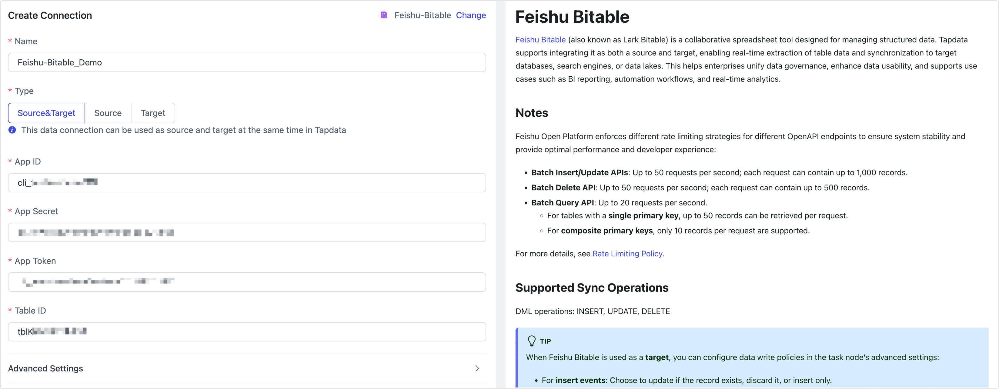

# Feishu Bitable

[Feishu Bitable](https://open.feishu.cn/document/server-docs/docs/bitable-v1/bitable-overview) (also known as Lark Bitable) is a collaborative spreadsheet tool designed for managing structured data. Tapdata supports integrating it as both a source and target, enabling real-time extraction of table data and synchronization to target databases, search engines, or data lakes. This helps enterprises unify data governance, enhance data usability, and supports use cases such as BI reporting, automation workflows, and real-time analytics.

## Considerations

Feishu Open Platform enforces different rate limiting strategies for different OpenAPI endpoints to ensure system stability and provide optimal performance and developer experience:

- **Batch Insert/Update APIs**: Up to 50 requests per second; each request can contain up to 1,000 records.
- **Batch Delete API**: Up to 50 requests per second; each request can contain up to 500 records.
- **Batch Query API**: Up to 20 requests per second.
    - For tables with a **single primary key**, up to 50 records can be retrieved per request.
    - For **composite primary keys**, only 10 records per request are supported.

For more details, see [Rate Limiting Policy](https://open.feishu.cn/document/server-docs/api-call-guide/frequency-control).

## Supported Sync Operations

DML operations: INSERT, UPDATE, DELETE

:::tip

When Feishu Bitable is used as a **target**, you can configure data write policies in the task node’s advanced settings:

- For **insert events**: Choose to update if the record exists, discard it, or insert only.
- For **update events**: Choose to discard if the record doesn't exist, or insert instead.

:::

## Prerequisites

1. Log in to the [Lark Open Platform](https://open.feishu.cn/app) as an administrator.

2. On the homepage of the development platform, open the self-built application.

   For instructions on creating a self-built application, see [Development Process](https://open.feishu.cn/document/develop-process/self-built-application-development-process).

3. In the left navigation bar, click **Credentials & Basic Info** to obtain the App ID and App Secret, which are needed when configuring the data source connection.

   

## Connect to Feishu Bitable

1. Log in to TapData platform.

2. In the left navigation panel, click **Connections**.

3. On the right side of the page, click **Create Connection**.

4. In the dialog box, search for and select **Feishu Bitable**.

5. Complete the data source configuration as follows:

   

    - **Name**: A unique, descriptive name with business significance.
    - **Type**: Support using Connect to Feishu Bitable as either a source or target.
    - **App ID**, **App Secret**: Obtain these from the Feishu Open Platform. See [Prerequisites](#prerequisite) for details.
    - **App Token**: Each Bitable app is treated as a unique app with a corresponding `app_token`. See the [Integration Guide](https://open.feishu.cn/document/server-docs/docs/bitable-v1/notification) for details.
    - **Table ID**: Each Bitable app may include multiple tables, each identified by a unique `table_id`. You can find this in the [Integration Guide](https://open.feishu.cn/document/server-docs/docs/bitable-v1/notification), or by calling the [List all tables](https://open.feishu.cn/document/uAjLw4CM/ukTMukTMukTM/reference/bitable-v1/app-table/list) API.
    - **Advanced Settings**
        - **Agent Settings**: Defaults to **Platform automatic allocation**, you can also manually specify an agent.
        - **Model Load Time**: If there are less than 10,000 models in the data source, their schema will be updated every hour. But if the number of models exceeds 10,000, the refresh will take place daily at the time you have specified.

6. Click **Test**. If successful, click **Save**.