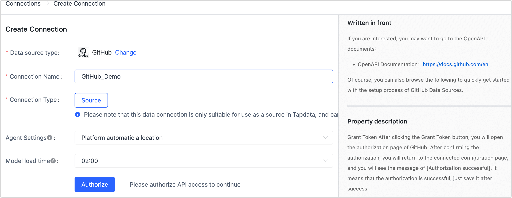

# GitHub

import Content from '../../reuse-content/_enterprise-and-cloud-features.md';

<Content />

GitHub is a website and cloud-based service that helps developers store and manage their code, as well as track and control changes to their code. TapData supports building data pipelines with GitHub as a source database, helping you to read the Issue and Pull Requests change data of the specified repository and synchronize to the specified data source. 

This article describes how to add GitHub data source to TapData Cloud.

## Procedure

1. [Log in to TapData Platform](../../user-guide/log-in.md).

2. In the left navigation panel, click **Connections**.

3. On the right side of the page, click **Create**.

4. In the pop-up **dialog**, select **GitHub**.

5. Fill in the connection information for GitHub on the redirected page, following the instructions provided below.

   

   * **Connection name**: Fill in a unique name that has business significance.
   * **Connection type**: Currently only supported as a **Source**.
   * **Agent settings**: Defaults to **Platform Automatic Allocation**, you can also manually specify an agent.
   * **Model load time**: If there are less than 10,000 models in the data source, their information will be updated every hour. But if the number of models exceeds 10,000, the refresh will take place daily at the time you have specified.

6. Click **Authorize**, and on the GitHub authorization page that you are redirected to, complete the login and authorization (it is recommended to authorize as an organization administrator).

   After completing the operation, the page will return to the data source configuration page and display **Authorization successful**.

7. Click **Test Connection**, and when passed, click **Save**.

   :::tip

   If the connection test fails, follow the prompts on the page to fix it.

   :::

