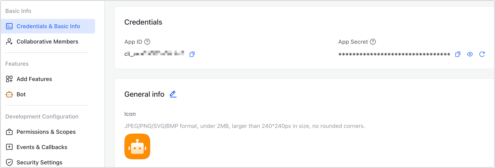
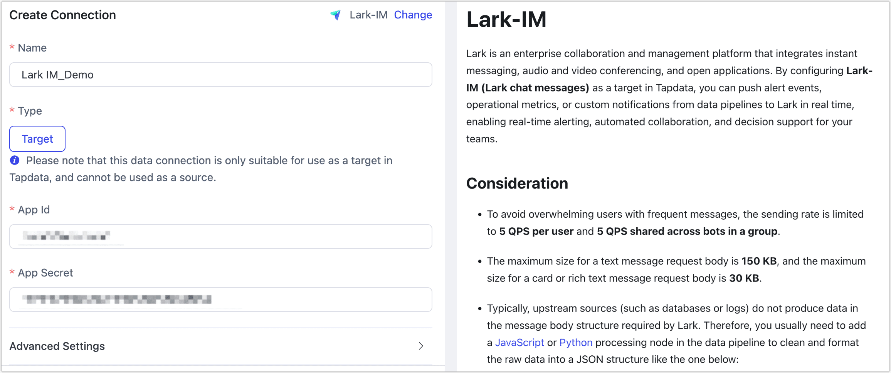

# Lark-IM

Lark is an enterprise collaboration and management platform that integrates instant messaging, audio and video conferencing, and open applications. By configuring **Lark-IM (Lark chat messages)** as a target in Tapdata, you can push alert events, operational metrics, or custom notifications from data pipelines to Lark in real time, enabling real-time alerting, automated collaboration, and decision support for your teams.

## Consideration

- To avoid overwhelming users with frequent messages, the sending rate is limited to **5 QPS per user** and **5 QPS shared across bots in a group**.

- The maximum size for a text message request body is **150 KB**, and the maximum size for a card or rich text message request body is **30 KB**.

- Typically, upstream sources (such as databases or logs) do not produce data in the message body structure required by Lark.
  Therefore, you usually need to add a JavaScript or Python processing node in the data pipeline to clean and format the raw data into a JSON structure like the one below:

  ```json
  [
    {
      "receiveType": "{{user | email | phone | chat}}",
      "receiveId": "{{user_open_id | user_email | user_phone | chat_id}}",
      "contentType": "text",
      "content": "{\"text\":\"Hello! This is lark message! \"}"
    }
  ]
  ```

<details>
  <summary>Fields Description</summary>

| Field Name      | Description                                                  |
| --------------- | ------------------------------------------------------------ |
| **receiveType** | Recipient type. Options: `user` (default), `chat`, `email`, `phone` |
| **receiveId**   | Recipient identifier. Must be within the app's visibility range, otherwise message delivery will fail |
| **contentType** | Message type, such as `text` or `interactive` (card)         |
| **content**     | Message content, formatted as a JSON string                  |

For more details, see the [Send message content structure](https://open.feishu.cn/document/server-docs/im-v1/message-content-description/create_json).
  </details>

## Prerequisites

1. Log in to the [Lark Open Platform](https://open.feishu.cn/app) as an administrator.

2. On the homepage of the development platform, open the self-built application.

   For instructions on creating a self-built application, see [Development Process](https://open.feishu.cn/document/develop-process/self-built-application-development-process).

3. In the left navigation bar, click **Credentials & Basic Info** to obtain the App ID and App Secret, which are needed when configuring the data source connection.

   

4. [Set the app availability scope](https://open.feishu.cn/document/develop-process/test-and-release-app/availability) to ensure that the target users or groups for Lark messages are within the app’s visible range to avoid message delivery failures.

5. Enable the [Bot capability](https://open.feishu.cn/document/faq/trouble-shooting/how-to-enable-bot-ability) for the application. Note that bot capabilities only take effect after the app is published.

## Connect to Lark-IM

1. Log in to TapData platform.

2. In the left navigation bar, click **Connections**.

3. On the right side of the page, click **Create Connection**.

4. In the pop-up dialog, search for and select **Lark-IM**.

5. Complete the configuration as described below:

   

    - **Name**: Enter a unique, business-meaningful name.
    - **Type**: Only supported as a **target**.
    - **App ID / App Secret**: Obtain these from the Lark Open Platform. See [Prerequisites](#prerequisites) for details.
    - **Agent Settings**: Defaults to **Platform automatic allocation**, you can also manually specify an agent.
    - **Model Load Time**: If there are less than 10,000 models in the data source, their schema will be updated every hour. But if the number of models exceeds 10,000, the refresh will take place daily at the time you have specified.

6. Click **Test**. If the test passes, click **Save**.

   If the connection test fails, follow the on-screen instructions to troubleshoot.
