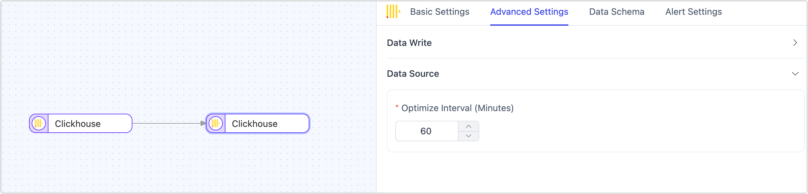

# ClickHouse

[ClickHouse](https://clickhouse.com/) is a high-performance, column-oriented SQL database management system (DBMS) for online analytical processing (OLAP). This document will guide you on how to add ClickHouse as a data source in TapData, enabling you to use it as either a **source** or **target database** for building real-time data pipelines.

```mdx-code-block
import Tabs from '@theme/Tabs';
import TabItem from '@theme/TabItem';
```

## Supported Versions

ClickHouse 20.x, 21.x, 22.x, 23.x, 24.x

## Supported Data Types

| Category    | Data Types                                                   |
| ----------- | ------------------------------------------------------------ |
| String      | FixedString, String, UUID                                    |
| Integer     | Int8, UInt8, Int16, UInt16, Int32, UInt32, UInt64, Int128, UInt128, Int256, UInt256 |
| Floating    | Float32, Float64                                             |
| Numeric     | Decimal                                                      |
| Date/Time   | Date, Date32, DateTime, DateTime64                           |
| Enumeration | Enum8, Enum16                                                |
| Composite   | Tuple                                                        |

## SQL Operations for Sync

* **DML**: INSERT, UPDATE, DELETE
* **DDL** (supported only as a target): ADD COLUMN, CHANGE COLUMN, DROP COLUMN, RENAME COLUMN

:::tip

* When using ClickHouse as a source for incremental synchronization, data changes are detected through field polling, and DDL operations collection are not supported. 
* When using ClickHouse as a target, you can select the write strategy through the advanced settings of the task node: in case of insert conflicts, you can choose to convert to an update or discard the record; in case of update failures, you can choose to convert to an insert or just log the issue.

:::

## Consideration

* Binary-related field types are not supported. If present in the synchronization/development task configuration, they can be removed through field mapping; otherwise, they will be automatically converted to Base64 strings before being written.
* When using ClickHouse as a target database and enabling automatic table creation by TapData, the `ReplacingMergeTree` engine is used if the source table has a primary key, with the primary key field as the sorting key. If there is no primary key, the `MergeTree` engine is used with no sorting key.

## Preparations

1. Modify the configuration file **user.xml** to enable access control and restart the service. For detailed steps, see the [official documentation](https://clickhouse.com/docs/zh/operations/access-rights#enabling-access-control).

   :::tip

   You can also modify this file to [complete account configurations](https://clickhouse.com/docs/zh/operations/settings/settings-users/). This guide demonstrates how to create and authorize accounts after enabling access control.

   :::

2. Log in to the ClickHouse database and execute the following command format to create a user account for data synchronization/development tasks.

   ```sql
   CREATE USER username HOST 'host' IDENTIFIED WITH protection BY 'password';
   ```

   * **username**: The username.
   * **host**: The host from which the user is allowed to log in. **ANY** allows any host.
   * **protection**: The password protection method.
   * **password**: The password.

   Example: Create a user account named **tapdata** with the sha256_password protection mechanism, allowing login from any host.

   ```sql
   CREATE USER tapdata HOST ANY IDENTIFIED WITH sha256_password BY 'your_password';
   ```

3. Grant the necessary permissions to the newly created user account. The examples below illustrate basic permissions, but you can set more granular controls based on your needs. For more details, see [Grant Syntax](https://clickhouse.com/docs/zh/sql-reference/statements/grant/).

```mdx-code-block
<Tabs className="unique-tabs">
<TabItem value="As a Source Database">
```

```sql
GRANT SELECT ON database_name.* TO username 
```

</TabItem>

<TabItem value="As a Target Database">

```sql
GRANT SELECT, INSERT, CREATE TABLE, ALTER TABLE, ALTER UPDATE, DROP TABLE, TRUNCATE ON database_name.* TO username
```

</TabItem>
</Tabs>

* **database_name**: The name of the database for which permissions are granted.
* **username**: The username.

## Connect to ClickHouse

1. Log in to TapData Platform.

2. In the left navigation bar, click **Connections**.

3. On the right side of the page, click **Create**.

4. In the pop-up dialog, search for and select **ClickHouse**.

5. Complete the data source configuration as described below.

   

   * **Connection Settings**
      * **Name**: Enter a unique and meaningful name.
      * **Type**: Supports using ClickHouse as either a source or a target database.
      * **Host**: The database host address.
      * **Port**: The HTTP API port of the database, which defaults to **8123**. If SSL encryption is enabled, the default port is 8443. For more details, see [Network Port Description](https://clickhouse.com/docs/en/guides/sre/network-ports/).
      * **Database**: The name of the database, with each connection corresponding to one database. If multiple databases exist, multiple connections must be created.
      * **Username**, **Password**: The username and password for the database.
   * **Advanced Settings**
      * **Connection Parameter String**: Additional connection parameters, which are empty by default.
      * **Timezone**: The default timezone is 0 (UTC). If another timezone is configured, it may impact the accuracy of data synchronization, particularly for fields without timezone information (e.g., `DateTime`).
      * **Agent Settings**: Defaults to **Platform automatic allocation**, but you can also manually specify an agent.
      * **Model Load Time**: If there are fewer than 10,000 models in the data source, schema updates occur hourly. If there are more than 10,000 models, the refresh will take place daily at the specified time.
      * **Enable Heartbeat Table**: When the connection type is **Source&Target** or **Source**, you can enable this switch. TapData will create a _tapdata_heartbeat_table heartbeat table in the source database and update it every 10 seconds (requires appropriate permissions) to monitor the health of the data source connection and tasks. The heartbeat task starts automatically after the data replication/development task starts, and you can view the heartbeat task in the data source editing page.

6. Click **Test**, and after a successful test, click **Save**.

   :::tip

   If the connection test fails, please follow the instructions on the page to troubleshoot and resolve the issue.

   :::

## Advanced Node Features

When configuring data synchronization/transformation tasks and using ClickHouse as the target node, TapData offers a range of advanced features to better meet complex business requirements and maximize performance. You can configure these features according to your business needs:



- **Optimize Interval**: Adjust the frequency of [Optimize Table](https://clickhouse.com/docs/en/sql-reference/statements/optimize) operations, measured in minutes, to achieve a balance between performance and data consistency.
- **Mix Fast Write**: Disabled by default. When enabled, TapData will add two new fields to the target table to record modification time and deletion flag. Records with a deletion flag set to **1** will be automatically cleared using the modification time and TTL index. This approach allows updates and deletions to be executed by inserting new records with the same primary key, significantly improving write performance for relational data sources.

## Performance Testing

### Test Environment

* **ClickHouse Environment**: `ecs.u1-c1m2.2xlarge` instance type with 8 CPU cores, 16 GB RAM, and a 100 GB ESSD disk.
* **Table Structure**: The test table contains 53 fields, including 30 random strings of length 8, 21 random floating-point number fields, 1 primary key field, 1 title, and 1 date field. The average size per row is approximately 1KB.

### Test Results

This performance test simulates a full data write scenario, with a maximum record processing rate (RPS) reaching up to 250,000. The test results are for reference only under the current environment and do not represent the performance limits of TapData.
