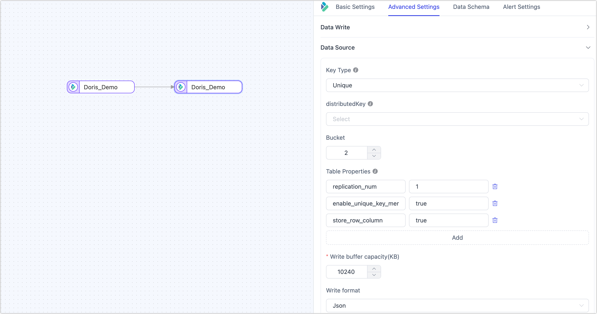

# Doris

[Apache Doris](https://doris.apache.org/) is an MPP-based real-time data warehouse known for its high query speed. It can be used for report analysis, ad-hoc queries, unified data warehouse, and data lake query acceleration. Tapdata supports using Doris as both a source and a target database to build data pipelines, helping you quickly handle data flows for big data analysis scenarios. In this article, we will introduce how to connect to Doris on the Tapdata platform.

```mdx-code-block
import Tabs from '@theme/Tabs';
import TabItem from '@theme/TabItem';
```

## Supported Versions and Architectures

Doris 1.2 to 3.0 (no restrictions on deployment architecture)

## Supported Data Types

| Category    | Data Types                               |
| ----------- | ---------------------------------------- |
| String      | CHAR, VARCHAR, STRING, TEXT              |
| Boolean     | BOOLEAN                                  |
| Integer     | TINYINT, SMALLINT, INT, BIGINT, LARGEINT |
| Numeric     | DECIMAL, DECIMALV3, FLOAT, DOUBLE        |
| Date/Time   | DATE, DATEV2, DATETIME, DATETIMEV2       |
| Aggregation | HLL                                      |

## SQL Operations for Sync 

* **DML**: INSERT, UPDATE, DELETE
* **DDL** (supported only as a target): ADD COLUMN, CHANGE COLUMN, DROP COLUMN, RENAME COLUMN

:::tip

- When used as a source database, incremental data synchronization needs to be implemented through field polling and does not support DDL operations.
- When used as a target database, you can also configure DML write strategies through the advanced settings of the task node, such as whether to convert insert conflicts to updates.

:::

## Considerations

* Due to the inherent limitations of Doris, frequent transactional operations (such as frequent updates and deletes) should be avoided when using it as a target database to prevent performance issues during data writes.
* Currently, Tapdata supports data writing via the Stream Load method. Therefore, for tables created using the **Duplicate Key Model** or **Aggregation Key Model**, update and delete operations are not fully supported.
* When using Doris as a target database for large-scale data ingestion, it is recommended to configure batch sizes between 10,000 to 100,000 records, based on the size of individual records, to improve performance. Avoid setting the batch size too large to prevent OOM issues.
* To reduce the impact on query performance, it is advisable to perform large-scale data ingestion into Doris during off-peak business hours to avoid consuming excessive database I/O resources.

## Preparations

1. To create an account, log in to the Doris database and run the following commands.

   ```sql
   CREATE USER 'username'@'host' IDENTIFIED BY 'password';
   ```

   - **username**: Enter user name.
   - **password**: Enter password.
   - **host**: Which host can be accessed by the account, percent (%) means to allow all host.

   Example: Create an account named tapdata.

   ```sql
   CREATE USER 'tapdata'@'%' IDENTIFIED BY 'Tap@123456';
   ```

2. Grant permissions to the account we just created, we recommend setting more granular permissions control based on business needs.

```mdx-code-block
<Tabs className="unique-tabs">
<TabItem value="As a Source Database">
```

```sql
-- Replace the catalog_name, database_name, and username follow the tips below
GRANT SELECT_PRIV ON catalog_name.database_name.* TO 'username'@'%';
```

</TabItem>

<TabItem value="As a Target Database">

```sql
-- Replace the catalog_name, database_name, and username follow the tips below
GRANT SELECT_PRIV, ALTER_PRIV, CREATE_PRIV, DROP_PRIV, LOAD_PRIV ON catalog_name.database_name.* TO 'username'@'%';
```

</TabItem>
</Tabs>


:::tip

Please replace the username, password, and host in the command above.

* **catalog_name**: The name of the data catalog. The default name is **internal**. You can view the created data catalog through the [SHOW CATALOGS](https://doris.apache.org/docs/sql-manual/sql-statements/Show-Statements/SHOW-CATALOGS) command. For more information, see [Multi Catalog](https://doris.apache.org/docs/1.2/lakehouse/multi-catalog/).
* **database_name**: Enter database name.
* **username**: Enter user name.

:::

## Connect to Doris

1. Log in to Tapdata platform.

2. In the left navigation bar, click **Connections**.

3. On the right side of the page, click **Create**.

4. In the pop-up dialog, search for and select **Doris**.

5. Fill in the Doris connection information as described below.

   

    - **Connection Settings**
      - **Name**: Enter a meaningful and unique name.
      - **Type**: Supports using Doris as a source or target database.
      - **DB Address**: The Doris connection address.
      - **Port**: The Doris query service port. The default port is **9030**.
      - **Enable HTTPS**: Choose whether to enable the HTTPS connection without certificates.
      - **HTTP/HTTPS Address**: The HTTP/HTTPS protocol access address for the FE service, including address and port information. The default port is **8030**.
      - **DB Name**: One connection corresponds to one database. If there are multiple databases, you need to create multiple connections.
      - **User** and **Password**: Enter the database username and password, respectively.
    - **Advanced Settings**
      - **Doris Catalog**: The Doris catalog, which is a higher level than the database. If using the default catalog, this can be left empty. For more details, see [Multi-Catalog](https://doris.apache.org/zh-CN/docs/1.2/lakehouse/multi-catalog/).
      - **Additional Connection Parameters**: Any additional connection parameters, default is empty.
      - **Timezone**: The default timezone is 0 UTC. Changing to a different timezone will affect the synchronization of fields without timezone information (such as `DATETIME`, `DATETIMEV2`), while fields like `DATE` and `DATE2` are not affected.
      - **Agent Settings**: Defaults to **Platform automatic allocation**, you can also manually specify an agent.
      - **Model Load Time**: If there are less than 10,000 models in the data source, their schema will be updated every hour. But if the number of models exceeds 10,000, the refresh will take place daily at the time you have specified.
      - **Enable Heartbeat Table**: When the connection type is **Source&Target** or **Source**, you can enable this switch. TapData will create a _tapdata_heartbeat_table heartbeat table in the source database and update it every 10 seconds (requires appropriate permissions) to monitor the health of the data source connection and tasks. The heartbeat task starts automatically after the data replication/development task starts, and you can view the heartbeat task in the data source editing page.

6. Click **Test** at the bottom of the page. After passing the test, click **Save**.

   :::tip

   If the connection test fails, please follow the prompts on the page to resolve the issue.

   :::

## Node Advanced Features

When configuring data synchronization or transformation tasks with Doris as the target node, Tapdata provides advanced features to better meet complex business requirements and maximize performance. You can configure these features based on your business needs:



| Configuration         | Description                                                  |
| --------------------- | ------------------------------------------------------------ |
| **Key Type**          | Choose the table key type: **Unique** (default, Unique Key Model), **Aggregate** (Aggregation Key Model), or **Duplicate** (Duplicate Key Model). For more information, see [Data Models](https://doris.apache.org/docs/table-design/data-model/overview). <br />When the key type is **Duplicate** and using append mode for writes, since there are no update conditions, you need to specify the sort fields. |
| **Partition Key**     | Refers to the `DISTRIBUTED BY HASH` partition key used when creating the table. If a partition key is manually set, it will be prioritized. If not set, the primary key or update condition fields will be used by default. If neither is specified, all fields will be used (not recommended). |
| **Number of Buckets** | Choose the number of buckets when creating the table, based on actual business needs. For more information, see [Bucket Design Recommendations](https://doris.apache.org/docs/table-design/data-partition?_highlight=bucket&_highlight=nu#recommendations-for-bucket-number-and-data-volume). |
| **Table Properties**  | Supports specifying [table properties](https://doris.apache.org/docs/sql-manual/sql-statements/Data-Definition-Statements/Create/CREATE-TABLE#properties) during table creation based on business requirements. |
| **Write Buffer Size**| Default is 10,240 KB. Increasing the size can improve performance for bulk data inserts, while decreasing it can limit memory usage and prevent OOM. |
| **Write Format**     | Supports JSON (default) and CSV formats. JSON is more secure and suitable for complex data types but offers slightly lower performance. Choose based on data security and performance requirements. |
