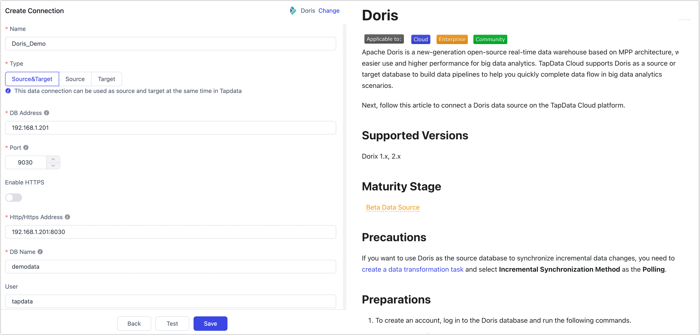

# Doris

import Content1 from '../../reuse-content/_enterprise-and-cloud-features.md';

<Content1 />

Apache Doris is a new-generation open-source real-time data warehouse based on MPP architecture, with easier use and higher performance for big data analytics. TapData Cloud supports Doris as a source or target database to build data pipelines to help you quickly complete data flow in big data analytics scenarios.

Next, follow this article to connect a Doris data source on the TapData Cloud platform.

```mdx-code-block
import Tabs from '@theme/Tabs';
import TabItem from '@theme/TabItem';
```

## Supported Versions

Dorix 1.x, 2.x

import Content from '../../reuse-content/_beta.md';

<Content />


## Precautions

If you want to use Doris as the source database to synchronize incremental data changes, you need to [create a data transformation task](../../user-guide/data-pipeline/data-development/create-task.md) and select **Incremental Synchronization Method** as the **Polling**.

## Preparations

1. To create an account, log in to the Doris database and run the following commands.

   ```sql
   CREATE USER 'username'@'host' IDENTIFIED BY 'password';
   ```

   - **username**: Enter user name.
   - **password**: Enter password.
   - **host**: Which host can be accessed by the account, percent (%) means to allow all host.

   Example: Create an account named tapdata.

   ```sql
   CREATE USER 'tapdata'@'%' IDENTIFIED BY 'Tap@123456';
   ```

2. Grant permissions to the account we just created, we recommend setting more granular permissions control based on business needs.

```mdx-code-block
<Tabs className="unique-tabs">
<TabItem value="As a Source Database">
```
```sql
-- Replace the catalog_name, database_name, and username follow the tips below
GRANT SELECT_PRIV ON catalog_name.database_name.* TO 'username'@'%';
```
</TabItem>

<TabItem value="As a Target Database">

```sql
-- Replace the catalog_name, database_name, and username follow the tips below
GRANT SELECT_PRIV, ALTER_PRIV, CREATE_PRIV, DROP_PRIV, LOAD_PRIV ON catalog_name.database_name.* TO 'username'@'%';
```
</TabItem>
</Tabs>

:::tip

Please replace the username, password, and host in the command above.
* **catalog_name**: The name of the data catalog. The default name is **internal**. You can view the created data catalog through the [SHOW CATALOGS](https://doris.apache.org/zh-CN/docs/1.2/sql-manual/sql-reference/Show-Statements/SHOW-CATALOGS) command. For more information, see [Multi Catalog](https://doris.apache.org/docs/1.2/lakehouse/multi-catalog/).
* **database_name**: Enter database name.
* **username**: Enter user name.

:::


## Connect to Doris

1. [Log in to TapData Platform](../../user-guide/log-in.md).

2. In the left navigation panel, click **Connections**.

3. On the right side of the page, click **Create**.

4. In the pop-up dialog, search for and select **Doris**.

5. On the page you are redirected to, follow the instructions below to fill in the connection information for Doris.

   

   - Basic Settings
     - **Name**: Fill in a unique name that has business significance.
     - **Type**: Doris is supported as a source or target database.
     - **DB Address**: The connection address of Doris.
     - **Port**: The query service port for Doris, the default port is **9030**.
     - **Enable HTTPS**: Select whether to enable the certificate-free HTTPS connection feature.
     - **HTTP/HTTPS Address**: The HTTP protocol address of the FE service, including address and port(e.g. http://192.168.1.18:8040), the default port is **8030**.
     - **DB Name**: database name, a connection corresponding to a database, if there are multiple databases, you need to create multiple connections.
     - **User**, **Password**: The database username and password.
   - Advanced Setting
     - **Doris Catalog**: The catalog of Doris, whose hierarchy is above the database. If you use the default catalog, you can leave it empty. For more information, see [Multi-Catalog](https://doris.apache.org/docs/1.2/lakehouse/multi-catalog/).
     - **Other Connection String Parameters**: Additionally connection parameters, empty by default.
     - **Timezone**: Defaults to the time zone used by the database, which you can also manually specify according to your business needs.
     - **Agent Settings**: Defaults to **Platform automatic allocation**, you can also manually specify an Agent.
     - **Model Load Time**: If there are less than 10,000 models in the data source, their information will be updated every hour. But if the number of models exceeds 10,000, the refresh will take place daily at the time you have specified.
     - **Enable Heartbeat Table**: This switch is supported when the connection type is set as the **Source&Target** or **Source**. TapData Cloud will generate a table named **tapdata_heartbeat_table** in the source database, which is used to monitor the source database connection and task health.

6. Click **Test Connection**, and when passed, click **Save**.

   :::tip

   If the connection test fails, follow the prompts on the page to fix it.

   :::
