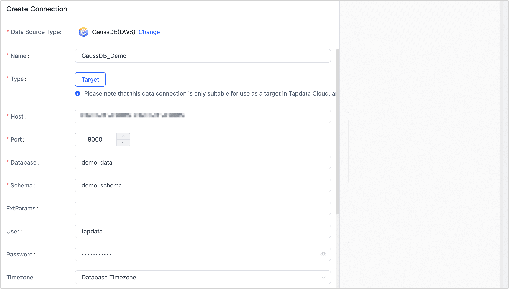

# GaussDB (DWS)

import Content from '../../reuse-content/_enterprise-and-cloud-features.md';

<Content />

GaussDB is a cloud-based, distributed relational database. Cross-AZ deployment ensures rock solid reliability and zero data loss. Hybrid transactional/analytical processing (HTAP) gives you stellar performance. After you complete the Agent deployment, you can follow this tutorial to add a GaussDB in TapData Cloud, which you can then use as a target database to build your data pipeline.

## Supported Versions

GaussDB (DWS) 8.1.3

## Precautions

* In GaussDB, distributed columns are not allowed to be modified. If updating is necessary, you can skip the error report or change the distribution column to one that cannot be updated. For more information, see the [Distribution Key Update Solution](https://support.huaweicloud.com/intl/en-us/trouble-dws/dws_09_0048.html).
* If no distributed columns are specified when creating a table, the data is stored based on different scenarios:
   * If the table contains a primary key/unique constraint, the hash distribution is selected, and the distribution column is the column corresponding to the primary key/unique constraint.
   * If the table does not contain a primary key/unique constraint, but there are columns with data types that support distribution columns, the hash distribution is selected, and the distribution column is the first column with data types that support distribution columns.
   * If the table does not contain a primary key/unique constraint and there are no columns with data types that support distribution columns, select the ROUNDROBIN distribution.
* If you need to use a partition table, it is recommended to maintain the table structure during the processing policy for selecting the target table. Otherwise, a normal table will be automatically created by TapData Cloud.
* TapData Cloud does not allow conflicting update operations when the partition table does not have a primary key or unique index.

<b>Learn more about Distribution Keys and Partition Tables.</b>

* In GaussDB, a distributed column is a column in a distributed table used for data distribution, which determines how the data is distributed in distributed storage and affects query performance. For more information, see [Best Practices for Selecting Distribution Keys](https://support.huaweicloud.com/intl/en-us/performance-dws/dws_10_0042.html).
* The partition table is a logical table divided into several physical block data according to the partition policy. This logical table is called the partition table, and the physical block is called the partition. A partition table is a logical table that does not store data. The data is actually stored on the partition. When performing a conditional query, the system only scans the partitions that meet the conditions, avoiding full table scans, thus improving query performance.

## Connect to GaussDB

1. Log in to [TapData Cloud](https://cloud.tapdata.net/console/v3/).

2. In the left navigation panel, click **Connections**.

3. On the right side of the page, click **Create**.

4. In the pop-up dialog box, search for and select **GaussDB (DWS)**.

5. On the page you are redirected to, fill in the GaussDB (DWS) connection information according to the instructions below.

   

   - **Name**: Fill in a unique name that has business significance.
   - **Type**: Currently only supported as a **Target**.
   - **Host**: The database service's connection address. For more information, see [Obtaining the Cluster Connection Address](https://support.huaweicloud.com/intl/en-us/mgtg-dws/dws_01_0033.html).
   - **Port**: The service port of database.
   - **Database**: database name, a connection corresponding to a database, if there are multiple databases, you need to create multiple connections.
   - **Schema**: Fill in the schema name.
   - **ExtParams**: Additional connection parameters, default empty.
   - **User**, **Password**: The database username and password.
   - **Timezone**: Defaults to the time zone used by the database, which you can also manually specify according to your business needs.
   - **Contain table**: Defaults to **all**, you can also choose to custom and fill in the included tables, separated by commas (,) between multiple tables.
   - **Exclude tables**: After turning on the switch, you can set the tables to be excluded, separated by commas (,) between multiple tables.
   - **Agent settings**: Defaults to **Platform automatic allocation**, you can also manually specify an Agent.

6. Click **Test Connection**, and when passed, click **Save**.

   :::tip

   If the connection test fails, follow the prompts on the page to fix it.

   :::
