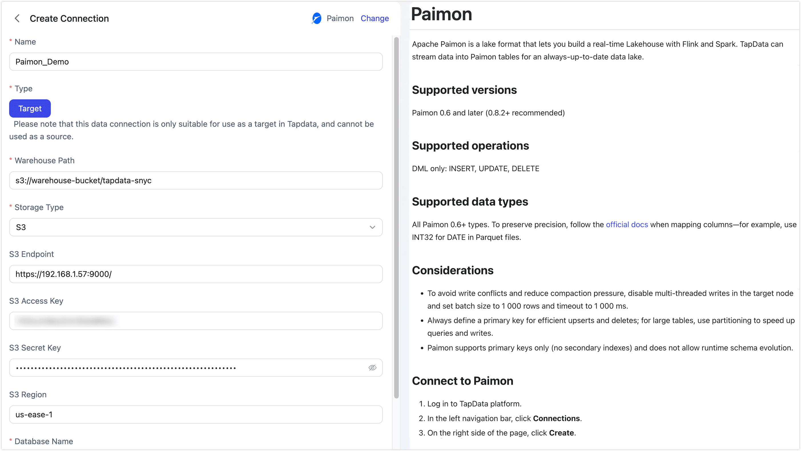

# Paimon

Apache Paimon is a lake format that lets you build a real-time Lakehouse with Flink and Spark. TapData can stream data into Paimon tables for an always-up-to-date data lake.

```mdx-code-block
import Tabs from '@theme/Tabs';
import TabItem from '@theme/TabItem';
```

## Supported versions

Paimon 0.6 and later (0.8.2+ recommended)

## Supported operations

DML only: INSERT, UPDATE, DELETE

## Supported data types

All Paimon 0.6+ types. To preserve precision, follow the [official docs](https://paimon.apache.org/docs/master/concepts/spec/fileformat/) when mapping columns—for example, use INT32 for DATE in Parquet files.

:::tip
Add a Type Modification Processor to the job if you need to cast columns to a different Paimon type.
:::

## Considerations

- To avoid write conflicts and reduce compaction pressure, disable multi-threaded writes in the target node and set batch size to 1,000 rows and timeout to 1,000 ms.
- Always define a primary key for efficient upserts and deletes; for large tables, use partitioning to speed up queries and writes.
- Paimon supports primary keys only (no secondary indexes) and does not allow runtime schema evolution.

## Connect to Paimon

1. Log in to TapData platform.
2. In the left navigation bar, click **Connections**.
3. On the right side of the page, click **Create**.
4. In the pop-up dialog, search for and select **Paimon**.
5. Fill in the connection details as shown below.

   

   **Basic Settings**
   - **Name**: Enter a meaningful and unique name.
   - **Type**: Only supports using Paimon as a target database.
   - **Warehouse Path**: Enter the root path for Paimon data based on the storage type.
     - S3: `s3://bucket/path`
     - HDFS: `hdfs://namenode:port/path`
     - OSS: `oss://bucket/path`
     - Local FS: `/local/path/to/warehouse`
   - **Storage Type**: TapData supports S3, HDFS, OSS, and Local FS, with each storage type having its own connection settings.

     ```mdx-code-block
     <Tabs className="unique-tabs">
     <TabItem value="S3" default>
     ```
     Use this option for any S3-compatible object store—AWS S3, MinIO, or private-cloud solutions. Supply the endpoint, keys, and region (if required) so TapData can write Paimon data directly to your bucket.
     - **S3 Endpoint**: full URL including protocol and port, e.g. `http://192.168.1.57:9000/`
     - **S3 Access Key**: the Access-Key ID that owns read/write permission on the bucket/path
     - **S3 Secret Key**: the corresponding Secret-Access-Key
     - **S3 Region**: the region where the bucket was created, e.g. `us-east-1`

     </TabItem>

     <TabItem value="HDFS">
     Choose this when your warehouse sits on Hadoop HDFS or any HCFS-compatible cluster. TapData writes through the standard HDFS client, so give it the NameNode host/port and the OS user it should impersonate.

     - **HDFS Host**: NameNode hostname or IP, e.g. `192.168.1.57`
     - **HDFS Port**: NameNode RPC port, e.g. `9000` or `8020`
     - **HDFS User**: OS user that TapData will impersonate when writing, e.g. `hadoop` 

     </TabItem>

     <TabItem value="OSS">
     Pick this for Alibaba Cloud OSS or any other OSS-compatible provider. Enter the public or VPC endpoint, the access key pair, and TapData will create Paimon files inside the bucket you specify.

     - **OSS Endpoint**: VPC or public endpoint, e.g. `https://oss-cn-hangzhou.aliyuncs.com` (do **not** include the bucket name)
     - **OSS Access Key**: Access-Key ID that has read/write permission on the bucket/path
     - **OSS Secret Key**: the corresponding Access-Key Secret

     </TabItem>

     <TabItem value="Local">

     **Local filesystem**:
     Select this option if you want to store the Paimon warehouse on a local disk or an NFS mount that is visible to the TapData server. Make sure the directory is writable by the TapData OS user and that enough free space is available for both data and compaction temporary files.

     </TabItem>
     </Tabs>

   - **Database Name**: one connection maps to one database (default is `default`). Create extra connections for additional databases.

   **Advanced Settings**
   - **Agent Settings**: Defaults to **Platform automatic allocation**, you can also manually specify an agent.
   - **Model Load Time**: If there are less than 10,000 models in the data source, their schema will be updated every hour. But if the number of models exceeds 10,000, the refresh will take place daily at the time you have specified.

6. Click **Test** at the bottom; after it passes, click **Save**.

   :::tip

   If the test fails, follow the on-screen hints to fix the issue.

   :::