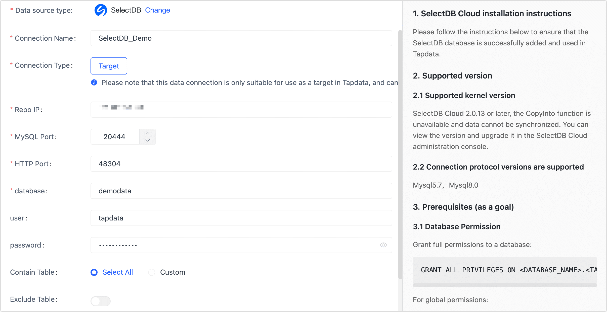

# SelectDB

import Content from '../../reuse-content/_enterprise-and-cloud-features.md';

<Content />

SelectDB is a cloud-native real-time data warehouse built on the basis of Apache Doris by the same core developers. 

This article describes how to connect to SelectDB Cloud (SelectDB) data sources in TapData Cloud.

## Supported Versions

SelectDB Cloud 2.0.13 and above

## Preparations

Log in to [SelectDB platform](https://en.selectdb.cloud/) and grant privileges to the database username.

Grant all privileges to Specified DB:

```sql
GRANT ALL PRIVILEGES ON <DATABASE_NAME>.<TABLE_NAME> TO 'tapdata' IDENTIFIED BY 'password';
```

Grant global privileges:

```sql
GRANT PROCESS ON *.* TO 'tapdata' IDENTIFIED BY 'password';
```


## Connect to SelectDB

1. [Log in to TapData Platform](../../user-guide/log-in.md).

2. In the left navigation panel, click **Connections**.

4. On the right side of the page, click **Create**.

5. In the pop-up dialog, select **SelectDB**.

6. On the page that you are redirected to, follow the instructions below to fill in the connection information for SelectDB.

   

    - **Connection name**: Fill in a unique name that has business significance.
    - **Connection type**: Currently only supported as a **Target**.
    - **Repo IP**: The public network connection address of the SelectDB's Warehouse.
    - **MySQL Port**: The service port of database.
    - **HTTP Port**: HTTP protocol port, for information about the address and how to obtain it, see the [official documentation](https://en.selectdb.com/docs/User%20Guide/Connect%20Warehouse).
    - **Database**: Database name, a connection corresponding to a database, if there are multiple databases, you need to create multiple connections.
    - **user**, **password**: The database username and password.
    - **Contain table**: The default option is **All**, which includes all tables. Alternatively, you can select **Custom** and manually specify the desired tables by separating their names with commas (,).
    - **Exclude tables**: Once the switch is enabled, you have the option to specify tables to be excluded. You can do this by listing the table names separated by commas (,) in case there are multiple tables to be excluded.
    - **Agent settings**: Defaults to **Platform automatic allocation**, you can also manually specify an Agent.

7. Click **Test Connection**, and when passed, click **Save**.

   :::tip

   If the connection test fails, follow the prompts on the page to fix it.

   :::


## Common Errors

"Unknown error 1044" appears in the dialog after the connection test.

If the correct permissions have been [granted](#preparations), can be checked and fixed by:

1. Execute the following command to see if the value of the Grant_priv field is **Y**, where **username** needs to be replaced with the real user name.

   ```sql
   SELECT host,user,Grant_priv,Super_priv FROM Doris.user where user='username';
   ```


2. If the value is not **Y**, execute the following command, where **username** needs to be replaced with the real username.

   ```sql
   UPDATE Doris.user SET Grant_priv='Y' WHERE user='username';
   FLUSH PRIVILEGES;
   ```

