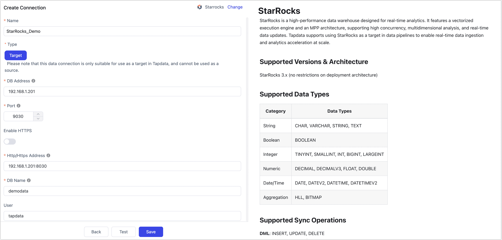

# StarRocks

StarRocks is a high-performance data warehouse designed for real-time analytics. It features a vectorized execution engine and an MPP architecture, supporting high concurrency, multidimensional analysis, and real-time data updates. Tapdata supports using StarRocks as a target in data pipelines to enable real-time data ingestion and analytics acceleration at scale.

```mdx-code-block
import Tabs from '@theme/Tabs';
import TabItem from '@theme/TabItem';
```

## Supported Versions & Architecture

StarRocks 3.x (no restrictions on deployment architecture)

## Supported Data Types

| Category    | Data Types                               |
| ----------- | ---------------------------------------- |
| String      | CHAR, VARCHAR, STRING, TEXT              |
| Boolean     | BOOLEAN                                  |
| Integer     | TINYINT, SMALLINT, INT, BIGINT, LARGEINT |
| Numeric     | DECIMAL, DECIMALV3, FLOAT, DOUBLE        |
| Date/Time   | DATE, DATEV2, DATETIME, DATETIMEV2       |
| Aggregation | HLL, BITMAP                              |

## Supported Sync Operations

**DML**: INSERT, UPDATE, DELETE

## Notes

- Tapdata writes to StarRocks using **Stream Load**. Since supported operations vary by table type (e.g., detail tables support inserts only, but not updates or deletes), see [Table Types Overview](https://docs.mirrorship.cn/docs/table_design/table_types/) for more information.

  :::tip
  Partitioned tables are not created automatically. You must manually define partition keys, buckets, and sort keys before syncing if needed.

  :::

- Avoid frequent transactional operations (e.g., frequent updates/deletes) when using StarRocks as the target, as they may degrade performance.

- For better performance in batch inserts, it’s recommended to configure the batch size between **10,000 and 100,000** records depending on individual record size. Avoid overly large batches to prevent OOM issues.

- Large-scale data loading is best performed during **off-peak hours** to minimize I/O contention and avoid affecting query performance.

## Prerequisites

1. Log in to the StarRocks database and run the following command to create a user account for data sync/development tasks:

   ```sql
   CREATE USER 'username'@'host' IDENTIFIED BY 'password';
   ```

   - **username**: User name
   - **password**: Password (For other authentication methods like LDAP, see [CREATE USER](https://docs.mirrorship.cn/zh/docs/sql-reference/sql-statements/account-management/CREATE_USER))
   - **host**: The allowed login host for the user; use `%` to allow all hosts

   Example:

   ```sql
   CREATE USER 'tapdata'@'%' IDENTIFIED BY 'Tap@123456';
   ```

2. Grant permissions to the created user account. You may also apply fine-grained access control based on your needs.

```mdx-code-block
<Tabs className="unique-tabs">
<TabItem value="Grant access to a specific database">
```

```sql
-- Replace with your actual database name and username
GRANT ALL ON DATABASE your_db_name TO USER your_username;
GRANT ALL ON ALL TABLES IN DATABASE database_name TO USER your_username;
```

</TabItem>

<TabItem value="Grant access to a all databases">

```sql
-- Replace with your actual username
GRANT ALL ON ALL DATABASES TO USER your_username;
GRANT ALL ON ALL TABLES IN ALL DATABASES TO USER your_username;
```

</TabItem>
</Tabs>


## Connect to StarRocks

1. Log in to Tapdata Platform.

2. In the left navigation bar, click **Connections**.

3. Click **Create** on the right side of the page.

4. In the dialog box, search for and select **StarRocks**.

5. Fill in the connection details as described below:

   

   - **Basic Settings**
     - **Name**: Enter a meaningful and unique name.
     - **Type**: Only supported as a **target** database.
     - **DB Address**: The StarRocks connection address.
     - **Port**: The StarRocks query service port. The default port is **9030**.
     - **Enable HTTPS**: Choose whether to enable the HTTPS connection without certificates.
     - **HTTP/HTTPS Address**: The HTTP/HTTPS protocol access address for the FE service, including address and port information,  e.g., `http://192.168.1.18:8030`.
     - **DB Name**: Each connection corresponds to one database. To connect multiple databases, create separate connections.
     - **User** and **Password**: Enter the database username and password, respectively.
     - **Number of BE Nodes**: Tapdata will try to auto-detect the number of BE nodes (requires admin privileges). If privileges are insufficient, enter the number manually.
   - **Advanced Settings**
     - **StarRocks Catalog**: StarRocks catalog name (optional if using default). See [Catalog Overview](https://docs.mirrorship.cn/docs/data_source/catalog/catalog_overview/) for details.
     - **Additional Parameters**: Optional JDBC parameters
     - **Timezone for Time Fields**: Defaults to UTC (offset 0). Affects fields like `DATETIME` and `DATETIMEV2` (non-timezone-aware). Fields like `DATE` or `DATEV2` are not affected.
     - **Agent Settings**: Defaults to **Auto Assignment**, but can be specified manually
     - **Model Refresh Frequency**: For fewer than 10,000 models, refreshes every hour. For more than 10,000, refresh occurs daily at a specified time.
     - **Enable Heartbeat Table**: If StarRocks is used as source or target, this toggle enables Tapdata to create a `_tapdata_heartbeat_table` that updates every 10 seconds (requires appropriate permissions).
        The heartbeat task starts automatically after replication or development tasks begin. You can view the heartbeat task in the data source settings.

6. Click **Test** at the bottom of the page. Once it passes, click **Save**.
