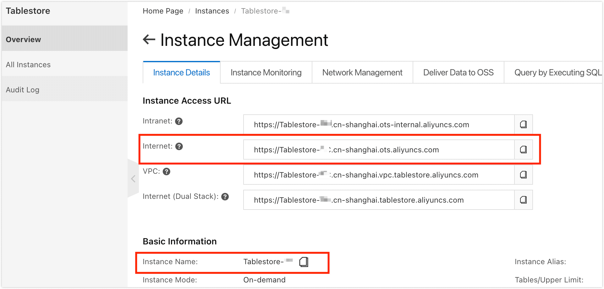
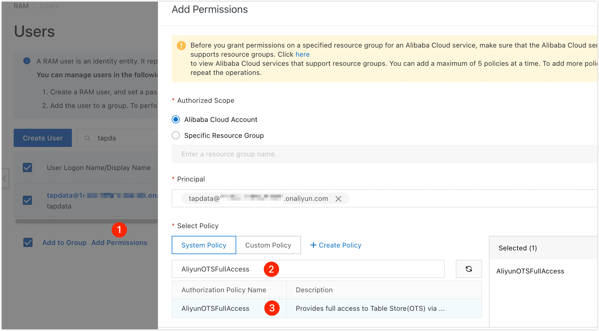
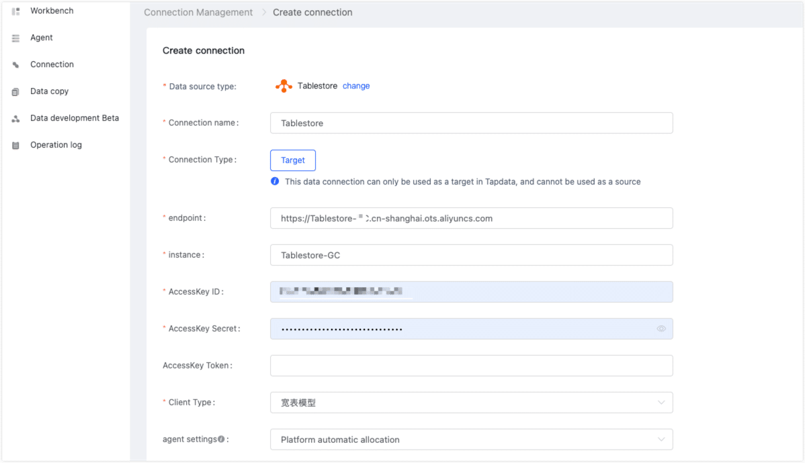

# Tablestore

import Content from '../../reuse-content/_enterprise-and-cloud-features.md';

<Content />

[Alibaba Cloud Tablestore](https://www.alibabacloud.com/help/en/tablestore) is a serverless table storage service designed for handling large volumes of structured data. It also provides a comprehensive solution for IoT scenarios, offering optimized data storage capabilities. TapData Cloud supports data synchronization tasks with Tablestore as the target database. 

This article provides instructions on how to add Tablestore data sources to TapData Cloud.

## Preparations

1. After [creating an Alibaba Cloud Tablestore instance](https://help.aliyun.com/document_detail/342853.html), you can retrieve the public network connection address and instance name of the instance.

   

2. Create a RAM user on the Alibaba Cloud and get AccessKey (AK), which will be used when connecting.

   1. To [create a RAM user](https://help.aliyun.com/document_detail/93720.htm#task-187540), select **OpenAPI access**.
   2. On the redirected page, click **Download CSV file** that contains the AccessKey information.

3. Grant the **AliyunOTSFullAccess** permission to the RAM user, which will provide them with full management permissions for the Tablestore service.

   1. Select the newly created RAM user and click **Add permissions**.

   2. Enter **AliyunOTSFullAccess** in the text box of the dialog, and then click on the search result to select the permissions policy name.

      

   3. Click **OK**, and then click **Complete**.

## Connect to Tablestore

1. [Log in to TapData Platform](../../user-guide/log-in.md).

2. In the left navigation panel, click **Connections**.

3. On the right side of the page, click **Create connection**.

4. In the pop-up dialog, select **Tablestore**.

5. Fill in the connection information for Tablestore on the redirected page, following the instructions provided below.

   

   * **Connection name**: Fill in a unique name that has business significance.
   * **Connection type**: Currently only supported as a**Target**.
   * **Endpoint**, **Instance**: Fill in the Tablestore public network connection address and instance name that you obtained during the [preparatory work](#prerequisite).
   * **AccessKey ID**, **AccessKey Secret**: Fill in the AccessKey information of the RAM user obtained in the [preparation](#prerequisite).
   * **AccessKey Token**: Default empty.
   * **Client type**: fixed as **Wide table**.
   * **Agent settings**: Defaults to **Platform automatic allocation**, you can also manually specify an agent.

6. Click **Connection Test**, and when passed, click **Save**.

   :::tip

   If the connection test fails, follow the prompts on the page to fix it.

   :::

## Related Topics

[Oracle to Tablestore Real-Time Sync](../../pipeline-tutorial/oracle-to-tablestore.md)
