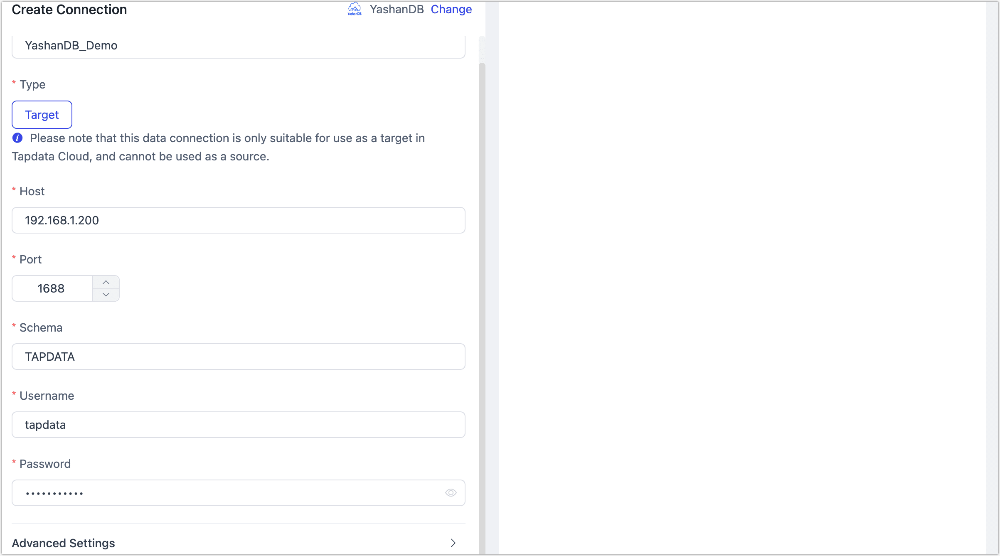

# YashanDB

import Content1 from '../../reuse-content/_enterprise-and-cloud-features.md';

<Content1 />

YashanDB is powered by Bounded Evaluation, which uniquely delivers Just in Time analytic capabilities focusing on conquering some of the challenges surrounding big data characterized by Volume, Velocity and Variety. TapData Cloud supports using YashanDB as a target database to build data pipelines, facilitating rapid data transfer.

This article will guide you through connecting a YashanDB data source on the TapData Cloud.

import Content from '../../reuse-content/_certificate.md';

<Content />

## Preparation

Log in to YashanDB as a DBA administrator and execute the following commands to complete account authorization:

```sql
-- Replace username with the actual username
GRANT CREATE SESSION TO username;
GRANT INSERT ANY TABLE TO username;
GRANT UPDATE ANY TABLE TO username;
GRANT DELETE ANY TABLE TO username;
GRANT SELECT ANY TABLE TO username;
```

## Connecting to YashanDB

1. Log in to [TapData Cloud](https://cloud.tapdata.net/console/v3/).

2. In the left navigation panel, click **Connections**.

3. On the right side of the page, click **Create**.

4. In the pop-up dialog box, search for and select **YashanDB**.

5. On the redirected page, fill in the connection information for YashanDB as per the instructions below.

   

    - **Basic Settings**
      - **Name**: Fill in a unique name that has business significance.
      - **Type**: Currently only supported as a **Target**.
      - **Host**: Fill in the connection address of YashanDB.
      - **Port**: The service port of the database, default is **1688**.
      - **Schema**: The Schema to connect to, which is the uppercase username, e.g., if the username is `tapdata`, the Schema is `TAPDATA`.
      - **Username**, **Password**: Fill in the database username and password respectively.
    - **Advanced Settings**
      - **Contain Table**: Defaults to **all**, you can also choose to custom and fill in the included tables, separated by commas (,) between multiple tables.
      - **Exclude Tables**: After turning on the switch, you can set the tables to be excluded, separated by commas (,) between multiple tables.
      - **Agent Settings**: Defaults to **Platform automatic allocation**, you can also manually specify an Agent.
      - **Model Load Time**: If there are less than 10,000 models in the data source, their information will be updated every hour. But if the number of models exceeds 10,000, the refresh will take place daily at the time you have specified.

6. Click **Test**, and when passed, click **Save**.

   :::tip

   If the connection test fails, follow the prompts on the page to fix it.

   :::
