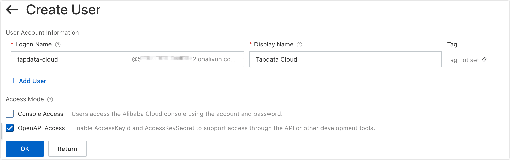
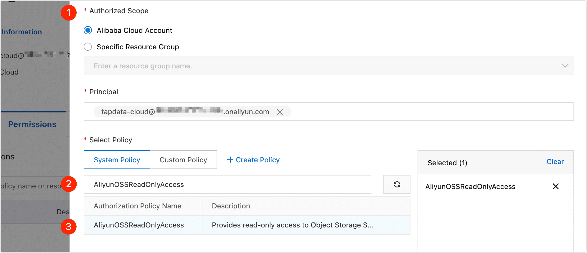
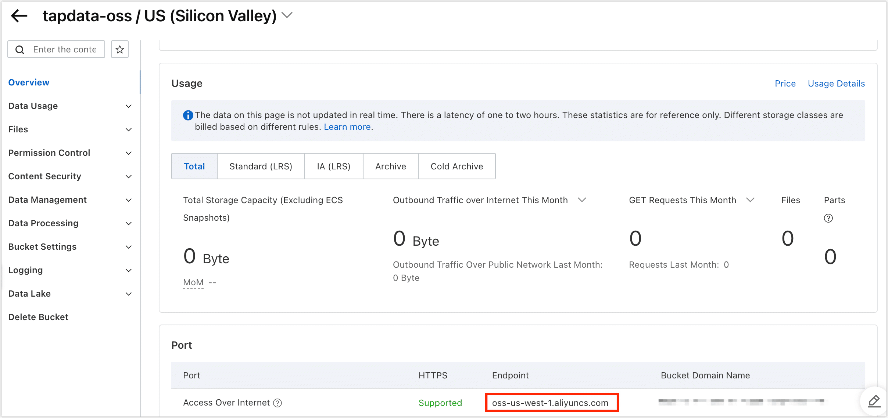

Object Storage Service (OSS) is a secure, cost-effective, and high-durability cloud storage service provided by Alibaba Cloud. When your files are stored on Alibaba Cloud OSS, you need to obtain the user's access key, bucket name, file path, and other necessary information.

1. Log in to [Alibaba Cloud RAM Console](https://ram.console.aliyun.com/).

2. Create a user and obtain an AccessKey.

    1. In the left navigation bar, select **Identities** > **Users**.

    2. Click **Create User**.

    3. On the redirected page, fill in the name, display name, select the OpenAPI Access, and click **OK**.

       

    4. After the user creation is complete, click **Download CSV file** that contains the AccessKey information.

       :::tip

       To ensure the security of your account, please keep your access key secure.

       :::

3. Grant permission to the user.

    1. On the user list page, find and click the user you just created.

    2. Click the Permissions tab, and then click **Grant Permission**.

    3. In the panel on the right, select the authorization scope, then search for and select the **AliyunOSSReadOnlyAccess** policy.

       

    4. Click **OK**, and then click **Complete**.

4. Obtains the OSS access domain name (Endpoint).

    1. Log in to [Alibaba Cloud OSS Console](https://oss.console.aliyun.com/bucket/).

    2. Locate and click on the target bucket.

    3. Click on the Overview tab on the left, then scroll down to the Port area and find the Endpoint for Access Over Internet.

       
