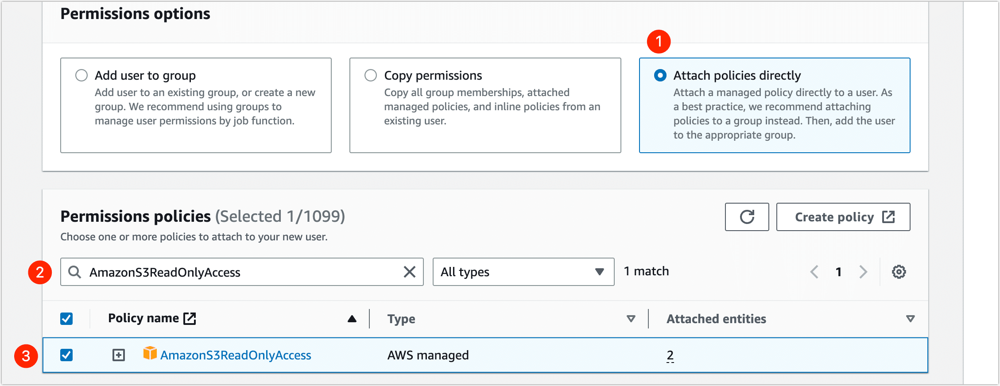
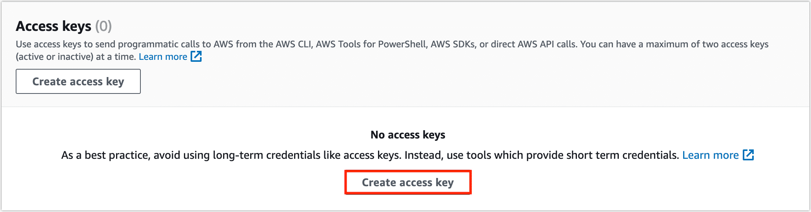
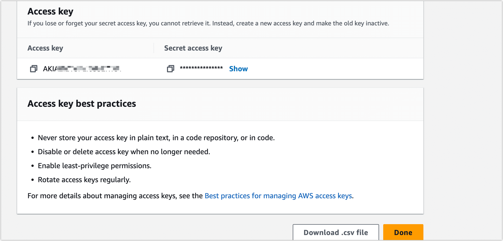
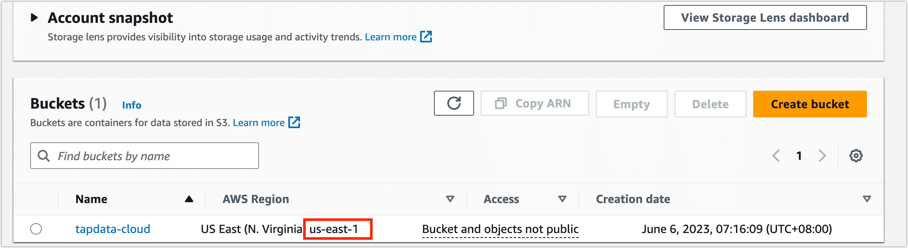

Amazon Simple Storage Service (Amazon S3) is an object storage service that offers industry-leading scalability, data availability, security, and performance. With Amazon S3, you can store and retrieve any size of data from anywhere on the web at any time. When your files are stored on Amazon S3, you need to obtain the user's access key, S3 bucket name, file path, and other necessary information.

1. Log in to [Amazon IAM Console](https://console.aws.amazon.com/iamv2/home?#/home).

2. Create a user and grant them access.

    1. In the left navigation bar, select **Access management** > **Users**.

    2. On the right side of the page, click **Add users**.

    3. Fill in the username and click **Next**.

       The user name can have up to 64 characters. Valid characters: A-Z, a-z, 0-9, and `\+ =,. @ _-`

    4. In the **Permissions options** area, select **Attach policies directly**, then search for and select the **AmazonS3ReadOnlyAccess** policy.

       

    5. Click **Next**, and then click **Create user**.

3. Create an access key for the user.

    1. On the user list page, find and click the user you just created.

    2. Click the **Security credentials** tab, and then click **Create access key** in the **Access keys** area.

       

    3. Select **Third-party services**and click **Next**.

    4. Fill in the description tab and click **Create access key**.

    5. **Access key** and **secret key** can be viewed or downloaded on the page.

       

       :::tip

       To ensure the security of your account, please keep your access key secure. This is the only time that the secret access key can be viewed or downloaded. You cannot recover it later. However, you can create a new access key any time.

       :::

4. Retrieve the bucket's region code.

    1. Log in to [Amazon S3 Console](https://console.aws.amazon.com/s3/buckets).

    2. On the bucket list page, find the target bucket and view its region code.

       

