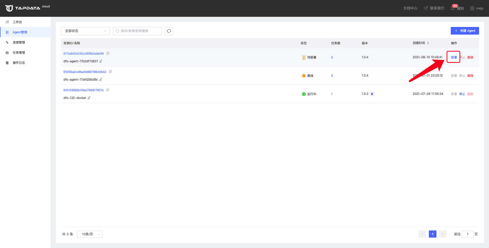

# Linux 平台上部署

## 环境要求

- 系统版本：64位
- 硬件环境：x86
- 环境要求：Java 1.8

## Java环境检查

Tapdata Agent 的运行依赖本地 Java 环境，因此，在部署前你需要检查本地否已经安装 Java 环境，可以在命令行中使用下方命令:

```bash
java -version
```

如果上方命令返回异常，则说明 Java 环境可能未安装，如果返回的版本不是 1.8.xx 的版本，则说明已安装的 Java 版本不挣钱。可参考下方的命令为本地安装 Java 环境（本提示中的 Openjdk 版本仅用于示例）：

```bash
yum -y install java-1.8.0-openjdk
```

在本地 Java 环境安装完毕后，即可开始下载 Tapdata Agent

## 安装步骤

1. 在Agent管理页面下找到你需要部署的 Tapdata Agent，点击部署打开部署页面。

   

2. 在部署页面复制部署命令并在本地部署环境执行（推荐采用独立文件夹以便维护），包含 Tapdata Agent 的下载、自动部署及启动。

   

3. 待上方命令执行完毕后，Tapdata Agent 会处于启动状态，自动上报状态等信息到管理端。

   

Tapdata Agent 运行后会在 Tapdata 官网 `Agent管理` 页面自动注册，此时你可通过管理页面对其进行管控，也可在本地使用命令行方式对其进行管控，如果你的本地部署环境无法连通公网，那么你可能无法在 `Agent管理`页面看到你的 Tapdata Agent。


## 管理 Tapdata Agent

进入到 Tapdata Agent 的部署目录下

关闭 Tapdata Agent：

```bash
./tapdata stop
```

启动Tapdata Agent：

```bash
./tapdata start
```

查看Tapdata Agent状态：

```bash
./tapdata status
```

## 目录结构及功能介绍

在完成 Tapdata Agent 的部署及启动后，Tapdata Agent 会自动在当前目录下生成其运行所需文件及目录，这些文件及目录主要用于任务信息、日志、配置文件、数据源证书文件的存放：

```bash
~/.tapdata/cert/ 
#如果中间库存在证书，那么此目录将用来存放证书相关文件

~/.tapdata/logs/ 
#此目录用来存放日志相关文件

~/.tapdata/os-monitor/
#此目录用来存放os-monitor配置文件

~/.tapdata/application.yml 
#该文件为Tapdata Agent配置文件

~/.tapdata/tapdata.conf
#该文件为早期版本Tapdata Agent配置文件，新版已由application.yml替代

~/agent.yml
#该文件同为Tapdata Agent配置文件
```

### Agent运行内存调整方式

在Agent部署目录下找到 `application.yml` 文件

在配置文件中找到tapdataJavaOpts配置，比如：`tapdataJavaOpts: "-Xms4G -Xmx8G"`

调整该配置里内存的值，具体的运行内存大小根据服务器的可用内存自行判断设置

```yaml
tapdata:
    conf:
        tapdataPort: '3030'
        backendUrl: 'https://cloud.tapdata.net/api/'
        apiServerPort: ""
        tapdataJavaOpts: "-Xms4G -Xmx8G"
        reportInterval: 20000
        uuid: a5f266a1-a495-412f-a433-29d345713c176
    cloud:
        accessCode: ""
        baseURLs: 'https://cloud.tapdata.net/api/'
        username: null
        token: 
spring:
    data:
        mongodb:
            username: ""
            password: ""
            mongoConnectionString: ""
            uri: ""
            ssl: ""
            sslCA: ""
            sslCertKey: ""
            sslPEMKeyFilePassword: ""
            authenticationDatabase: ""
```

配置文件修改完成后，重启Agent生效

```bash
#先停止Agent
./tapdata stop -f

#然后再启动Agent
./tapdata start
```

以上目录并不会占用太多磁盘空间，为了确保 Tapdata Agent 的稳定运行及在你遇到问题时 Tapdata 技术客服能够协助你快速定位问题根因，请勿删除这些目录以及目录中的文件。


## 视频教程
<iframe      src="https://20778419.s21v.faiusr.com/58/2/ABUIABA6GAAgqJSHkQYo5JeGyQc.mp4"   width="100%"      height="539"      frameborder="0"    allowfullscreen="true"  > </iframe>

## 下一步

[连接数据库](../connect-database.md)
