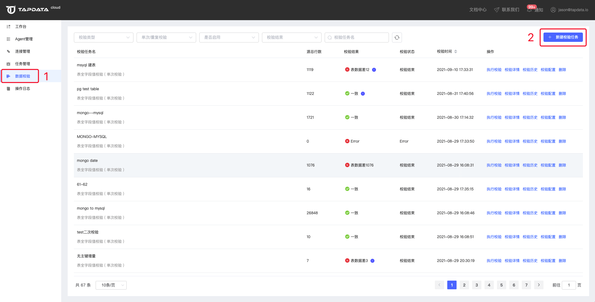
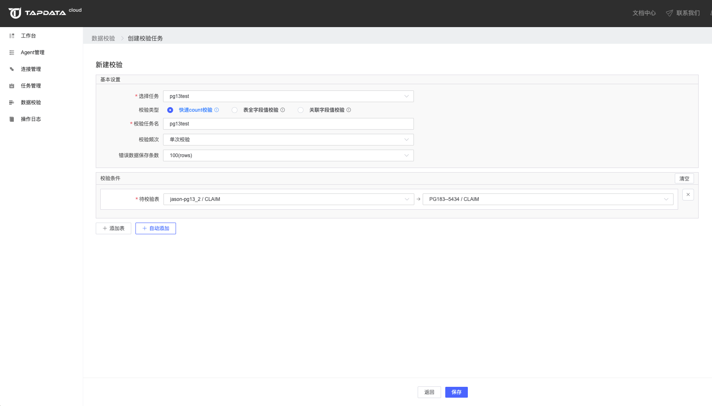
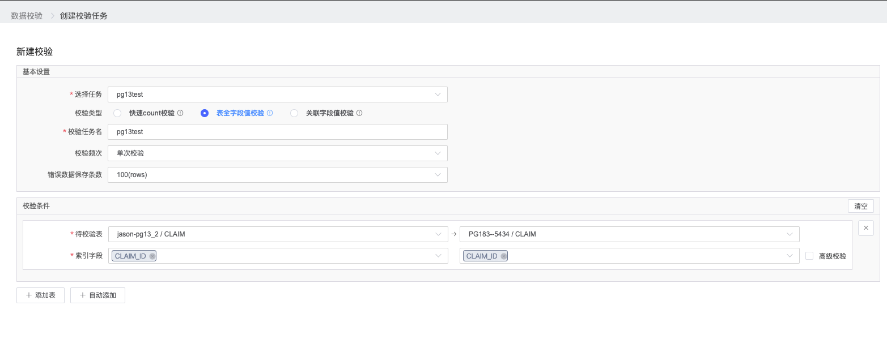
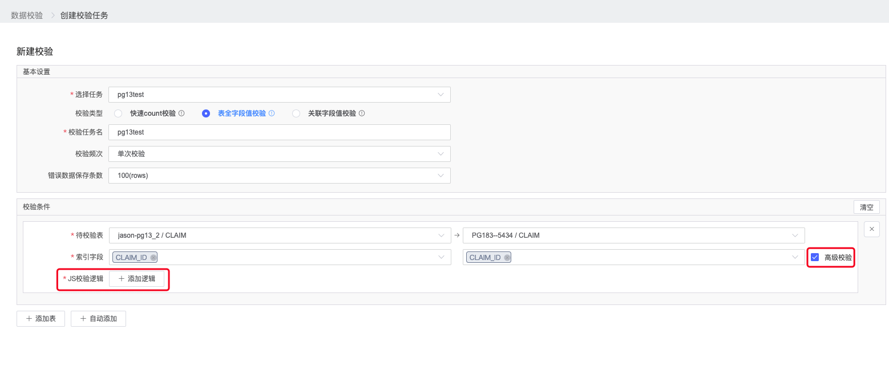
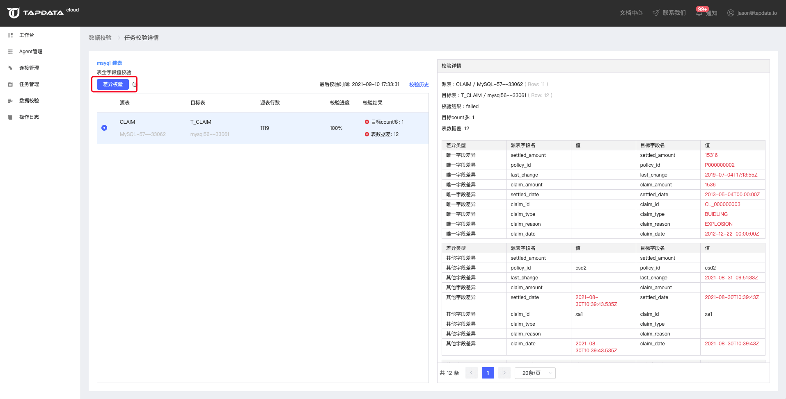
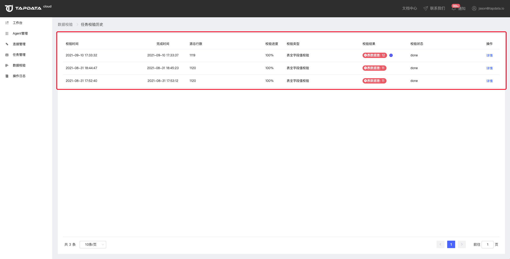
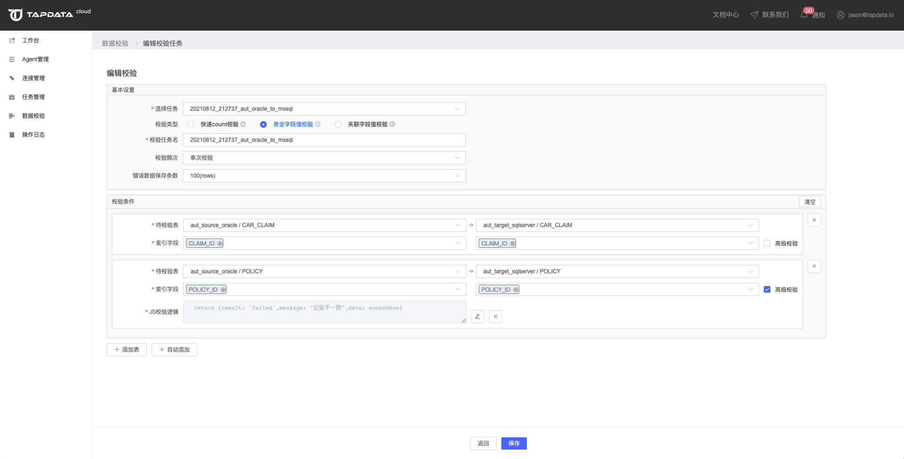
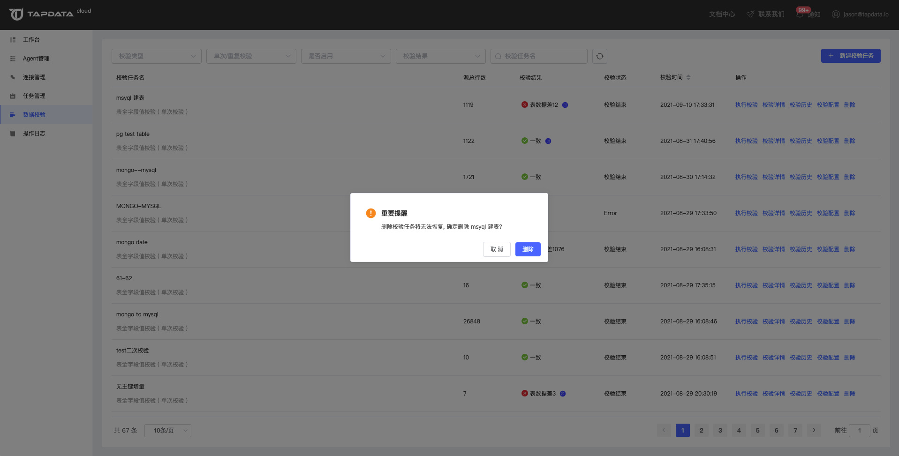

# 校验数据

数据校验是一个数据验证工具，用户可以根据自己数据同步的情况，选择对应的方式校验同步数据的正确性。该工具支持：快速count校验、表全字段值校验和关联字段值校验三种校验方式。

- 快速count仅对源表和目标表的行数进行count校验，速度极快，但是不会展示差异的具体字段内容。
- 全表字段值校验会对源表和目标表的全部字段进行逐行校验，能查出所有字段的差异，但是速度慢。
- 关联字段值校验只对源表和目标表的关联字段的值进行比对校验，速度快于全表字段值校验模式。



## 新建校验任务

进入【数据校验】菜单，点击【新建校验任务】可以创建数据校验。

- 选择任务：选择一个您需要进行校验的同步任务
- 校验类型：根据需要选择你要使用的校验类型
- 校验任务名：给您的校验任务起一个名字，默认与您选择的同步任务名字一样
- 校验频次：设置您的校验的执行频次
- - 单次校验：只执行一次校验
  - 重复校验：设置校验任务重复执行，支持设置校验执行的起止时间和校验间隔
- 错误数据保存条数：当出现校验不一致的数据时，不一致数据保存的最大条数。**该数值会影响到您进行差异校验，当您的错误数据条数超出您设置的保存条数时，将无法进行差异校验。**
- 校验条件：添加您需要进行校验的表。点击自动添加会自动将您任务下的所有表全部添加进来。



### 快速count校验

快速count仅对源表和目标表的行数进行count校验，速度极快，但是不会展示差异的具体字段内容。创建快速count校验时只需要选择到要校验的表，无需设置关联条件。


### 表全字段值校验

全表字段值校验会对源表和目标表的全部字段进行逐行校验，能查出所有字段的差异，但是速度慢。创建全表字段值校验时，您除了要选择带校验表外，还需要针对每一个表设置索引字段。



#### 高级校验

在进行全表字段值校验时，还支持进行高级校验。通过高级校验您可以添加JS校验逻辑，对源和目标的数据进行校验。



#### 高级校验说明

**第一步** 函数入参为源表数据，可以根据源表数据调用内置函数查询出目标数据
**第二步** 自定义校验逻辑
**第三步** 函数返回结果

- **result**：是否通过校验（passed：校验通过，failed：校验失败），如果不填或填其它字符则校验失败，必填项
- **message**：校验异常信息，建议校验失败返回，选填项
- **data**：当前校验目标数据，建议校验失败返回，选填项

完整示例：此为MongoDB查询示例

```javascript
function validate(sourceRow){
    // 第1步
    var targetRow = target.executeQuery({database: "target",collection: "USER",filter: {USER_ID: sourceRow.USER_ID}});
    // 第2步
    if(sourceRow.USER_ID === targetRow[0].USER_ID){
        // 第3步
        return {result: 'passed',message: "",data: ""}
    }else{
        return {result: 'failed',message: "记录不一致",data: targetRow}
    }
}
```


### 关联字段值校验

关联字段值校验只对源表和目标表的关联字段的值进行比对校验，速度快于全表字段值校验模式。创建关联字段值校验时，您除了要选择带校验表外，还需要针对每一个表设置索引字段。


校验任务创建完成保存时会自动开始执行校验，您也可以在列表手动执行一个已经存在的校验任务。

**注意事项：**

如果您在同步过程中对表字段名进行了修改，那么进行表全字段值校验和关联字段值校验时会因为字段名不匹配而导致校验失败**。**

# 校验详情

点击【校验详情】可以查看当前校验任务的详情。

- 对于快速count的校验任务，您可以在详情页看到每个表一致和不一致的结果。
- 对于表全字段值校验的任务，你可以在详情页看到每个表的一致和不一致的结果，对于有差异数据的表，点击可以看到错误数据详情。需要注意的时，对于一次校验的错误数据我们并不会全部保存，保存的数量取决于您在创建任务时设置的【错误数据保存条数】，目前最多只支持10000条。
- 对于关联字段值校验的任务，你可以在详情页看到每个表的一致和不一致的结果，对于有差异数据的表，点击可以看到错误数据详情。需要注意的时，对于一次校验的错误数据我们并不会全部保存，保存的数量取决于您在创建任务时设置的【错误数据保存条数】，目前最多只支持10000条。


## 差异校验

差异校验是对上一次校验后还有差异的那一部分数据进行再次校验，以确认数据是否已经一致。

对于表全字段值校验和关联字段值校验的任务，可以进行差异校验。快速count校验暂不支持差异校验。

**注意：如果您校验任务的差异数据数量超过您设置的【错误数据保存条数】，由于错误数据记录不完整，将无法再进行差异校验。**



### 差异校验历史

进行了差异校验的校验任务可以看到最后校验时间和查看差异校验历史。


差异校验历史显示的是从第一次全量校验开始，基于这一次全量校验进行的每一次差异校验的历史记录。点击详情可以查看每一次差异校验后有差异的数据的详细信息。


## 校验历史

在校验任务列表点击【校验历史】可以打开当前任务的校验历史页面，校验历史显示的是当前校验任务进行的所有全量校验的历史记录，差异校验的记录不会在这里显示。



## 校验配置

点击【校验配置】，可以打开校验任务的编辑页面，可以对校验任务的配置进行编辑和调整。



## 删除

点击【删除】可以删除一个不需要的校验任务。



