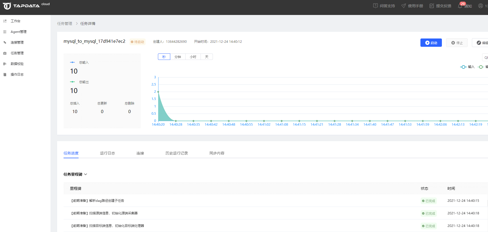
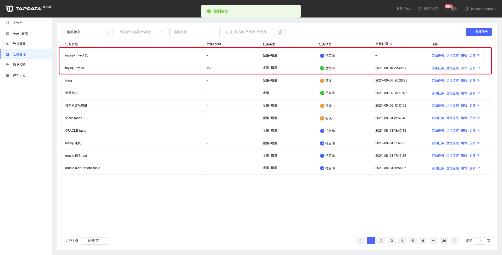

# 管理任务

任务创建完成后，您可以在任务列表中对任务进行监控和管理操作。

## 运行监控

单击任务**操作**栏的**运行监控**，即可打开任务执行页面，可查看任务执行的具体信息。

可查看到任务进度、运行日志、连接、历史运行记录、同步内容等信息。

## 编辑任务

点击任务编辑页面，可以对任务的内容和配置进行编辑调整。

## 复制任务

通过【复制】操作可以快速复制一个任务

## 重置任务

点击【重置】可以将任务同步进度清除

## 删除任务

点击【删除】可以删除任务，任务删除无法恢复

