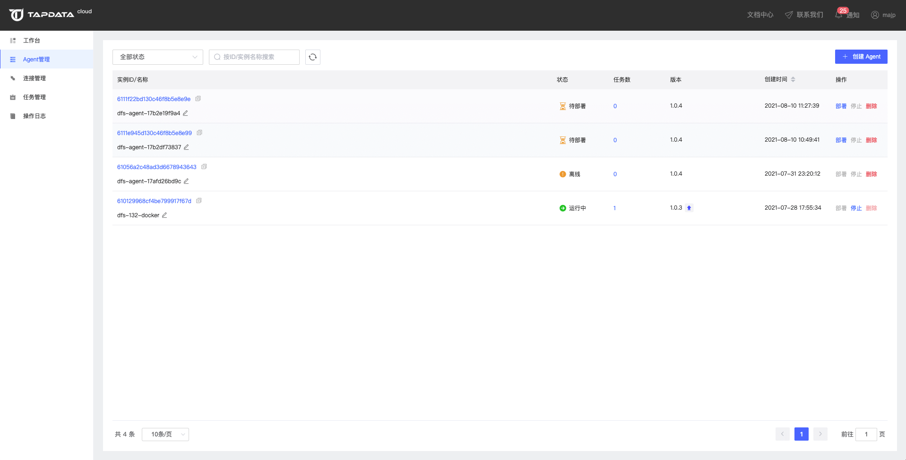
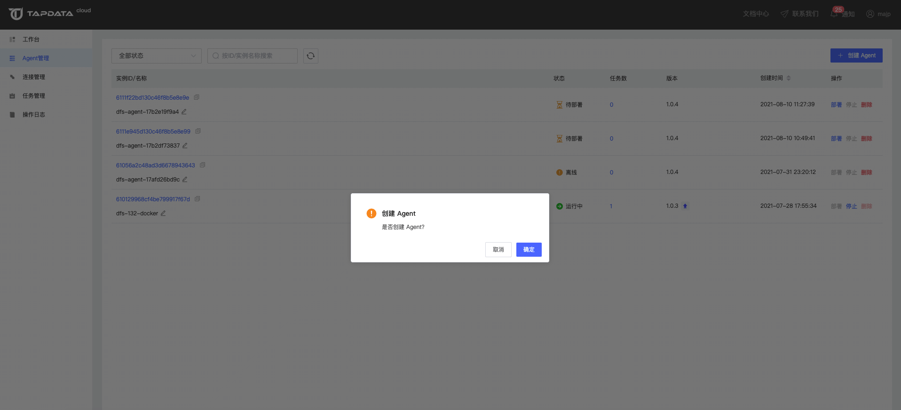
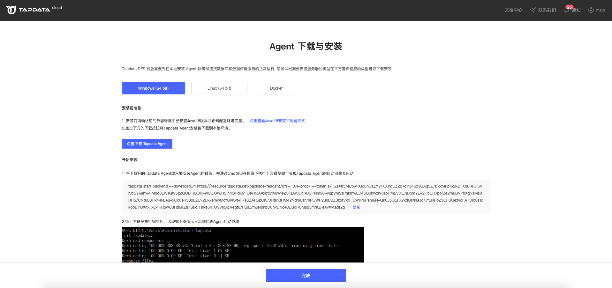
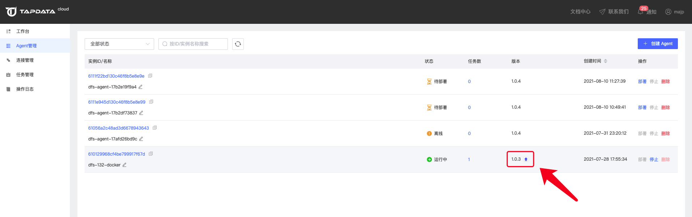
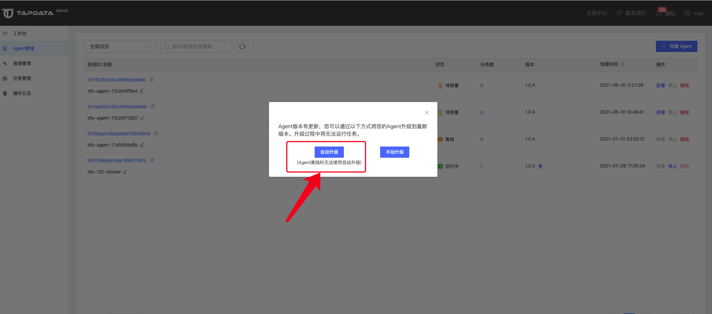

# 管理 Agent

Agent 管理列表可以对 Agent 进行创建、部署、停止、删除等操作。您可以在这里修改 Agent 的名称、查看 Agent 详情。

## 创建 Agent

点击【创建Agent】可以创建一个Agent，用户可以根据需要创建多个Agent，Agent创建完成后需要进行部署启动才可以使用。

## 部署 Agent

点击 Agent 列表的部署按钮可以打开Agent部署页面，选择您需要部署Agent的版本按照部署操作指引进行部署即可，相关介绍，见[安装 Agent](../quick-start/install-agent)。

## 升级 Agent

当 Agent 有新版本可用时，Agent 版本后会显示升级按钮，点击升级按钮可以对 Agent 进行升级。目前支持自动升级和手动升级两种方式。

### 自动升级

只有Agent状态为运行中时才可以使用自动升级，升级前会对Agent进行检测，如果要升级的Agent上有任务正在运行，为了避免升级Agent对任务造成影响，需要先手动停止所有任务才可以升级Agent。

自动升级时，Agent会自动下载升级包进行升级，所以需要一定的时间，升级成功后升级提醒图标会自动消失，如果升级失败会自动回滚，此时用户可以通过手动升级功能再进行升级。

### 手动升级

如果Agent状态为离线，则只能使用手动升级。点击手动升级会进入手动升级页面。按照页面指引，在部署Agent的宿主机执行升级命令即可完成升级。

## 停止Agent

对于运行中的Agent，点击停止按钮，可以停止Agent的运行，对于自建实例目前只支持停止，暂不支持启动。

## 删除Agent

已经停止的Agent用户可以删除。点击删除按钮即可完成Agent的删除。