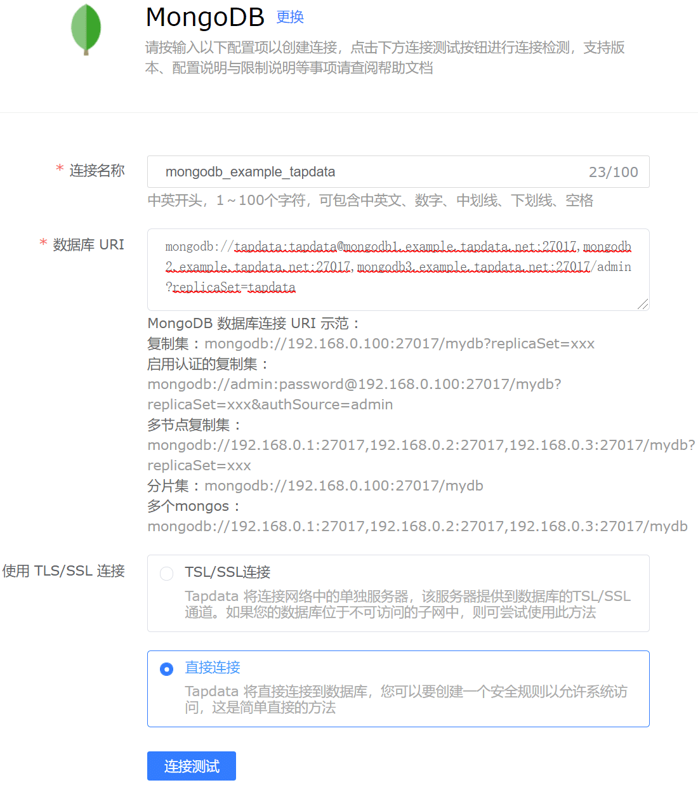
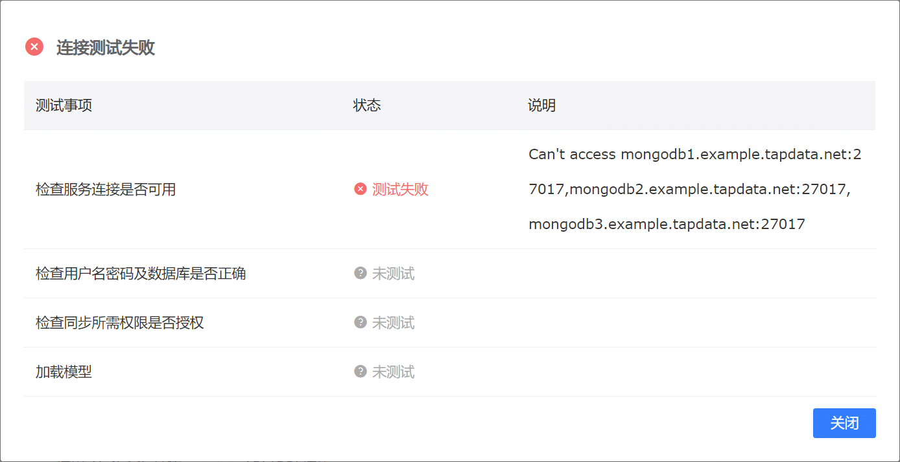

# MongoDB 连接测试

在对连接进行测试前，你需要在对应连接添加页面填写相关配置信息，如下图所示：

在所有配置项填写完毕后，可通过下方蓝色“连接测试”按钮对本次添加的连接进行测试。测试包括连通性测试、账号登录测试、版本检查、账号权限测试等，对应测试项目如下图所示：

上图展示了在连接为MongoDB时的所有测试项目，对应测试项目的功能及常见问题：

:::tip

只有在所有测试项目均为测试通过时，Tapdata Agent才能够为该数据源提供对应数据服务。

:::

- **检查服务连接是否可用**

  该测试项会对所填写的MongoDB尝试连接，在网络不可达时Tapdata Agent会提示测试失败，此时请检查网络连通性，如：本地iptables配置、网络中的ACL限制等。

- **检查用户名密码及数据库是否正确**

  该测试项会使用所填写的用户名密码对MongoDB尝试连接并登陆所填写数据库，在用户名错误、密码错误、库名错误、库不存在时Tapdata Agent会提示测试失败，此时请检查用户名、密码、库名的正确性。

- **检查数据源版本信息是否可用**

  该测试项会对所填写的MongoDB进行版本检测，发现版本为不支持版本时Tapdata Agent会提示测试失败。

- **检查同步所需的权限是否授权**

  该测试项会对同步权限进行检测，在对应账号同步权限时Tapdata Agent会提示测试失败，此时请检查对应账户是否拥有同步权限，如果没有则需要对该权限进行补充。

- **加载模型**

  该测试项会尝试加载所填写数据库中的表的表结构，在无法加载时Tapdata Agent会提示测试失败，此时请检查对应账户权限是否足够。
