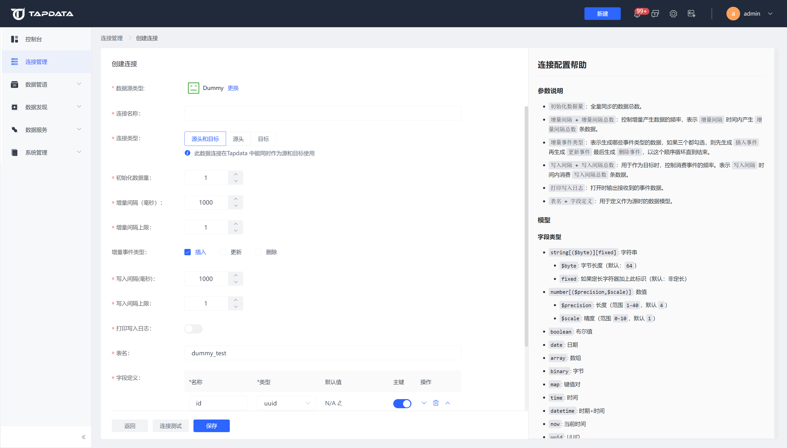

# 连接 Dummy

Dummy是测试数据源，可以生成测试数据。本文介绍如何在 Tapdata 中添加 Dummy 数据源。

1. 登录 Tapdata 平台。

2. 在左侧导航栏，单击**连接管理**。

3. 单击页面右侧的**创建连接**。

4. 在弹出的对话框中，选择 **Dummy**。

5. 在跳转到的页面，根据下述说明填写连接信息。

   

   * **连接名称**：填写具有业务意义的独有名称。
   * **连接类型**：选择源头或目标，也可以选择源头和目标。
   * **初始化数据量**：全量同步的数据总数，范围：0 ~ 9223372036854775807。
   * **增量间隔**、**增量间隔上限**：控制增量产生数据的频率，表示**增量间隔时间**内产生的**增量间隔总数**条数据，范围：0 ~ 2147483647。
   * **增量事件类型**：表示生成哪些事件类型的数据，如果全选，则以插入事件 > 更新事件 > 删除事件 的顺序循环。
   * **写入间隔**：作为目标数据源时，控制消费事件的频率，单位为毫秒，
   * **写入间隔总数**：表示 **写入间隔** 时间内消费 **写入间隔总数条**数据，范围 0 ~ 2147483647。
   * **打印写入日志**：打开时输出接收到的事件数据。
   * **表名**、**字段定义**：定义作为源头时表的结构，支持批量新增字段。
   * **包含表**：默认为**全部**，您也可以选择自定义并填写包含的表，多个表之间用英文逗号（,）分隔。
   * **排除表**：打开该开关后，可以设定要排除的表，多个表之间用英文逗号（,）分隔。
   * **agent 设置**：默认为**平台自动分配**，您也可以手动指定 Agent 。
   * **模型加载频率**：数据源中模型数量大于1万时，会按本参数设置的频率执行模型刷新。

6. 单击**连接测试**，测试通过后单击**保存**。

   :::tip

   如提示连接测试失败，请根据页面提示进行修复。

   :::

   