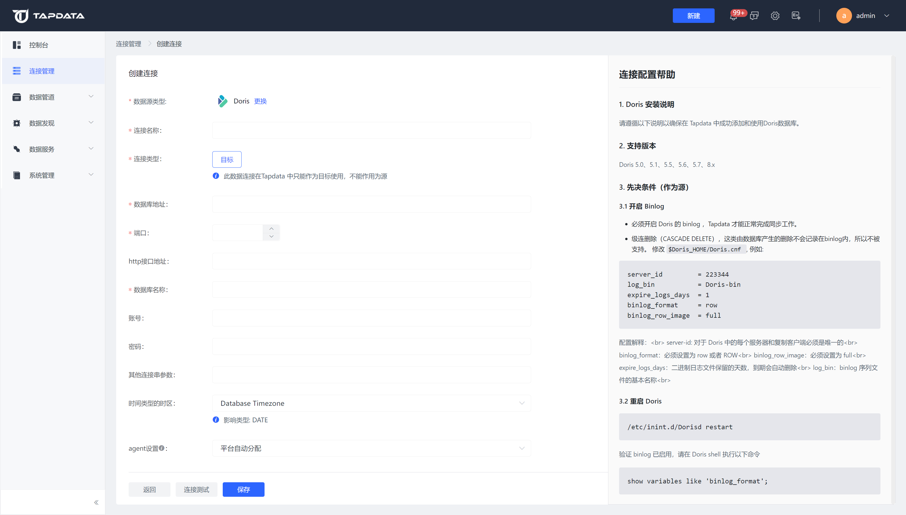

# 连接 Doris

在数据源类型选择页面选择Doris，打开Doris连接配置页面。

数据源类型：已选择的数据源类型

连接名称：设置连接的名称

连接类型：Doris仅支持作为目标。

目标：此数据连接在Tapdata 中只能作为目标使用，不能作用为源

数据库地址：配置数据库的访问地址

端口：配置数据库的访问端口

http接口地址：此连接的http接口地址

数据库名称：配置数据库的名称

账号：配置数据库的账号

密码：配置数据库的密码

连接参数：配置需要的JDBC连接串参数

时间类型的时区：设置时间类型字段需要使用的时区，默认为数据库时区。

agent设置：可设置该连接调用的引擎服务器，默认为平台自动分配可用户手动指定。

连接测试：点击连接测试，测试连接是否可用。

保存：点击保存按钮，保存连接。

用户根据自己实际的Doris连接信息，按照配置页面右侧的连接配置帮助进行配置。

配置完成后，点击测试连接进行测试，看连接是否有效。