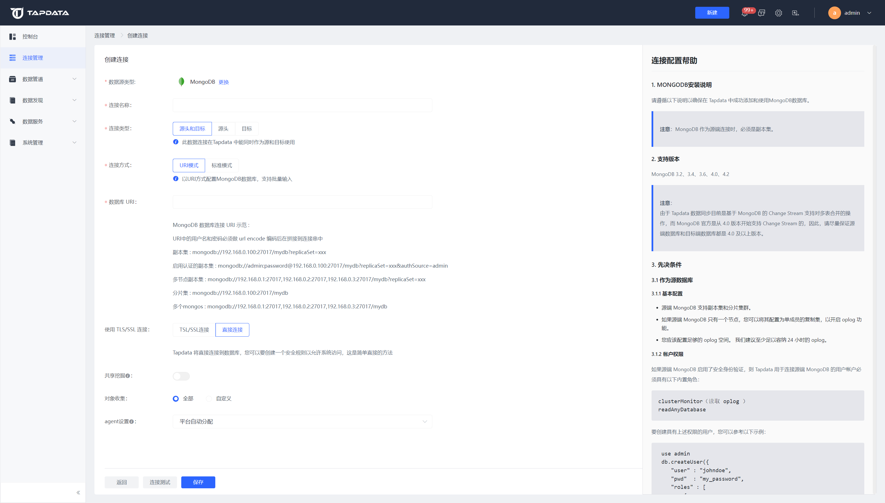
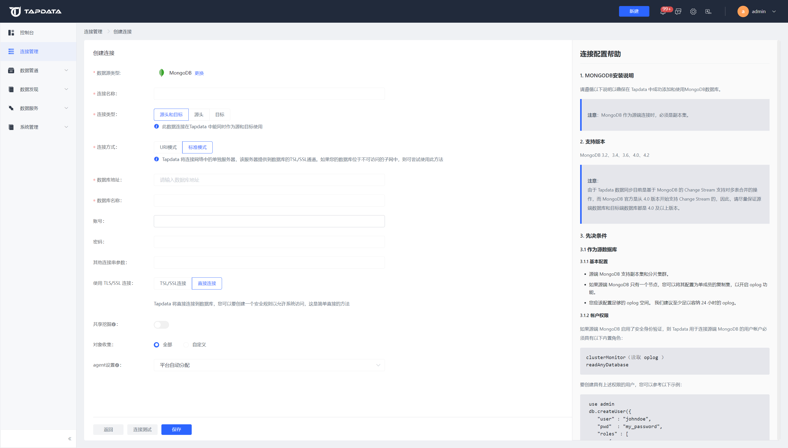
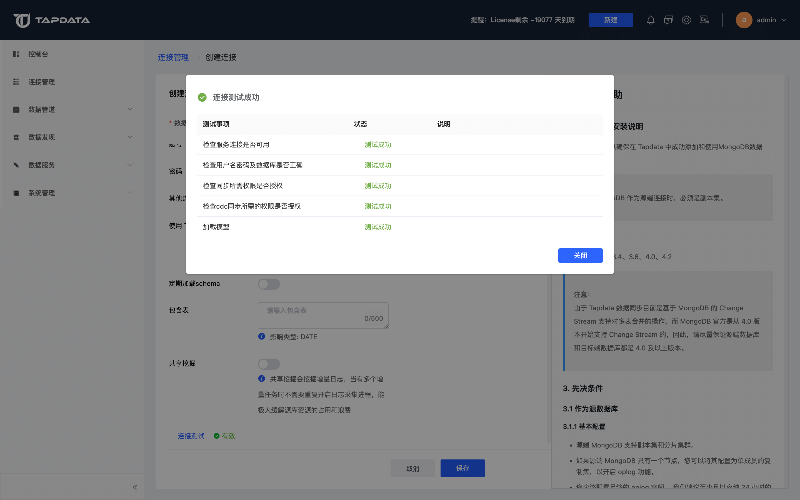

# 连接 MongoDB

在数据源类型选择页面选择MongoDB，打开MongoDB连接配置页面。

数据源类型：已选择的数据源类型

连接名称：设置连接的名称

连接类型：支持源头和目标、源头、目标三种选择。

源头和目标：此数据连接在Tapdata 中能同时作为源和目标使用

源头：此数据连接在Tapdata 中只能作为源使用，不能作用为目标

目标：此数据连接在Tapdata 中只能作为目标使用，不能作用为源

连接方式：支持URI模式和标准模式

URI模式：以URI方式配置MongoDB数据库，支持批量输入

标准模式：通过标准模式配置数据库地址和端口

如果您选择的是URI模式，则需要配置

数据库URI

如果您选择的是标准模式，则需要配置

数据库地址：配置数据库的访问地址

数据库名称：配置数据库的名称

端口：配置数据库的访问端口

账号：配置数据库的账号

密码：配置数据库的密码

使用TLS/SSL连接

TLS/SSL连接：Tapdata 将连接网络中的单独服务器，该服务器提供到数据库的TSL/SSL通道。如果您的数据库位于不可访问的子网中，则可尝试使用此方法

直接连接：Tapdata 将直接连接到数据库，您可以要创建一个安全规则以允许系统访问，这是简单直接的方法

共享挖掘：设置是否开启共享挖掘。共享挖掘会挖掘增量日志，当有多个增量任务时不需要重复开启日志采集进程，能极大缓解源库资源的占用和浪费。

对象收集：设置平台会收集该连接下的哪些表，默认为全部，也可以自定义只收集部分表。

agent设置：可设置该连接调用的引擎服务器，默认为平台自动分配可用户手动指定。

连接测试：点击连接测试，测试连接是否可用。

保存：点击保存按钮，保存连接。

标准模式：

用户根据自己实际的MongoDB连接信息，按照配置页面右侧的连接配置帮助进行配置。

配置完成后，点击测试连接，测试配置完成的连接是否有效。

 

测试通过后，点击保存按钮，保存配置好的MongoDB连接。