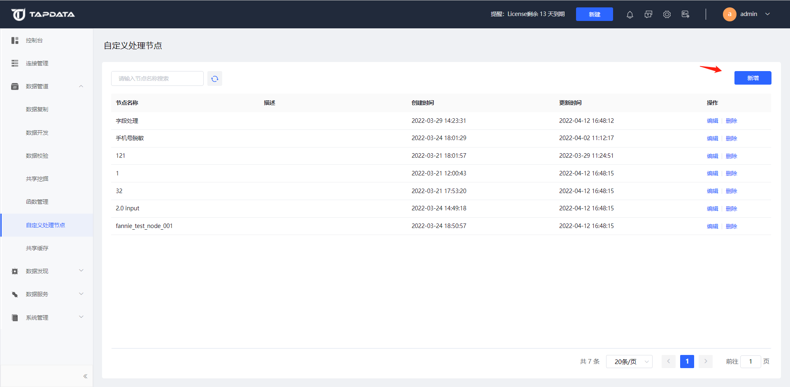

# 自定义节点

为了将一些通用的 JS 脚本整理成可直接使用的处理节点，降低用户在使用时的开发工作量，Tapdata 支持了自定义节点功能。用来满足现有 JS 节点需要每次都重新编写比较麻烦、函数的逻辑又较为简单无法满足的情况。


## 创建自定义节点

打开【数据管道】的【自定义处理节点】界面，点击右上角【新增】按钮



设置自定义的配置项

**表单设置：**

设置该处理节点的需要的组件及相应配置

左侧为组件区域，可拖拽各种需要的组件至操作区并进行配置

中间为操作区域，可调整各组件的位置或选中后进行配置

右侧为配置区域，可设置该组件的各项配置（如标题、描述、默认值等）


**JSON展示**

点击上方【JSON展示】按钮，显示该处理节点表单项的JSON模型，用户可直接在该界面编辑表单信息


**节点代码逻辑编辑**

点击上方【代码编辑】按钮，可编辑该处理节点的数据处理逻辑，可将表单中的字段标识进行引用


**预览**

点击上方【预览】按钮可参考该处理节点的展示效果

创建完成后即可点击右上角【保存】按钮，保存该自定义处理节点


## 使用处理节点

在开发任务中可使用已经创建好的自定义处理节点，将需要节点拖拽至DAG画布中即可正常使用


## 应用场景

处于信息安全考虑，希望对 MySQL 表中的一部分手机号进行脱敏。


**操作思路：**

先创建一个自定义节点，填写相应配置和逻辑后，再创建个开发任务引用该节点。


**具体流程：**

1. 登录 Tapdata，单击左侧导航栏的**数据管道** > **自定义节点**。

2. 点击右上角**新增**按钮，创建一个自定义节点操作及配置如下：

   * 操作：先从左侧输入控件区域拖拽一个单行输入框到中间的操作区域

   * 节点名称：左上角，可任意填写，例：手机号脱敏

   * 字段标识：可任意填写，例：masking_field_name

   * 标题：可任意填写，例：手机号字段名

     其他为非必填项

3. 点击上方中的**代码编辑**按钮，打开代码编辑界面编写节点逻辑。

   ```java
   // 代码逻辑：将手机号中的“1234”进行脱敏
   function process(record, form){
   var str="18912341234"
   var pat=/(\d{3})\d*(\d{4})/*
   *var b=str.replace(pat,'$1****$2');
   console.log(b)
    record[form.masking_field_name] = record[form.masking_field_name].replace("1234","****"); 
   ```

4. 点击右上角**保存**按钮。

5. 打开数据管道-数据开发，点击右上角**创建任务**按钮。

6. 选择一个连接作为源节点，在处理节点区域选择刚才创建的自定义节点，并手机号字段填写mobile

7. 选择一个连接作为目标节点。

8. 连接好源节点-自定义处理节点-目标节点 后，点击右上角**保存**按钮。

9. 点击左上角**返回**按钮，跳转至任务列页。

10. 点击该任务的**启动**按钮，即可启动一个使用自定义节点的任务，将源表中的手机号进行脱敏了。


源端表数据：


目标表数据进行脱敏后：

