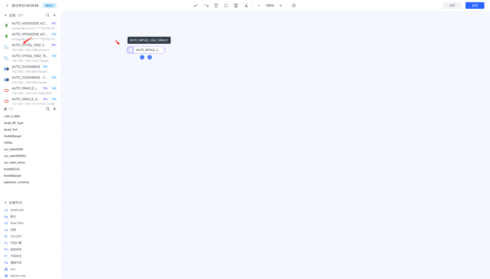
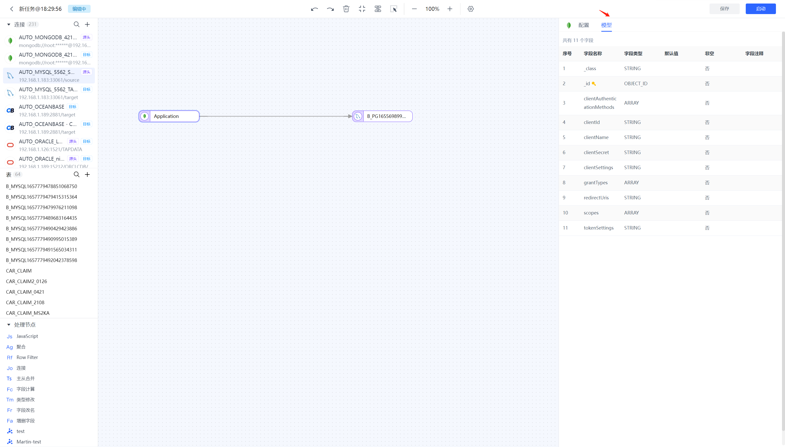
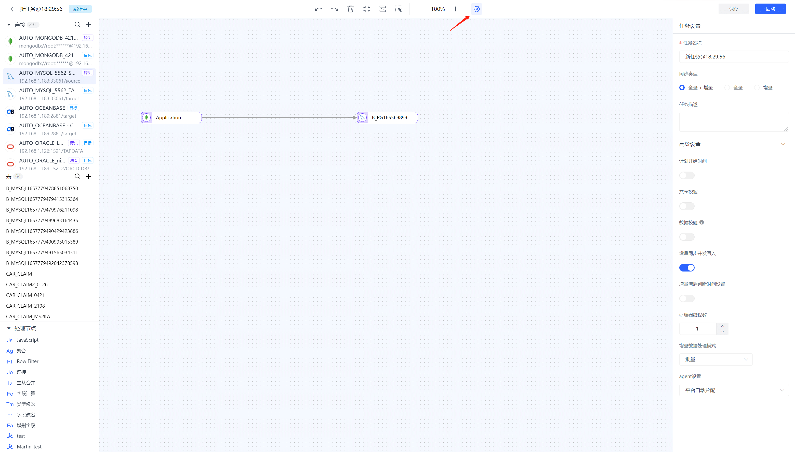

# 创建数据开发任务

点击数据开发任务列表右上方的【创建任务】按钮，会打开数据开发任务创建的画布区域，用户可以在这里构建数据开发任务。

### 画布区域介绍

连接区域：显示当前用户可用的所有连接，支持对连接进行搜索，支持直接新建连接

表区域：与连接区域联动，根据连接区域所选择的连接，会自动显示该连接下的表。支持搜索表和新建表。

处理节点区域：显示当前开发任务可用的所有处理节点

画布区域：开发任务构建的画布区域，将需要使用的表和处理节点添加到画布区域进行开发任务构建。

设置区域：节点和任务的属性设置区域

操作区域：主要包含修改任务名，撤销、重做、删除、内容居中、自动布局、缩小、放大、设置、保存等操作。

### 添加节点

选择要使用的源表，将其拖拽添加到画布。

可以根据需要添加多个源表节点。添加完源节点及目标节点后进行连线

### 源节点设置

点击源表节点，设置表节点的属性

节点名称：该节点的名称，默认为表名称可修改

数据库/连接：选择该节点的连接

表：选择该节点的表

高级设置：

增量同步间隔：轮询增量事件的间隔，单位是毫秒，只对通过轮询方式实现增量的数据库有效

每次读取数量 ：同步数据批次大小

DDL事件采集：开启后任务将会自动采集选中的源端DDL事件

可以点击模型按钮查看该表的模型

### 目标节点配置

点击目标表节点，设置表节点的属性

节点名称：该节点的名称，默认为表名称可修改

数据库/连接：选择该节点的连接

表：选择该节点的表

高级设置：

已有数据处理：当数据传输时发现目标端存在相同的表的处理策略，默认为保持已存在的数据

数据写入模式：传输时的数据传输策略，默认为更新已存在或者插入新数据

更新条件字段：源于目标进行关联的字段，字段值一致则判定为同一条数据

全量写入线程数：设置全量写入的线程数量。默认为8，可以根据服务器的性能适当进行调整。

增量写入线程数：设置增量写入的线程数量。默认关闭，开启后默认为4。可以根据服务器的性能适当进行调整。

### 任务属性设置

点击【设置】按钮，设置任务的属性

任务属性设置包含基本设置和高级设置。

基本设置包含：

任务名：设置任务的名称

任务描述：开发任务的描述信息

同步类型：开发任务的同步类型

全量+增量

全量

增量

高级设置：

计划开始时间：开启后可以从设置指定的时间点开始任务，同时纯全量任务可以支持周期调动，通过设置cron表达式来实现任务的定期执行。

共享挖掘：若有多个任务需要从源库读取数据时为降低源库压力，开启后我们会将增量日志存储至中间MongoDB库中供不同的任务使用

数据校验：开启后会对任务中所有表的数据进行校验，不一致会在任务监控可观测性中展示

增量同步并发写入：开启后增量时会进行并发写入

增量滞后判断时间设置：开启后可设置滞后时间，超过该时间才会被判定为增量滞后。

增量数据处理模式：默认为逐条，支持逐条和批量。仅任务类型包含增量时支持该设置

agent设置：用户可以根据需要平台自动分配或自己手动设置

### 保存/启动任务

任务设置完成后，点击【保存】按钮保存任务，如果点击【启动】按钮，该任务启动后会进入运行监控界面。

