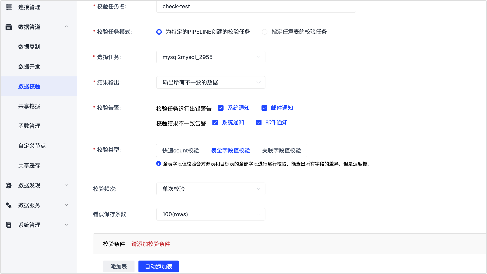

# 数据校验

基于多种自研技术，Tapdata 可最大程度保障数据一致性。除此以外，Tapdata 还支持对数据表执行数据校验，帮助您进一步验证和确保数据流转的正确性，满足生产环境的严苛要求。本文介绍数据校验任务的配置流程。

## 操作步骤

1. 登录 Tapdata 平台。

2. 在左侧导航栏，选择**数据管道** > **数据校验**。

3. 单击页面右上角的**创建**，根据下述说明填写各项参数：

   

   * **校验任务名**：为任务填写有业务意义的名称，便于后续识别。
   * **校验任务模式**：
     * **为特定的 PIPELINE 创建的校验任务**：为指定的数据复制/开发任务执行校验，选择此项时，您还需要选择待校验的数据复制/开发任务。
     * **指定任意表的校验任务**：自由指定需要校验的源和目标表。
   * **结果输出**：选择**输出所有不一致的数据**或**只输出来源表不一致的数据**。
   * **校验告警**：选择当任务运行出错或校验结果不一致时，告警信息的通知方式。 
   * **校验类型**：目前支持下述三种校验方式。
     :::tip
     如在同步过程中修改了表的字段名，那么执行**表全字段值校验**或**关联字段值校验**时，可能因字段名不匹配而导致校验失败。
     ::: 
     * **快速 count 校验**：对源表和目标表的行数进行校验，不会展示具体的差异内容，速度极快。
     * **全表字段值校验**：对源表和目标表的全部字段的值逐行校验，可展示所有字段的差异内容，速度较慢。
     * **关联字段值校验**：仅对源表和目标表的关联字段的值进行校验，速度中等。
   * **校验频次**：默认为**单次校验**，如选择为**重复校验**，您还需要设置校验执行的起止时间和任务间隔时间。 
   * **错误保存条数**：即不一致数据保存的最大条数，默认为 **100**，最大为 **10000**，推荐设置较大的值以确保记录的完整性。
   * **校验条件**：推荐选择**自动添加表**，即由 Tapdata 自动加载数据复制/开发任务中的源/目标数据表，此外，您也可以手动添加表、设置高级校验并添加 JS 校验逻辑。

4. 单击**保存**，校验任务开始执行。

5. （可选）单击校验任务对应的**详情**，查看详细校验结果。

   

   :::tip

   当校验类型为**全表字段值校验**或**关联字段值校验**时，您还可以单击右上角的**差异校验**，对本次全量校验的差异数据结果进行再次校验，以确认数据是否已经一致。

   :::

## 常见问题

* 问：支持定时执行数据校验吗？

  答：支持，可在配置校验任务时选择**校验频次**为**重复校验**，然后根据需要选择执行时间和间隔时间。

* 问：为什么会出现数据校验不一致？

  答：Tapdata 基于多种自研技术保障数据一致性，通常数据校验不一致的原因包括但不限于以下几种原因：

  * 有客户端在目标表中新写或修改了数据
  * 数据复制过程中修改了表的字段名
  * 数据增量复制有延迟，源表中新的数据变更尚未同步到目标表

* 问：校验任务提示失败，如何处理？

  答：单击校验任务对应的**详情**，查看相关报错提示，或联系我们[获取技术支持](../../support.md)。

