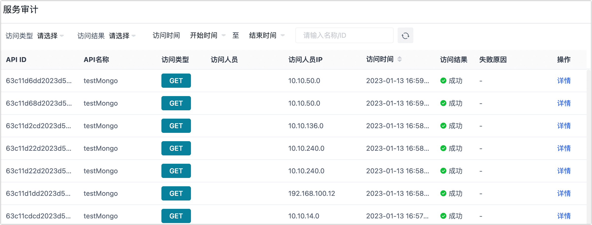
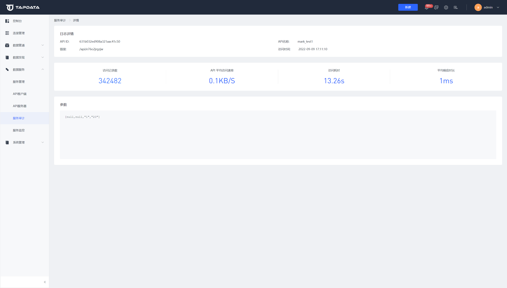

# 服务审计

服务审计主要用来查看 API 的访问记录，可查看每次请求的记录包括访问类型、访问人员、IP 地址、访问时间、访问结果、失败原因等等，也可按不同条件进行筛选。

登录至 Tapdata 平台，单击页面左侧的**数据服务** > **服务审计**即可查看。

单击**详情**可查看到对应请求的详细信息，具体如下：

- **日志详情**：包括访问的基本信息和各项指标，例如 API 的 ID、名称、访问人员的 IP 地址等。
- **访问记录数**：该次访问总的记录条数（条）
- **API 平均访问速率**：对API单次访问的数据平均传输速率。
- **访问耗时**：对 API 单次访问的计算耗时统计（单位为秒）。
- **平均响应时长**：对 API 单次访问每条记录的平均响应时间（单位为毫秒）。