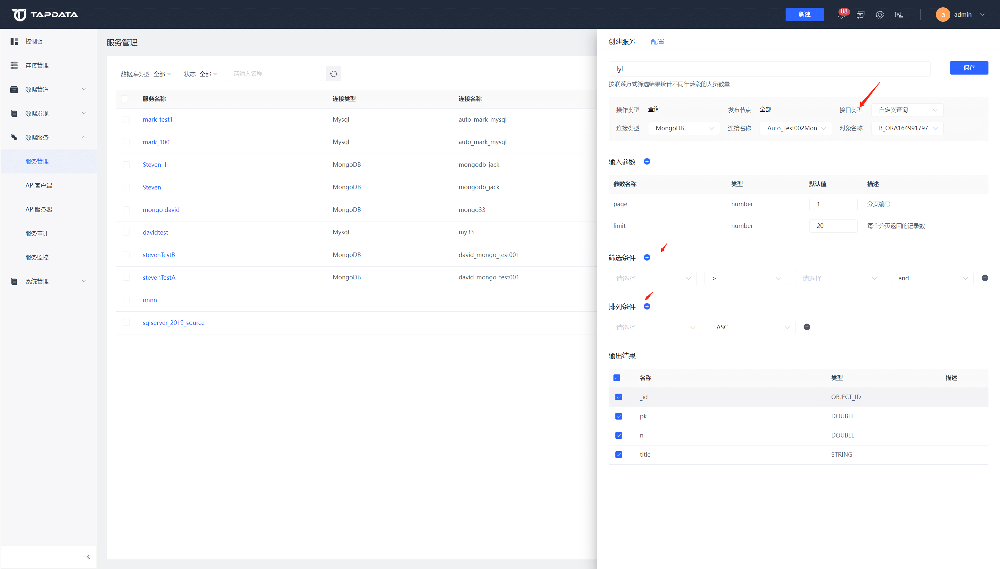

# 创建数据服务

为了方便开发人员进行接口对接，同时也方便查看通过 Tapdata 发布的 API 信息，我们提供了数据服务功能。

## 操作步骤

1. 打开【数据服务】的【数据服务】界面。

2. 点击右上角【创建服务】按钮，然后填写相关设置。

   

   * 设置服务名称
   * 接口类型默认为默认查询，可调整为自定义查询，自定义查询可设置筛选添加及排列条件
   * 输入参数默认参数可修改默认值可新增参数
   * 输出结果可设置输出哪几个字段

3. 配置好相应信息后保存即可。

4. 刚创建好的服务为未发布状态需点击右侧发布按钮进行发布即可进行使用。
