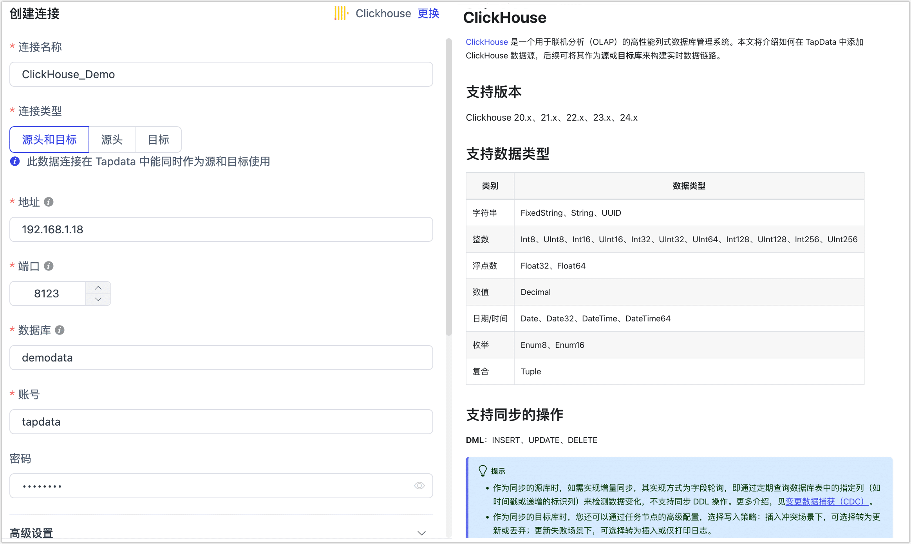

# ClickHouse
import Content from '../../reuse-content/_all-features.md';

<Content />

[ClickHouse](https://clickhouse.com/) 是一个用于联机分析（OLAP）的高性能列式数据库管理系统。本文将介绍如何在 TapData 中添加 ClickHouse 数据源，后续可将其作为**源**或**目标库**来构建实时数据链路。

```mdx-code-block
import Tabs from '@theme/Tabs';
import TabItem from '@theme/TabItem';
```

## 支持版本

Clickhouse 20.x、21.x、22.x、23.x、24.x

## 支持数据类型

| 类别      | 数据类型                                                     |
| --------- | ------------------------------------------------------------ |
| 字符串    | FixedString、String、UUID                                    |
| 整数      | Int8、UInt8、Int16、UInt16、Int32、UInt32、UInt64、Int128、UInt128、Int256、UInt256 |
| 浮点数    | Float32、Float64                                             |
| 数值      | Decimal                                                      |
| 日期/时间 | Date、Date32、DateTime、DateTime64                           |
| 枚举      | Enum8、Enum16                                                |
| 复合      | Tuple                                                        |

## 支持同步的操作

* **DML**：INSERT、UPDATE、DELETE
* **DDL**（仅在作为目标时支持）：ADD COLUMN、CHANGE COLUMN、DROP COLUMN、RENAME COLUMN

:::tip

* 作为源库进行增量同步时，需通过字段轮询的方式检测数据变化，且不支持采集 DDL 操作，详见[变更数据捕获（CDC）](../../introduction/change-data-capture-mechanism.md)。
* 作为目标库时，您还可以通过任务节点的高级配置，选择写入策略：插入冲突场景下，可选择转为更新或丢弃；更新失败场景下，可选择转为插入或仅打印日志。

:::

## 注意事项

* 暂不支持 **BINARY** 相关的字段类型，如包含在配置数据同步/开发任务时，可通过字段映射将其删除，否则会自动转成 Base64 字符串写入。
* 作为同步的目标库时，如果选择由 TapData 自动建表，源表有主键时使用 `ReplacingMergeTree` 引擎，主键字段作为排序键；无主键时使用 `MergeTree` 引擎，排序键位空。

## 准备工作

1. 调整配置文件 **user.xml**，启用访问权限控制并重启服务，具体操作，见[官方文档](https://clickhouse.com/docs/zh/operations/access-rights#enabling-access-control)。

   :::tip

   您也可以使用通过修改该文件[完成账号配置](https://clickhouse.com/docs/zh/operations/settings/settings-users/)，本文演示权限控制开启后，如何创建和授权账号。

   :::

2. 登录 ClickHouse 数据库，执行下述格式的命令，创建用于数据同步/开发任务的账号。

   ```sql
   CREATE USER username HOST 'host' IDENTIFIED WITH protection BY 'password';
   ```

   * **username**：用户名。
   * **host**：允许该账号登录的主机，**ANY** 表示允许任意主机。
   * **protection**：密码保护方式。
   * **password**：密码。

   示例：创建一个名为 **tapdata** 的账号，采用 sha256_password 密码保护机制，允许其从任意主机登录。

   ```sql
   CREATE USER tapdata HOST ANY IDENTIFIED WITH sha256_password BY 'your_password';
   ```

3. 为刚创建的账号授予权限，简易示例如下，您还可以基于业务需求设置更精细化的权限控制。更多介绍，见[授权语法](https://clickhouse.com/docs/zh/sql-reference/statements/grant/)。

```mdx-code-block
<Tabs className="unique-tabs">
<TabItem value="作为源库">
```
```sql
GRANT SELECT ON database_name.* to username 
```
</TabItem>

<TabItem value="作为目标库">

```sql
GRANT SELECT, INSERT, CREATE TABLE, ALTER TABLE, ALTER UPDATE, DROP TABLE, TRUNCATE ON database_name.* TO username
```
</TabItem>
</Tabs>


   * **database_name**：要授予权限的数据库名称。
   * **usernmae**：用户名。

## 连接 ClickHouse

1. [登录 Tapdata 平台](../../user-guide/log-in.md)。

2. 在左侧导航栏，单击**连接管理**。

3. 在页面右侧，单击**创建连接**。

4. 在弹出的对话框中，搜索并选择 **ClickHouse**。

5. 根据下述说明完成数据源配置。

   

   * **连接设置**
      * **连接名称**：填写具有业务意义的独有名称。
      * **连接类型**：支持将 ClickHouse 作为源或目标库。
      * **地址**：数据库连接地址。
      * **端口**：数据库的 HTTP API 服务端口，默认为 **8123**，如开启了 SSL 加密，默认端口为 8443，更多介绍，见[网络端口说明](https://clickhouse.com/docs/en/guides/sre/network-ports/)。
      * **数据库名称**：数据库名称，即一个连接对应一个数据库，如有多个数据库则需创建多个数据连接。
      * **账号**、**密码**：数据库的账号和密码。
   * **高级设置**
      * **连接参数**：额外的连接参数，默认为空。
      * **时区**：默认时区为 0 时区（UTC），如果设置为其他时区，将影响数据同步的时间准确性，特别是对于不带时区信息的字段（如 `DateTime`）。
      * **Agent 设置**：默认为**平台自动分配**，您也可以手动指定。
      * **模型加载时间**：如果数据源中的模型数量少于10,000个，则每小时更新一次模型信息。但如果模型数量超过10,000个，则刷新将在您指定的时间每天进行。
      * **开启心跳表**：当连接类型为源头或目标时，可启用该开关。TapData 会在源库创建 `_tapdata_heartbeat_table` 心跳表，并每 10 秒更新一次（需具备相应权限），用于监测数据源连接与任务的健康状况。心跳任务在数据复制/开发任务启动后自动启动，您可在数据源编辑页面[查看心跳任务](../../case-practices/best-practice/heart-beat-task.md)。

6. 单击**连接测试**，测试通过后单击**保存**。

   :::tip

   如提示连接测试失败，请根据页面提示进行修复。

   :::

## 节点高级特性

在配置数据同步/转换任务时，将 ClickHouse 作为目标节点时，为更好满足业务复杂需求，最大化发挥性能，TapData 为其内置更多高级特性能力，您可以基于业务需求配置：


- **设定合并分区间隔**：调整 [Optimize Table](https://clickhouse.com/docs/en/sql-reference/statements/optimize) 频率，单位为分钟，实现性能与数据一致性间的平衡。
- **混合快速写入**：默认关闭状态，启用后，TapData 会在目标表中新增 2 个字段用来记录 **修改时间** 和 **待删除标识**，对于待删除标识为 **1** 的记录将根据其修改时间和 TTL 索引自动清除，从而通过插入同主键记录实现更新和删除操作，大幅提升关系型数据源的写入性能。


## 性能测试

### 测试环境

* ClickHouse 环境：ecs.u1-c1m2.2xlarge 机型，拥有 8 CPU 核数，16 GB 内存和 100GB ESSD 磁盘。
* 表结构：测试表拥有 53 个字段，包括 30 个长度为 8 的随机字符串、21 个随机浮点数字段,、以及 1 个主键字段、1 个标题、1 个日期字段，平均单条数据约为 1KB。

### 测试结果

本次性能测试模拟了全量数据写入场景，记录处理速率（RPS）最高可达 25 万。测试结果仅供当前环境下参考，并非 TapData 的性能上限。
