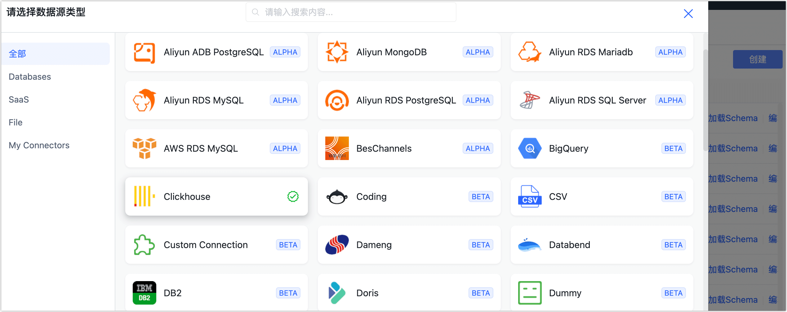
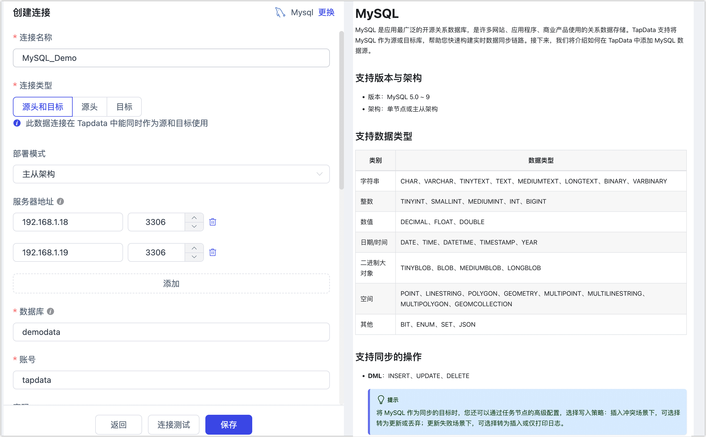

# 连接数据库
import Content from '../reuse-content/_all-features.md';

<Content />

完成[部署](../installation/README.md)后，您需要在 TapData 平台为数据库建立连接，完成操作后即可创建数据同步任务。

:::tip

在连接数据库前，您还需要确保网络环境访问正常并完成数据库账号的授权，更多介绍，见[准备工作](../prerequisites)。

:::

## 操作步骤

1. 登录 TapData 服务平台。

2. 在左侧导航栏栏，单击**连接管理**。

3. 单击页面右侧的**创建连接**，然后在弹出的对话框中选择要连接的数据源。

   

4. 在弹出的对话框中填写数据源连接信息，同时右侧面板会提示连接配置的帮助信息。

   :::tip

   下文以 MySQL 数据源为例演示操作流程，其他数据源见[连接各类数据库](../prerequisites)。

   :::

   

   * **连接名称**：填写具有业务意义的独有名称。
   * **连接类型**：固定为**目标**。
   * **地址**：数据库连接地址。
   * **端口**：数据库的服务端口。
   * **数据库**：数据库名称，即一个连接对应一个数据库，如有多个数据库则需创建多个数据连接。
   * **账号**：数据库的账号。
   * **密码**：数据库账号对应的密码。
   * **连接参数**：额外的连接参数，默认为空。
   * **时区**：默认为数据库所用的时区，您也可以根据业务需求手动指定。
   * **包含表**：默认为**全部**，您也可以选择自定义并填写包含的表，多个表之间用英文逗号（,）分隔。
   * **排除表**：打开该开关后，可以设定要排除的表，多个表之间用英文逗号（,）分隔。
   * **Agent 设置**：默认为**平台自动分配**，您也可以手动指定 Agent。

5. 单击页面下方的**连接测试**，提示通过后单击**保存**。

   :::tip

   如提示连接测试失败，请根据页面提示进行修复。

   :::

## 下一步

[创建数据同步任务](create-task.md)
